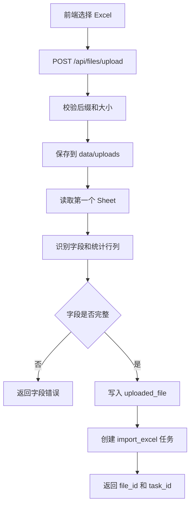

# Excel 上传与导入开发设计

> 功能编号：F01
> **里程碑归属：M1（工作流骨架接真实数据·确定性闭环）**
> 独立测试目标：用户上传 `产品标准体系.xlsx` 后，系统保存原始文件、识别字段、读取基础信息，并创建原始版本导入任务。
> 相关源需求：PRD 8.1、技术架构 11.1、15、16、17。

---

## 1. 功能目标

提供本地 Web 上传入口和 FastAPI 文件接口，接收 `.xlsx` 文件，保存到本地 `data/uploads/`，校验字段结构，记录文件元数据，并返回可供后续解析流程使用的 `file_id`。

本功能只负责文件接收、基础校验和任务创建，不负责构建分类树、不执行诊断、不调用 LLM。

---

## 2. 功能边界

### 2.1 输入

1. Excel 文件，后缀必须为 `.xlsx`。
2. 文件中至少包含以下字段：
   - `category_id`
   - `category_name`
   - `category_group_id`
   - `category_pids`
   - `category_group_name`
   - `syn_list`

### 2.2 输出

1. 本地上传文件副本。
2. `uploaded_file` 数据库记录。
3. 导入任务状态记录。
4. 上传接口响应：

```json
{
  "file_id": 1,
  "file_name": "产品标准体系.xlsx",
  "row_count": 21090,
  "column_count": 6,
  "columns": [
    "category_id",
    "category_name",
    "category_group_id",
    "category_pids",
    "category_group_name",
    "syn_list"
  ],
  "status": "uploaded"
}
```

### 2.3 不包含

1. 不创建 `category_node`。
2. 不创建 `taxonomy_version`。
3. 不写入 Qdrant。
4. 不生成诊断问题。
5. 不覆盖用户原始 Excel。

---

## 3. 推荐文件结构

```text
backend/app/
├── api/files.py
├── services/excel_service.py
├── repositories/file_repo.py
├── schemas/file.py
├── config.py
└── main.py

backend/tests/
├── test_file_upload_api.py
└── test_excel_service.py
```

| 文件 | 职责 |
|---|---|
| `api/files.py` | 定义上传、文件列表、文件详情 API |
| `services/excel_service.py` | 保存文件、读取 Excel 表头、统计行列、字段校验 |
| `repositories/file_repo.py` | 读写 `uploaded_file` |
| `schemas/file.py` | 定义上传响应、文件详情响应 |
| `config.py` | 管理 `UPLOAD_DIR`、允许后缀、最大文件大小 |

---

## 4. 数据库设计

使用技术架构中的 `uploaded_file` 表：

```sql
CREATE TABLE uploaded_file (
    id INTEGER PRIMARY KEY AUTOINCREMENT,
    file_name TEXT NOT NULL,
    file_path TEXT NOT NULL,
    file_size INTEGER,
    sheet_name TEXT,
    row_count INTEGER,
    column_count INTEGER,
    upload_time DATETIME DEFAULT CURRENT_TIMESTAMP,
    status TEXT DEFAULT 'uploaded'
);
```

建议增加导入任务表，方便前端轮询：

```sql
CREATE TABLE task_record (
    id TEXT PRIMARY KEY,
    file_id INTEGER,
    task_type TEXT NOT NULL,
    status TEXT NOT NULL,
    current_step TEXT,
    progress INTEGER DEFAULT 0,
    error_message TEXT,
    created_time DATETIME DEFAULT CURRENT_TIMESTAMP,
    updated_time DATETIME DEFAULT CURRENT_TIMESTAMP,
    FOREIGN KEY (file_id) REFERENCES uploaded_file(id)
);
```

`task_type` 初始支持：

| 值 | 含义 |
|---|---|
| `import_excel` | Excel 导入解析任务 |
| `diagnosis` | 诊断任务 |
| `export_report` | 报告导出任务 |

---

## 5. API 设计

### 5.1 上传文件

```text
POST /api/files/upload
Content-Type: multipart/form-data
```

请求字段：

| 字段 | 类型 | 必填 | 说明 |
|---|---|---|---|
| `file` | File | 是 | `.xlsx` 文件 |

成功响应：

```json
{
  "file_id": 1,
  "task_id": "import_20260704_000001",
  "file_name": "产品标准体系.xlsx",
  "row_count": 21090,
  "column_count": 6,
  "columns": [
    "category_id",
    "category_name",
    "category_group_id",
    "category_pids",
    "category_group_name",
    "syn_list"
  ],
  "status": "uploaded"
}
```

失败响应：

```json
{
  "error_code": "INVALID_COLUMNS",
  "message": "Excel 缺少必要字段：category_id、category_name"
}
```

### 5.2 获取文件列表

```text
GET /api/files
```

### 5.3 获取文件详情

```text
GET /api/files/{file_id}
```

---

## 6. 核心流程



---

## 7. 关键业务规则

1. 文件后缀必须为 `.xlsx`。
2. 文件保存名使用 `{timestamp}_{safe_original_name}.xlsx`，避免覆盖。
3. 上传目录不存在时自动创建。
4. 默认读取第一个 Sheet；如后续支持多 Sheet，可增加 `sheet_name` 参数。
5. 字段名按去除首尾空格后精确匹配。
6. `category_id` 和 `category_name` 缺失时上传失败。
7. 父节点缺失不是上传失败条件，属于结构诊断问题。
8. 上传失败不得写入不完整的 `uploaded_file` 记录。

---

## 8. 前端交互

页面组件：

| 组件 | 行为 |
|---|---|
| `Upload` | 选择并上传 `.xlsx` 文件 |
| `Progress` | 显示上传进度 |
| `FileInfoCard` | 展示文件名、行数、字段数、字段识别结果 |
| `Alert` | 展示字段缺失或格式错误 |

用户流程：

1. 用户进入上传页。
2. 选择样例 Excel。
3. 页面展示上传中状态。
4. 上传成功后展示文件信息。
5. 前端跳转到体系概览或提示等待解析任务。

---

## 9. 测试设计

### 9.1 单元测试

| 测试项 | 输入 | 期望 |
|---|---|---|
| 读取合法 Excel | `data/sample/产品标准体系.xlsx` | 返回 21090 行、6 列 |
| 字段完整校验 | 标准字段列表 | 校验通过 |
| 字段缺失校验 | 去掉 `category_name` | 返回 `INVALID_COLUMNS` |
| 非 Excel 后缀 | `.csv` 文件 | 返回 `INVALID_FILE_TYPE` |
| 空文件 | 0 字节文件 | 返回 `EMPTY_FILE` |

### 9.2 接口测试

```text
POST /api/files/upload
```

断言：

1. HTTP 状态码为 200。
2. 响应包含 `file_id` 和 `task_id`。
3. `row_count = 21090`。
4. `columns` 包含 6 个标准字段。
5. `uploaded_file` 表新增 1 条记录。
6. `data/uploads/` 下存在保存后的文件。

### 9.3 页面测试

1. 上传按钮只接受 `.xlsx`。
2. 上传成功后显示文件名和字段列表。
3. 字段错误时页面展示错误信息，不跳转到下一步。

---

## 10. 验收标准

1. 可以成功上传 `data/sample/产品标准体系.xlsx`。
2. 系统识别字段：`category_id`、`category_name`、`category_group_id`、`category_pids`、`category_group_name`、`syn_list`。
3. 系统显示节点数量 21090。
4. 上传后生成 `uploaded_file` 记录。
5. 上传后返回可追踪的 `task_id`。
6. 上传失败时返回清晰错误，不产生脏数据。

