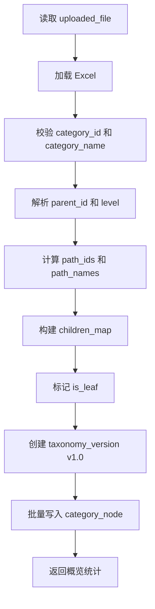

# 分类树解析与体系概览开发设计

> 功能编号：F02
> **里程碑归属：M1（工作流骨架接真实数据·确定性闭环）**
> 独立测试目标：基于已上传 Excel 构建分类树，写入初始版本节点快照，并提供体系概览、节点搜索、局部树查询能力。
> 相关源需求：PRD 8.2、8.3，技术架构 6.3、7.2、7.3、11.2、12.2。

---

## 1. 功能目标

将上传文件中的二维表数据解析为分类树节点集合，计算 `parent_id`、`level`、`path_ids`、`path_names`、`is_leaf` 等派生字段，保存原始版本 `v1.0`，并为前端提供体系统计、一级类目、节点详情和搜索接口。

---

## 2. 功能边界

### 2.1 输入

1. `file_id`
2. `uploaded_file.file_path`
3. Excel 标准字段：
   - `category_id`
   - `category_name`
   - `category_group_id`
   - `category_pids`
   - `category_group_name`
   - `syn_list`

### 2.2 输出

1. `taxonomy_version` 原始版本记录，版本号为 `v1.0`。
2. `category_node` 节点快照。
3. 体系概览统计。
4. 局部树结构。
5. 节点详情。

### 2.3 不包含

1. 不生成诊断问题。
2. 不生成维护建议。
3. 不执行节点修改。
4. 不写入 Qdrant；向量索引属于 F04。

---

## 3. 推荐文件结构

```text
backend/app/
├── api/taxonomy.py
├── services/taxonomy_service.py
├── services/version_service.py
├── repositories/node_repo.py
├── repositories/version_repo.py
├── schemas/node.py
├── schemas/version.py
└── tools/tree_tools.py

backend/tests/
├── test_taxonomy_parser.py
├── test_taxonomy_overview_api.py
└── test_taxonomy_tree_api.py
```

---

## 4. 数据模型

### 4.1 taxonomy_version

```sql
CREATE TABLE taxonomy_version (
    id INTEGER PRIMARY KEY AUTOINCREMENT,
    file_id INTEGER NOT NULL,
    version_no TEXT NOT NULL,
    description TEXT,
    quality_score REAL,
    snapshot_path TEXT,
    created_time DATETIME DEFAULT CURRENT_TIMESTAMP,
    FOREIGN KEY (file_id) REFERENCES uploaded_file(id)
);
```

### 4.2 category_node

```sql
CREATE TABLE category_node (
    id INTEGER PRIMARY KEY AUTOINCREMENT,
    version_id INTEGER NOT NULL,
    category_id INTEGER NOT NULL,
    category_name TEXT NOT NULL,
    parent_id INTEGER,
    level INTEGER,
    path_ids TEXT,
    path_names TEXT,
    category_group_id TEXT,
    category_pids TEXT,
    category_group_name TEXT,
    syn_list TEXT,
    is_leaf INTEGER DEFAULT 0,
    created_time DATETIME DEFAULT CURRENT_TIMESTAMP,
    FOREIGN KEY (version_id) REFERENCES taxonomy_version(id)
);
```

建议增加唯一约束：

```sql
CREATE UNIQUE INDEX idx_category_node_version_category
ON category_node(version_id, category_id);
```

---

## 5. 解析规则

| 字段 | 处理规则 |
|---|---|
| `category_id` | 转为整数，作为业务节点唯一 ID |
| `category_name` | 去除首尾空白，不能为空 |
| `category_group_id` | 按英文逗号拆分祖先 ID |
| `parent_id` | 取 `category_group_id` 最后一个 ID；为空则为 `NULL` |
| `level` | 祖先 ID 数量 + 1 |
| `path_ids` | `category_group_id + category_id` |
| `path_names` | `category_group_name + category_name`，使用 ` > ` 拼接 |
| `is_leaf` | 无其他节点以当前节点为 `parent_id` 时为 `1` |

字段异常处理：

1. `category_id` 为空或非整数：终止导入。
2. `category_id` 重复：终止导入。
3. `category_name` 为空：终止导入。
4. `parent_id` 不存在：允许导入，后续由结构诊断记录为问题。
5. `category_group_name` 与 `category_group_id` 数量不一致：允许导入，但记录导入警告。

---

## 6. API 设计

### 6.1 启动解析

```text
POST /api/taxonomy/import
```

请求：

```json
{
  "file_id": 1
}
```

响应：

```json
{
  "version_id": 1,
  "version_no": "v1.0",
  "total_nodes": 21090,
  "root_count": 12,
  "max_depth": 10,
  "status": "completed"
}
```

### 6.2 获取体系概览

```text
GET /api/taxonomy/overview?version_id=1
```

响应：

```json
{
  "version_id": 1,
  "total_nodes": 21090,
  "root_count": 12,
  "max_depth": 10,
  "leaf_count": 17965,
  "non_leaf_count": 3125,
  "missing_parent_count": 44,
  "duplicate_name_count": 3,
  "synonym_non_empty_count": 15072
}
```

### 6.3 获取局部树

```text
GET /api/taxonomy/tree?version_id=1&parent_id=&depth=2
```

响应字段：

| 字段 | 说明 |
|---|---|
| `category_id` | 节点 ID |
| `category_name` | 节点名称 |
| `parent_id` | 父节点 ID |
| `level` | 层级 |
| `is_leaf` | 是否叶子节点 |
| `children_count` | 直接子节点数量 |
| `children` | 子节点数组 |

### 6.4 搜索节点

```text
GET /api/taxonomy/search?version_id=1&q=苹果
```

---

## 7. 核心流程



---

## 8. 统计指标

| 指标 | 计算方式 | 样例期望 |
|---|---|---:|
| 节点总数 | `count(category_node)` | 21090 |
| 一级类目数 | `parent_id IS NULL` | 12 |
| 最大层级 | `max(level)` | 10 |
| 叶子节点数 | `is_leaf = 1` | 17965 |
| 非叶子节点数 | `is_leaf = 0` | 3125 |
| 缺失父节点数 | `parent_id not in category_id set` | 44 |
| 重复名称类型数 | `category_name count > 1` | 3 |
| 同义词非空节点数 | `syn_list not empty` | 以实际解析结果为准 |

---

## 9. 测试设计

### 9.1 单元测试

| 测试项 | 输入 | 期望 |
|---|---|---|
| 根节点解析 | `category_group_id` 为空 | `parent_id = null`、`level = 1` |
| 非根节点解析 | `category_group_id = "2,3,4,5"` | `parent_id = 5`、`level = 5` |
| 路径名称拼接 | 祖先名称 + 当前名称 | 使用 ` > ` 拼接完整路径 |
| 叶子节点计算 | 无子节点 | `is_leaf = 1` |
| 重复 ID 校验 | 两行相同 `category_id` | 导入失败 |

### 9.2 接口测试

1. 调用 `POST /api/taxonomy/import`。
2. 断言返回 `version_no = v1.0`。
3. 查询 `category_node`，断言节点数为 21090。
4. 调用 `GET /api/taxonomy/overview`，断言最大层级为 10。
5. 调用 `GET /api/taxonomy/tree`，断言根节点数量为 12。
6. 调用 `GET /api/taxonomy/search?q=苹果`，断言结果包含名称为“苹果”的节点。

---

## 10. 验收标准

1. 正确识别 12 个一级类目。
2. 正确解析 21090 个分类节点。
3. 正确计算最大深度 10。
4. 正确统计叶子节点和非叶子节点。
5. 支持按节点展开局部树。
6. 支持按节点名称或 ID 搜索节点。
7. 初始导入后生成 `v1.0` 版本。

