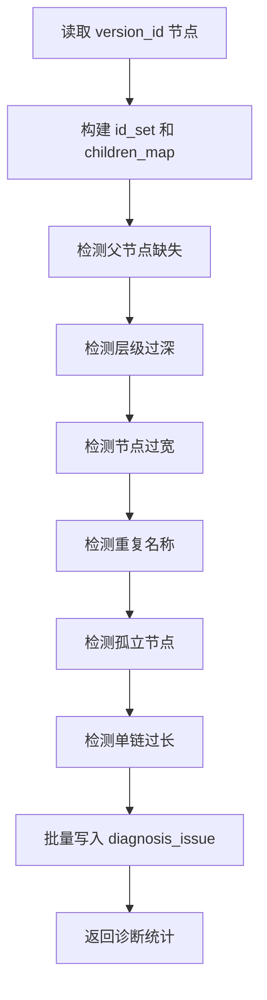

# 结构诊断开发设计

> 功能编号：F03
> **里程碑归属：M1（工作流骨架接真实数据·确定性闭环）**
> 独立测试目标：在不依赖 LLM 和 Qdrant 的情况下，通过确定性规则检测分类树结构问题，并写入 `diagnosis_issue`。
> 相关源需求：PRD 8.4、12，技术架构 9.1、11.3、15。

---

## 1. 功能目标

对指定版本的 `category_node` 执行结构诊断，识别父节点缺失、层级过深、节点过宽、重复名称、孤立节点和单链过长等问题，生成可筛选、可追踪、可用于后续建议生成的问题记录。

---

## 2. 功能边界

### 2.1 输入

1. `version_id`
2. 规则阈值：
   - `MAX_TREE_DEPTH_THRESHOLD = 7`
   - `MAX_CHILDREN_THRESHOLD = 80`
   - `SINGLE_CHAIN_THRESHOLD = 4`

### 2.2 输出

1. `diagnosis_issue` 问题记录。
2. 结构诊断统计。
3. 诊断任务状态。

### 2.3 不包含

1. 不调用 LLM。
2. 不调用 Qdrant。
3. 不生成维护建议。
4. 不修改节点数据。

---

## 3. 推荐文件结构

```text
backend/app/
├── api/diagnosis.py
├── services/diagnosis_service.py
├── repositories/issue_repo.py
├── repositories/node_repo.py
├── schemas/issue.py
└── tools/tree_tools.py

backend/tests/
├── test_structure_diagnosis_rules.py
└── test_diagnosis_api.py
```

---

## 4. 数据模型

```sql
CREATE TABLE diagnosis_issue (
    id INTEGER PRIMARY KEY AUTOINCREMENT,
    version_id INTEGER NOT NULL,
    issue_type TEXT NOT NULL,
    node_id INTEGER,
    node_name TEXT,
    description TEXT,
    reason TEXT,
    risk_level TEXT,
    confidence REAL,
    status TEXT DEFAULT 'pending',
    created_time DATETIME DEFAULT CURRENT_TIMESTAMP,
    FOREIGN KEY (version_id) REFERENCES taxonomy_version(id)
);
```

建议增加幂等约束，防止重复运行诊断时生成重复问题：

```sql
CREATE UNIQUE INDEX idx_issue_unique_rule
ON diagnosis_issue(version_id, issue_type, node_id, description);
```

---

## 5. 诊断规则

### 5.1 父节点缺失

检测方式：

```text
node.parent_id 不为空 且 node.parent_id 不在当前版本 category_id 集合中
```

输出：

| 字段 | 值 |
|---|---|
| `issue_type` | `missing_parent` |
| `risk_level` | `high` |
| `confidence` | `1.0` |
| `reason` | 直接父节点不存在，树结构断裂 |

样例期望：当前数据应识别 44 个父节点缺失问题。

### 5.2 层级过深

检测方式：

```text
node.level > MAX_TREE_DEPTH_THRESHOLD
```

输出：

| 字段 | 值 |
|---|---|
| `issue_type` | `deep_level` |
| `risk_level` | `medium` |
| `confidence` | `1.0` |

样例期望：当前最大层级为 10，应能识别 8 层及以上节点。

### 5.3 节点过宽

检测方式：

```text
某 parent_id 的直接子节点数量 > MAX_CHILDREN_THRESHOLD
```

输出：

| 字段 | 值 |
|---|---|
| `issue_type` | `wide_node` |
| `risk_level` | `medium` |
| `confidence` | `1.0` |

样例期望：能识别“煤化工设备与试剂”等过宽节点。

### 5.4 重复名称

检测方式：

```text
同一 version_id 下，相同 category_name 出现次数 > 1
```

输出策略：

1. 每个重复名称生成一条汇总问题，`node_id` 可为空。
2. `description` 中记录重复节点 ID 和路径摘要。
3. 后续由内容诊断或建议生成判断是否合并。

样例期望：能识别 `锰矿石`、`风机叶片`、`风电齿轮箱`。

### 5.5 孤立节点

检测方式：

```text
从节点沿 parent_id 向上追溯，无法到达根节点，或遇到不存在父节点
```

输出：

| 字段 | 值 |
|---|---|
| `issue_type` | `orphan_node` |
| `risk_level` | `high` |
| `confidence` | `1.0` |

### 5.6 单链过长

检测方式：

```text
连续多层节点均只有 1 个子节点，长度 >= SINGLE_CHAIN_THRESHOLD
```

输出：

| 字段 | 值 |
|---|---|
| `issue_type` | `long_single_chain` |
| `risk_level` | `low` |
| `confidence` | `0.8` |

---

## 6. API 设计

### 6.1 运行结构诊断

```text
POST /api/diagnosis/structure/run
```

请求：

```json
{
  "version_id": 1,
  "max_depth": 7,
  "max_children": 80
}
```

响应：

```json
{
  "version_id": 1,
  "status": "completed",
  "issue_count": 128,
  "summary": {
    "missing_parent": 44,
    "deep_level": 139,
    "wide_node": 9,
    "duplicate_name": 3,
    "orphan_node": 44,
    "long_single_chain": 0
  }
}
```

### 6.2 获取问题列表

```text
GET /api/diagnosis/issues?version_id=1&issue_type=missing_parent&risk_level=high&status=pending
```

### 6.3 获取问题详情

```text
GET /api/diagnosis/issues/{issue_id}
```

---

## 7. 核心流程



---

## 8. 幂等与异常处理

1. 同一 `version_id` 重复运行结构诊断时，先删除该版本未处理的结构诊断问题，再重新生成。
2. 已经被用户接受、拒绝或执行的问题不直接删除，避免破坏审计记录。
3. 如果节点表为空，返回 `VERSION_HAS_NO_NODES`。
4. 如果阈值小于 1，返回 `INVALID_THRESHOLD`。
5. 诊断失败时不影响已导入的版本和节点数据。

---

## 9. 测试设计

### 9.1 单元测试

| 测试项 | 构造数据 | 期望 |
|---|---|---|
| 父节点缺失 | 子节点 parent_id=999 | 生成 `missing_parent` |
| 层级过深 | level=8，阈值=7 | 生成 `deep_level` |
| 节点过宽 | 父节点 81 个直接子节点 | 生成 `wide_node` |
| 重复名称 | 两个节点名称相同 | 生成 `duplicate_name` |
| 孤立节点 | parent_id 链断裂 | 生成 `orphan_node` |
| 正常树 | 完整三层树 | 不生成高风险结构问题 |

### 9.2 集成测试

基于样例 Excel 完整导入后运行结构诊断，断言：

1. 父节点缺失数量为 44。
2. 最大层级问题能覆盖 10 层路径。
3. 过宽节点列表包含“煤化工设备与试剂”。
4. 重复名称列表包含“锰矿石”“风机叶片”“风电齿轮箱”。

---

## 10. 验收标准

1. 能识别 44 个父节点缺失问题。
2. 能识别最大深度为 10 的深层路径。
3. 能识别“煤化工设备与试剂”等过宽节点。
4. 能识别重复节点名称。
5. 问题记录包含类型、节点、描述、原因、风险等级、置信度和状态。
6. 重复运行诊断不产生重复待处理问题。

