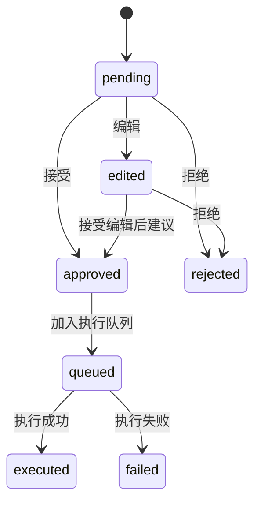

# 人工审核开发设计

> 功能编号：F06  
> 独立测试目标：用户可以查看、接受、拒绝、编辑维护建议，所有操作写入日志，但不直接修改分类树。  
> 相关源需求：PRD 8.7，技术架构 10、11.4、16。

---

## 1. 功能目标

为智能建议提供人工审核入口。用户可以逐条或批量处理建议，将建议状态从 `pending` 更新为 `approved`、`rejected` 或 `edited`。审核只改变建议状态和审核内容，不执行节点修改；真正执行属于 F07。

---

## 2. 功能边界

### 2.1 输入

1. `suggestion_id`
2. 用户操作：
   - 接受
   - 拒绝
   - 编辑
   - 批量接受低风险建议
3. 编辑后的结构化建议内容。

### 2.2 输出

1. 更新后的 `adjustment_suggestion`。
2. `operation_log` 审核记录。
3. 前端审核状态。

### 2.3 不包含

1. 不执行节点移动、合并、改名、同义词清理。
2. 不生成新版本。
3. 不导出文件。

---

## 3. 推荐文件结构

```text
backend/app/
├── api/suggestions.py
├── services/review_service.py
├── repositories/suggestion_repo.py
├── repositories/operation_log_repo.py
├── schemas/suggestion.py
└── tools/validation_tools.py

backend/tests/
├── test_suggestion_review_service.py
└── test_suggestion_review_api.py
```

---

## 4. 状态机



状态说明：

| 状态 | 含义 |
|---|---|
| `pending` | 待审核 |
| `approved` | 已接受，等待执行 |
| `rejected` | 已拒绝，不执行 |
| `edited` | 已编辑，等待最终接受 |
| `queued` | 已进入执行队列 |
| `executed` | 已执行 |
| `failed` | 执行失败 |

---

## 5. API 设计

### 5.1 接受建议

```text
POST /api/suggestions/{suggestion_id}/approve
```

请求：

```json
{
  "operator": "local_user"
}
```

响应：

```json
{
  "suggestion_id": 1,
  "status": "approved"
}
```

### 5.2 拒绝建议

```text
POST /api/suggestions/{suggestion_id}/reject
```

请求：

```json
{
  "operator": "local_user",
  "reject_reason": "该重复节点属于产业链视角复用，不需要合并。"
}
```

### 5.3 编辑建议

```text
PUT /api/suggestions/{suggestion_id}
```

请求：

```json
{
  "operator": "local_user",
  "action_type": "clean_synonym",
  "action_payload": {
    "synonyms_to_remove": ["AirPods", "Apple Music", "Apple Pencil", "iPhone"]
  },
  "reason": "人工确认这些同义词与水果节点不相关。",
  "suggestion": "删除电子品牌和设备相关词。"
}
```

### 5.4 批量接受低风险建议

```text
POST /api/suggestions/batch-approve
```

请求：

```json
{
  "version_id": 1,
  "suggestion_ids": [1, 2, 3],
  "operator": "local_user"
}
```

限制：

1. 只允许批量接受 `risk_level=low` 的建议。
2. 中高风险建议必须逐条确认。

---

## 6. 审核校验

| 操作 | 校验规则 |
|---|---|
| 接受 | 当前状态必须是 `pending` 或 `edited` |
| 拒绝 | 当前状态必须不是 `executed` |
| 编辑 | 当前状态必须是 `pending` 或 `edited` |
| 批量接受 | 所有建议必须为 `risk_level=low` 且状态为 `pending` |

编辑后的建议还必须重新执行 F05 中的结构化校验，确保动作可被 F07 执行校验识别。

---

## 7. 操作日志

```sql
CREATE TABLE operation_log (
    id INTEGER PRIMARY KEY AUTOINCREMENT,
    version_id INTEGER,
    operator TEXT,
    operation_type TEXT,
    operation_detail TEXT,
    created_time DATETIME DEFAULT CURRENT_TIMESTAMP,
    FOREIGN KEY (version_id) REFERENCES taxonomy_version(id)
);
```

日志示例：

```json
{
  "version_id": 1,
  "operator": "local_user",
  "operation_type": "approve_suggestion",
  "operation_detail": {
    "suggestion_id": 1,
    "action_type": "clean_synonym",
    "target_node_id": 441
  }
}
```

---

## 8. 前端交互

页面组件：

| 组件 | 行为 |
|---|---|
| `SuggestionTable` | 展示建议列表，支持按动作、风险、状态筛选 |
| `ActionPreview` | 展示动作前后对比 |
| `ConfirmModal` | 中高风险接受前二次确认 |
| `SuggestionEditDrawer` | 编辑结构化建议 |

交互规则：

1. 点击建议行展示问题来源、原因、目标节点、动作详情。
2. 接受中高风险建议前弹窗确认。
3. 拒绝必须填写或选择拒绝原因。
4. 编辑建议后状态变为 `edited`，需要再次接受。

---

## 9. 测试设计

### 9.1 单元测试

| 测试项 | 初始状态 | 操作 | 期望 |
|---|---|---|---|
| 接受待审核建议 | `pending` | approve | `approved` |
| 拒绝待审核建议 | `pending` | reject | `rejected` |
| 编辑待审核建议 | `pending` | edit | `edited` |
| 已执行建议不能拒绝 | `executed` | reject | 返回错误 |
| 批量接受中风险建议 | `medium` | batch approve | 返回错误 |

### 9.2 接口测试

1. 创建 1 条 `pending` 建议。
2. 调用接受接口。
3. 断言状态为 `approved`。
4. 断言 `operation_log` 新增审核记录。
5. 断言 `category_node` 没有变化。

---

## 10. 验收标准

1. 用户可以逐条查看建议详情。
2. 用户可以对建议进行接受、拒绝、编辑。
3. 所有用户操作写入操作日志。
4. 审核阶段不修改分类树节点。
5. 中高风险建议不能被批量静默接受。

