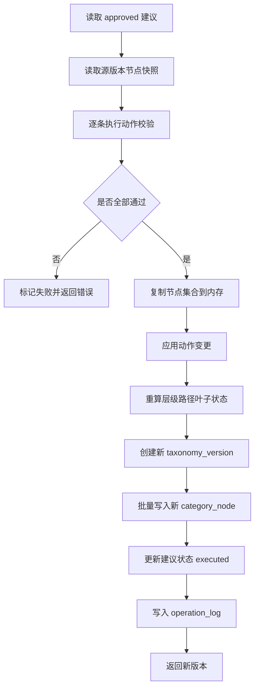

# 动作执行与版本管理开发设计

> 功能编号：F07  
> 独立测试目标：只执行已人工确认的建议，执行前校验动作合法性，执行后生成新版本、节点快照、操作日志和版本差异。  
> 相关源需求：PRD 8.8，技术架构 7、10、11.5、18。

---

## 1. 功能目标

将状态为 `approved` 的维护建议转换为实际节点变更。系统必须先校验动作，基于当前版本生成新的节点集合，再写入新 `taxonomy_version` 和对应 `category_node` 快照。任何动作都不得直接覆盖原始版本。

---

## 2. 功能边界

### 2.1 输入

1. `version_id`
2. 已接受建议列表：
   - `status = approved`
3. 操作人 `operator`

### 2.2 输出

1. 新版本，例如 `v1.1`。
2. 新版本 `category_node` 快照。
3. 建议状态更新为 `executed` 或 `failed`。
4. 操作日志。
5. 版本差异结果。

### 2.3 不包含

1. 不调用 LLM。
2. 不自动执行未审核建议。
3. 不直接覆盖上传 Excel。
4. `split_subtree` MVP 阶段只保存方案，不自动拆分。

---

## 3. 推荐文件结构

```text
backend/app/
├── api/suggestions.py
├── api/versions.py
├── services/action_execution_service.py
├── services/version_service.py
├── repositories/node_repo.py
├── repositories/version_repo.py
├── repositories/suggestion_repo.py
├── repositories/operation_log_repo.py
├── schemas/version.py
└── tools/validation_tools.py

backend/tests/
├── test_action_validation.py
├── test_action_execution_service.py
├── test_version_diff.py
└── test_version_api.py
```

---

## 4. 动作校验规则

| 动作 | 校验规则 |
|---|---|
| `add_node` | 新节点名称不能为空，父节点必须存在或为根，`category_id` 不能重复 |
| `move_node` | 目标父节点必须存在，不能移动到自身或自身子树下 |
| `rename_node` | 新名称不能为空，同级下不能重名 |
| `merge_node` | 源节点和目标节点必须存在，不能跨不兼容体系自动合并 |
| `clean_synonym` | 删除词必须存在于原 `syn_list` 中 |
| `split_subtree` | MVP 只记录方案，不修改节点 |
| `mark_as_valid` | 不修改节点，只更新问题和建议状态 |

---

## 5. 版本规则

1. 原始 Excel 导入后生成 `v1.0`。
2. 每次批量执行建议后生成新版本，例如 `v1.1`、`v1.2`。
3. 新版本必须完整保存节点快照。
4. 新版本基于执行前版本拷贝后变更。
5. 重新计算：
   - `parent_id`
   - `level`
   - `path_ids`
   - `path_names`
   - `is_leaf`
6. 执行失败时不生成半成品版本。

---

## 6. API 设计

### 6.1 执行已确认建议

```text
POST /api/suggestions/execute
```

请求：

```json
{
  "version_id": 1,
  "suggestion_ids": [1, 2, 3],
  "operator": "local_user"
}
```

响应：

```json
{
  "source_version_id": 1,
  "new_version_id": 2,
  "new_version_no": "v1.1",
  "executed_count": 3,
  "failed_count": 0,
  "status": "completed"
}
```

### 6.2 版本列表

```text
GET /api/versions?file_id=1
```

### 6.3 版本详情

```text
GET /api/versions/{version_id}
```

### 6.4 版本差异

```text
GET /api/versions/{version_id}/diff?target_version_id=2
```

响应：

```json
{
  "from_version_id": 1,
  "to_version_id": 2,
  "added": [],
  "deleted": [],
  "renamed": [],
  "moved": [],
  "synonym_changed": [
    {
      "category_id": 441,
      "category_name": "苹果",
      "removed_synonyms": ["AirPods", "Apple Music", "Apple Pencil", "iPhone"]
    }
  ]
}
```

### 6.5 回滚版本

```text
POST /api/versions/{version_id}/rollback
```

说明：回滚不删除历史版本，而是基于目标历史版本创建一个新版本，例如从 `v1.3` 回滚到 `v1.1` 时创建 `v1.4`。

---

## 7. 核心流程



---

## 8. 质量评分

每个版本保存后计算质量分：

```text
质量分 = 100
      - 父节点缺失数 * 1.0
      - 层级过深节点数 * 0.2
      - 过宽节点数 * 0.5
      - 重复名称数 * 0.5
      - 高风险内容问题数 * 1.0
```

评分写入 `taxonomy_version.quality_score`，用于前端展示版本优化效果。

---

## 9. 测试设计

### 9.1 单元测试

| 测试项 | 输入 | 期望 |
|---|---|---|
| 清理同义词 | `clean_synonym` 删除已存在词 | 新节点同义词减少 |
| 移动节点 | `move_node` 到合法父节点 | 新版本路径重算 |
| 移动到自身子树 | 非法 `new_parent_id` | 校验失败 |
| 重命名同级重名 | `rename_node` 新名称已存在 | 校验失败 |
| 合理标记 | `mark_as_valid` | 不修改节点，只更新状态 |

### 9.2 集成测试

1. 导入 `v1.0`。
2. 创建并接受 1 条 `clean_synonym` 建议。
3. 执行建议。
4. 断言生成 `v1.1`。
5. 断言 `v1.0` 节点未变。
6. 断言 `v1.1` 中目标节点同义词已清理。
7. 断言操作日志记录执行详情。

---

## 10. 验收标准

1. 执行修改前保存原始版本。
2. 只执行状态为 `approved` 的建议。
3. 执行修改后生成新版本。
4. 可以查看版本差异。
5. 可以回滚到历史版本并生成新的版本号。
6. 任意动作校验失败时不生成半成品版本。

