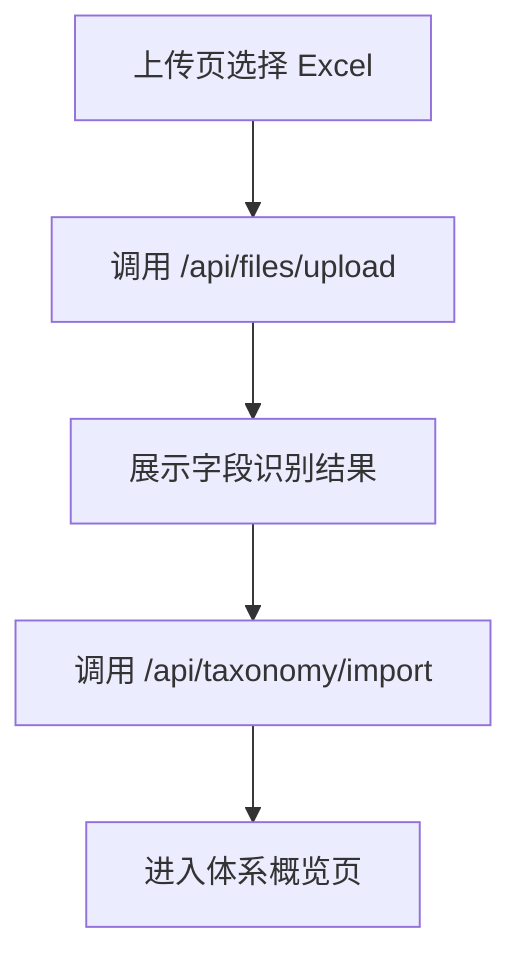
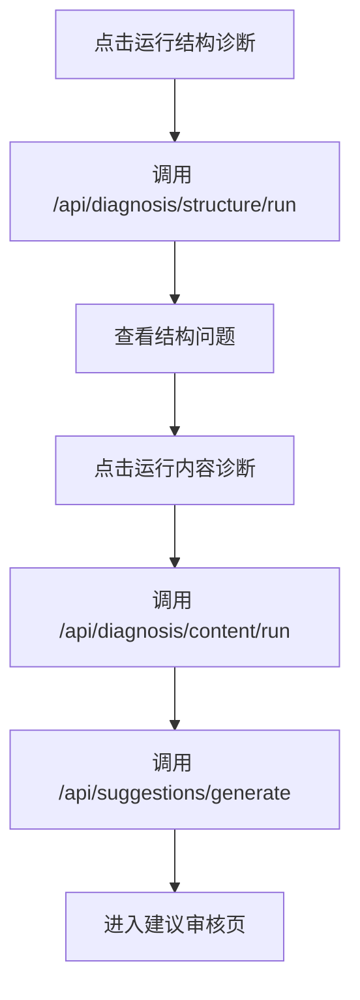
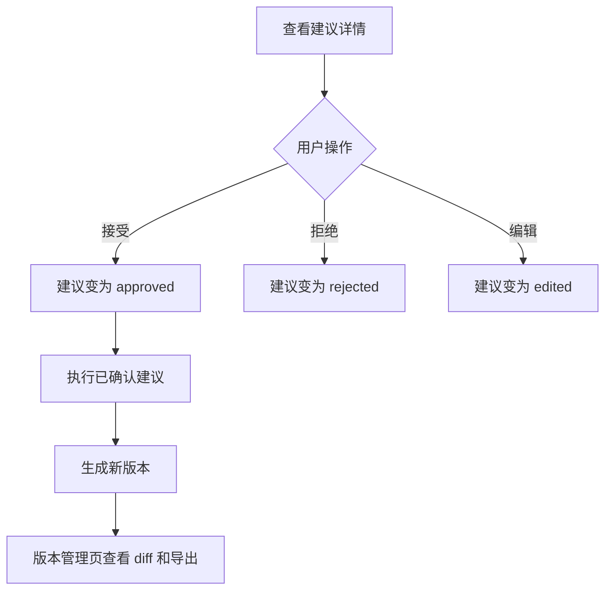

# 前端工作台开发设计

> 功能编号：F09
> **里程碑归属：M5（前端工作台 + 端到端演示）**
> 独立测试目标：通过本地 Web 工作台完成上传、概览、树浏览、诊断、建议审核、版本管理和报告下载的完整演示流程。
> 相关源需求：PRD 9，技术架构 6.1、17。

---

## 1. 功能目标

提供一个面向体系管理员、业务专家和课程答辩用户的本地 Web 工作台。前端只负责展示和交互，所有 Excel 处理、诊断、智能体流程、版本保存和导出均由后端 API 完成。

---

## 2. 页面结构

推荐使用 React + Ant Design 或 Vue + Element Plus。若项目没有既定前端框架，课程设计阶段优先选择 Vue + Element Plus，开发成本较低，表格、树、弹窗组件齐全。

页面清单：

| 页面 | 路由 | 核心能力 |
|---|---|---|
| 上传页 | `/upload` | 上传 Excel、显示字段识别结果 |
| 体系概览页 | `/overview` | 展示统计卡片、一级类目、质量分 |
| 分类树页 | `/tree` | 展开树、搜索节点、查看节点详情 |
| 结构诊断页 | `/diagnosis/structure` | 展示结构问题列表和筛选 |
| 内容诊断页 | `/diagnosis/content` | 展示语义问题、相似节点、LLM 说明 |
| 智能建议页 | `/suggestions` | 查看、接受、拒绝、编辑建议 |
| 版本管理页 | `/versions` | 查看版本、差异、回滚、导出 |
| 报告页 | `/reports` | 生成和下载 Markdown 报告 |
| 智能问答页 | `/chat` | 可选：基于召回上下文问答 |

---

## 3. 推荐文件结构

```text
frontend/src/
├── main.ts
├── router/index.ts
├── api/
│   ├── files.ts
│   ├── taxonomy.ts
│   ├── diagnosis.ts
│   ├── suggestions.ts
│   ├── versions.ts
│   └── reports.ts
├── views/
│   ├── UploadView.vue
│   ├── OverviewView.vue
│   ├── TreeView.vue
│   ├── StructureDiagnosisView.vue
│   ├── ContentDiagnosisView.vue
│   ├── SuggestionsView.vue
│   ├── VersionsView.vue
│   └── ReportsView.vue
├── components/
│   ├── FileInfoCard.vue
│   ├── StatisticCard.vue
│   ├── TaxonomyTree.vue
│   ├── NodeDetailDrawer.vue
│   ├── IssueTable.vue
│   ├── SuggestionTable.vue
│   ├── ActionPreview.vue
│   ├── VersionTable.vue
│   └── MarkdownViewer.vue
└── stores/
    └── workspace.ts
```

---

## 4. 全局状态

`workspace` store 保存当前工作上下文：

```ts
type WorkspaceState = {
  fileId: number | null
  versionId: number | null
  versionNo: string | null
  taskId: string | null
}
```

规则：

1. 上传成功后写入 `fileId`。
2. 解析成功后写入 `versionId` 和 `versionNo`。
3. 诊断、导出等耗时操作写入 `taskId` 并轮询任务状态。
4. 刷新页面后从 URL 参数或本地存储恢复当前版本。

---

## 5. 关键交互流程

### 5.1 上传到概览



### 5.2 诊断到建议



### 5.3 审核到版本



---

## 6. 组件设计

### 6.1 `StatisticCard`

展示：

1. 节点总数。
2. 一级类目数。
3. 最大层级。
4. 叶子节点数。
5. 缺失父节点数。
6. 重复名称类型数。
7. 质量分。

### 6.2 `TaxonomyTree`

能力：

1. 懒加载子节点。
2. 支持按节点名称或 ID 搜索。
3. 点击节点打开 `NodeDetailDrawer`。
4. 展示叶子节点和非叶子节点状态。

### 6.3 `IssueTable`

列：

1. 问题类型。
2. 节点名称。
3. 完整路径。
4. 风险等级。
5. 置信度。
6. 状态。
7. 操作。

筛选：

1. 问题类型。
2. 风险等级。
3. 状态。

### 6.4 `SuggestionTable`

列：

1. 动作类型。
2. 目标节点。
3. 建议说明。
4. 风险等级。
5. 置信度。
6. 审核状态。
7. 操作按钮。

操作：

1. 接受。
2. 拒绝。
3. 编辑。
4. 查看动作预览。

### 6.5 `VersionTable`

列：

1. 版本号。
2. 描述。
3. 质量分。
4. 创建时间。
5. 操作：查看差异、导出、回滚。

---

## 7. 任务状态轮询

耗时任务统一轮询：

```text
GET /api/tasks/{task_id}
```

响应：

```json
{
  "task_id": "task_001",
  "status": "running",
  "current_step": "content_diagnosis",
  "progress": 65
}
```

前端处理：

1. `pending`：展示等待状态。
2. `running`：展示进度条和当前步骤。
3. `waiting_review`：跳转建议审核页。
4. `completed`：刷新当前页面数据。
5. `failed`：展示错误信息和重试按钮。

---

## 8. 页面验收场景

### 8.1 课程演示主流程

1. 打开上传页。
2. 上传 `产品标准体系.xlsx`。
3. 进入概览页，展示 21090 节点、12 个一级类目、最大深度 10。
4. 进入结构诊断页，展示父节点缺失、层级过深、节点过宽和重复名称。
5. 进入内容诊断页，展示“苹果”同义词污染等案例。
6. 进入建议页，接受 1 条同义词清理建议。
7. 执行建议并生成 `v1.1`。
8. 进入版本页，查看差异并导出 Excel。
9. 进入报告页，生成 Markdown 诊断报告。

---

## 9. 测试设计

### 9.1 组件测试

| 组件 | 测试内容 |
|---|---|
| `FileInfoCard` | 正确展示文件名、行数、字段 |
| `StatisticCard` | 正确展示统计指标 |
| `TaxonomyTree` | 点击节点能打开详情 |
| `IssueTable` | 筛选风险等级后列表变化 |
| `SuggestionTable` | 接受、拒绝、编辑按钮调用正确 API |
| `VersionTable` | 点击导出调用版本导出接口 |

### 9.2 端到端测试

1. Mock 上传接口返回 `file_id`。
2. Mock 解析接口返回 `version_id`。
3. 断言页面跳转到概览页。
4. Mock 诊断接口返回问题列表。
5. 断言结构诊断页展示问题类型和风险标签。
6. Mock 建议审核接口。
7. 断言建议状态更新。

---

## 10. 验收标准

1. 上传 Excel 后自动进入解析任务。
2. 概览页能展示统计卡片和一级类目列表。
3. 分类树页能展开、搜索、查看节点详情。
4. 问题列表支持按类型、风险、状态筛选。
5. 建议执行前需要弹窗确认。
6. 导出前可以选择版本。
7. 整体页面流程能完成课程演示闭环。

