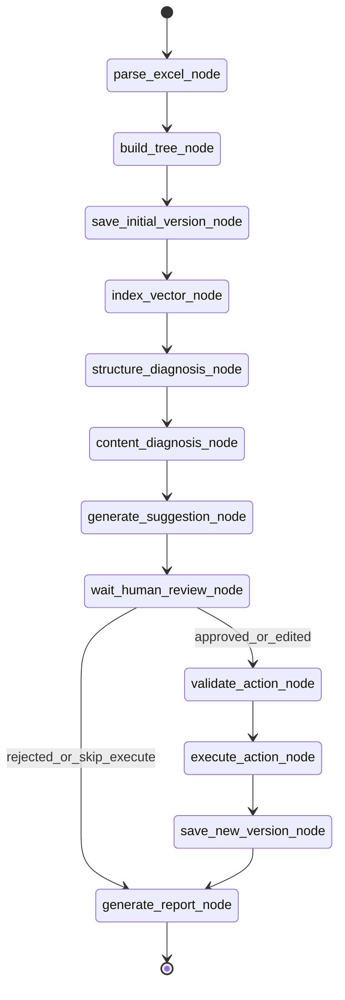

# LangGraph 智能体工作流开发设计

> 功能编号：F10  
> 独立测试目标：系统能通过 LangGraph 编排 Excel 解析、分类树构建、结构诊断、内容诊断、建议生成、人工审核、动作执行、版本保存和报告生成，支持中断、恢复、状态查询、流式进度、人工审核和失败重试。  
> 相关源需求：PRD 2、6、8.4-8.10、10、11、12；技术架构 3、5、6.2、6.3、6.4、10、11、12、15。  
> 官方定位参考：[LangGraph overview](https://docs.langchain.com/oss/python/langgraph/overview)、[LangGraph persistence](https://docs.langchain.com/oss/python/langgraph/persistence)、[LangGraph interrupts](https://docs.langchain.com/oss/python/langgraph/interrupts)、[LangChain overview](https://docs.langchain.com/oss/javascript/langchain/overview)。

---

## 1. 设计纠偏

本项目不是普通 Excel 上传工具，也不是一个套壳聊天机器人。核心应是一个由 LangGraph 编排的产品分类体系维护智能体。

LangGraph 在本系统中承担底层编排运行时职责：

1. durable execution：每个关键步骤可持久化检查点。
2. streaming：前端可看到工作流当前步骤、进度和事件。
3. human-in-the-loop：执行高风险动作前暂停，等待人工审核。
4. persistence：通过 thread_id 和 checkpointer 让工作流可恢复、可追踪、可重放。

LangChain 在本系统中承担高层模型与工具抽象：

1. LLM 调用。
2. Prompt 模板。
3. 输出解析。
4. Tool 封装。
5. Agent loop 或工具调用子流程。

关键原则：

1. LangGraph 负责“流程怎么走”。
2. LangChain 负责“模型和工具怎么调用”。
3. Service 层负责“业务逻辑怎么做”。
4. Repository 层负责“数据怎么存取”。
5. LangGraph node 必须薄，只调度 service、更新 state、决定下一步。

---

## 2. 总体目标

把 01-08 号功能文档中的离散能力编排成一个可运行的维护智能体流程：


工作流必须支持：

1. 从上传文件开始启动。
2. 自动完成解析、建树、保存初始版本、向量索引、诊断和建议生成。
3. 在人工审核节点中断。
4. 用户审核后从同一个 thread_id 恢复。
5. 执行动作前做结构化校验。
6. 执行动作后保存新版本。
7. 生成诊断报告。
8. 任意步骤失败后保留错误状态，可重试或重新启动。

---

## 3. 非目标

本功能不要求一次性完成所有业务算法。它先定义智能体工作流主干和节点契约。

不包含：

1. 不把 Excel 解析细节写进 LangGraph node。
2. 不把树构建算法写进 LangGraph node。
3. 不把 LLM prompt、Qdrant 检索、动作执行全部塞入 node。
4. 不让 LLM 直接改数据库。
5. 不跳过人工审核直接执行高风险动作。
6. 不用前端静态假数据模拟 LangGraph 进度。

---

## 4. 架构分层

```text
backend/app/
├── agents/
│   ├── graph.py              # StateGraph 构建、编译、路由
│   ├── nodes.py              # 薄节点，只调 service 并更新 state
│   ├── states.py             # TaxonomyGraphState
│   ├── checkpoints.py        # LangGraph checkpointer 配置
│   └── events.py             # streaming 事件映射
├── services/
│   ├── excel_service.py
│   ├── taxonomy_service.py
│   ├── vector_index_service.py
│   ├── diagnosis_service.py
│   ├── suggestion_service.py
│   ├── review_service.py
│   ├── action_service.py
│   ├── version_service.py
│   └── report_service.py
├── repositories/
│   ├── file_repo.py
│   ├── taxonomy_repo.py
│   ├── diagnosis_repo.py
│   ├── suggestion_repo.py
│   ├── version_repo.py
│   ├── task_repo.py
│   └── checkpoint_repo.py
├── api/
│   ├── workflows.py          # 启动、状态、恢复、事件流
│   ├── reviews.py            # 人工审核提交
└── tools/
    ├── validation_tools.py
    ├── tree_tools.py
    └── export_tools.py
```

### 4.1 LangGraph 层

职责：

1. 定义节点顺序。
2. 定义条件分支。
3. 调用业务 service。
4. 更新 graph state。
5. 抛出 interrupt。
6. 支持 streaming。
7. 使用 checkpointer 持久化执行状态。

不负责：

1. 不写 SQL。
2. 不直接读写 Excel。
3. 不直接写 Qdrant。
4. 不拼 prompt。
5. 不执行复杂树算法。

### 4.2 Service 层

职责：

1. 实现业务用例。
2. 调 repository、tool、LangChain、Qdrant。
3. 返回结构化结果。
4. 保持可单测。

示例：

```python
class DiagnosisService:
    def run_structure_diagnosis(self, version_id: int) -> StructureDiagnosisResult:
        issues = self.structure_rules.detect(version_id)
        self.diagnosis_repo.bulk_create_issues(version_id, issues)
        return StructureDiagnosisResult(issue_count=len(issues))
```

### 4.3 Repository 层

职责：

1. SQLite CRUD。
2. 查询版本、节点、问题、建议、任务、日志。
3. 不包含业务判断。

### 4.4 Tool 层

职责：

1. 纯函数或工具型能力。
2. 可被 service 或 LangChain tool 调用。
3. 例如树校验、动作校验、Excel 导出、报告渲染。

---

## 5. State 设计

### 5.1 Pydantic State

建议扩展当前 `TaxonomyGraphState`：

```python
from typing import Literal
from pydantic import BaseModel, Field


WorkflowStatus = Literal[
    "pending",
    "running",
    "waiting_review",
    "completed",
    "failed",
    "cancelled",
]


class TaxonomyGraphState(BaseModel):
    # identity
    workflow_id: str
    thread_id: str
    task_id: str | None = None

    # input
    file_id: int | None = None
    file_path: str | None = None
    file_name: str | None = None

    # version context
    base_version_id: int | None = None
    current_version_id: int | None = None
    new_version_id: int | None = None
    version_no: str | None = None

    # progress
    status: WorkflowStatus = "pending"
    current_step: str | None = None
    progress: int = 0
    completed_steps: list[str] = Field(default_factory=list)

    # counts
    row_count: int = 0
    column_count: int = 0
    node_count: int = 0
    max_depth: int = 0
    max_children_count: int = 0
    structure_issue_count: int = 0
    content_issue_count: int = 0
    suggestion_count: int = 0
    approved_action_count: int = 0
    executed_action_count: int = 0

    # human review
    review_batch_id: str | None = None
    review_decision: Literal["approve", "reject", "edit"] | None = None
    review_payload: dict | None = None

    # report/export
    report_id: int | None = None
    report_path: str | None = None
    export_path: str | None = None

    # error
    error_code: str | None = None
    error_message: str | None = None
```

### 5.2 thread_id 规则

LangGraph persistence 依赖 thread_id 识别同一个可恢复执行线程。规则：

```text
thread_id = taxonomy_workflow:{workflow_id}
workflow_id = import_{file_id}_{timestamp}
task_id = workflow_id
```

要求：

1. 启动、查询、恢复必须使用同一个 thread_id。
2. thread_id 写入 `task_record.thread_id`。
3. 前端只需要持有 `task_id`，后端通过 task_id 找 thread_id。

---

## 6. 数据库补充设计

现有 `task_record` 不够支撑 LangGraph 状态查询、恢复和审计。建议扩展：

```sql
ALTER TABLE task_record ADD COLUMN workflow_id TEXT;
ALTER TABLE task_record ADD COLUMN thread_id TEXT;
ALTER TABLE task_record ADD COLUMN version_id INTEGER;
ALTER TABLE task_record ADD COLUMN progress INTEGER DEFAULT 0;
ALTER TABLE task_record ADD COLUMN interrupt_payload TEXT;
ALTER TABLE task_record ADD COLUMN result_payload TEXT;
```

新增执行事件表：

```sql
CREATE TABLE workflow_event (
    id INTEGER PRIMARY KEY AUTOINCREMENT,
    workflow_id TEXT NOT NULL,
    thread_id TEXT NOT NULL,
    task_id TEXT,
    node_name TEXT,
    event_type TEXT NOT NULL,
    status TEXT,
    progress INTEGER,
    message TEXT,
    payload TEXT,
    created_time DATETIME DEFAULT CURRENT_TIMESTAMP
);
```

新增检查点表可以先使用 LangGraph 官方 SQLite checkpointer 所需表结构；如果先不接官方 SQLite checkpointer，可临时使用 `MemorySaver` 做开发，但验收阶段必须换成 SQLite 持久化 checkpointer。

---

## 7. Graph 拓扑

### 7.1 主流程



### 7.2 失败分支

每个节点包装统一异常处理：

```python
def node_guard(node_name: str, fn):
    def wrapped(state: TaxonomyGraphState) -> TaxonomyGraphState:
        try:
            return fn(state)
        except DomainError as exc:
            workflow_event_service.record_failed(state, node_name, exc)
            return state.model_copy(update={
                "status": "failed",
                "current_step": node_name,
                "error_code": exc.error_code,
                "error_message": str(exc),
            })
    return wrapped
```

失败后 graph 进入 `failed` 终态或 `failed_router`，由 API 决定是否允许从最近 checkpoint 重试。

---

## 8. 节点契约

所有节点都遵循同一风格：

1. 输入 `TaxonomyGraphState`。
2. 调用一个 service 方法。
3. 写 workflow event。
4. 返回 `state.model_copy(update={...})`。
5. 不写复杂业务逻辑。

### 8.1 parse_excel_node

职责：

1. 根据 `file_id` 读取上传文件记录。
2. 调 `excel_service.parse_uploaded_file(file_id)`。
3. 生成规范化临时节点数据。
4. 更新行数、列数、字段信息。

薄节点示例：

```python
def parse_excel_node(state: TaxonomyGraphState) -> TaxonomyGraphState:
    result = excel_import_service.parse_uploaded_file(state.file_id)
    workflow_event_service.record_step(state, "parse_excel_node", result.summary)
    return state.model_copy(update={
        "file_path": result.file_path,
        "file_name": result.file_name,
        "row_count": result.row_count,
        "column_count": result.column_count,
        "current_step": "parse_excel",
        "progress": 10,
        "status": "running",
        "completed_steps": [*state.completed_steps, "parse_excel_node"],
    })
```

Service 返回：

```python
class ParseExcelResult(BaseModel):
    file_id: int
    file_name: str
    file_path: str
    sheet_name: str
    row_count: int
    column_count: int
    columns: list[str]
    staging_table: str
```

### 8.2 build_tree_node

职责：

1. 调 `taxonomy_service.build_tree(file_id)`。
2. 计算 parent_id、level、path_ids、path_names、is_leaf。
3. 识别基础统计。

节点示例：

```python
def build_tree_node(state: TaxonomyGraphState) -> TaxonomyGraphState:
    result = taxonomy_service.build_tree(state.file_id)
    return state.model_copy(update={
        "node_count": result.node_count,
        "max_depth": result.max_depth,
        "max_children_count": result.max_children_count,
        "current_step": "build_tree",
        "progress": 20,
    })
```

### 8.3 save_initial_version_node

职责：

1. 调 `version_service.create_initial_version(file_id)`。
2. 保存 `v1.0`。
3. 写入 `taxonomy_version` 和 `category_node`。

节点示例：

```python
def save_initial_version_node(state: TaxonomyGraphState) -> TaxonomyGraphState:
    result = version_service.create_initial_version(state.file_id)
    return state.model_copy(update={
        "base_version_id": result.version_id,
        "current_version_id": result.version_id,
        "version_no": result.version_no,
        "current_step": "save_initial_version",
        "progress": 30,
    })
```

### 8.4 index_vector_node

职责：

1. 调 `vector_index_service.index_version(version_id)`。
2. 将节点文本写入 Qdrant。
3. 记录索引数量。

节点示例：

```python
def index_vector_node(state: TaxonomyGraphState) -> TaxonomyGraphState:
    result = vector_index_service.index_version(state.current_version_id)
    return state.model_copy(update={
        "current_step": "index_vector",
        "progress": 40,
    })
```

### 8.5 structure_diagnosis_node

职责：

1. 调 `diagnosis_service.run_structure_diagnosis(version_id)`。
2. 检测规则型结构问题。
3. 不调用 LLM。

节点示例：

```python
def structure_diagnosis_node(state: TaxonomyGraphState) -> TaxonomyGraphState:
    result = diagnosis_service.run_structure_diagnosis(state.current_version_id)
    return state.model_copy(update={
        "structure_issue_count": result.issue_count,
        "current_step": "structure_diagnosis",
        "progress": 55,
    })
```

### 8.6 content_diagnosis_node

职责：

1. 调 `diagnosis_service.run_content_diagnosis(version_id)`。
2. 使用 Qdrant 召回相似节点。
3. 对疑似问题调用 LangChain LLM chain。
4. 写入内容诊断问题。

节点示例：

```python
def content_diagnosis_node(state: TaxonomyGraphState) -> TaxonomyGraphState:
    result = diagnosis_service.run_content_diagnosis(state.current_version_id)
    return state.model_copy(update={
        "content_issue_count": result.issue_count,
        "current_step": "content_diagnosis",
        "progress": 68,
    })
```

### 8.7 generate_suggestion_node

职责：

1. 调 `suggestion_service.generate_suggestions(version_id)`。
2. 将诊断问题转成结构化 action JSON。
3. 所有建议状态为 `pending_review`。

节点示例：

```python
def generate_suggestion_node(state: TaxonomyGraphState) -> TaxonomyGraphState:
    result = suggestion_service.generate_suggestions(state.current_version_id)
    return state.model_copy(update={
        "suggestion_count": result.suggestion_count,
        "review_batch_id": result.review_batch_id,
        "current_step": "generate_suggestion",
        "progress": 78,
    })
```

### 8.8 wait_human_review_node

职责：

1. 使用 LangGraph `interrupt()` 暂停。
2. 把待审核建议摘要暴露给 API。
3. 等待前端提交 approve/reject/edit。
4. 恢复后写入 review decision。

节点示例：

```python
from langgraph.types import interrupt


def wait_human_review_node(state: TaxonomyGraphState) -> TaxonomyGraphState:
    review_request = review_service.create_review_request(
        version_id=state.current_version_id,
        review_batch_id=state.review_batch_id,
    )

    decision = interrupt({
        "type": "human_review",
        "review_batch_id": review_request.review_batch_id,
        "suggestion_count": review_request.suggestion_count,
        "required_actions": ["approve", "reject", "edit"],
    })

    result = review_service.apply_review_decision(
        review_batch_id=state.review_batch_id,
        decision=decision,
    )

    return state.model_copy(update={
        "status": "running",
        "review_decision": result.decision,
        "review_payload": result.payload,
        "approved_action_count": result.approved_action_count,
        "current_step": "human_review_completed",
        "progress": 82,
    })
```

前端看到 interrupt 后：

1. 调 `GET /api/reviews/{review_batch_id}` 获取建议列表。
2. 用户接受、拒绝、编辑。
3. 调 `POST /api/workflows/{task_id}/resume`。

resume 示例：

```python
from langgraph.types import Command

graph.invoke(
    Command(resume={
        "decision": "approve",
        "approved_suggestion_ids": [1, 2, 3],
        "edited_suggestions": [],
    }),
    config={"configurable": {"thread_id": thread_id}},
)
```

### 8.9 validate_action_node

职责：

1. 调 `action_service.validate_approved_actions(review_batch_id)`。
2. 校验动作不会破坏树结构。
3. 校验 move/merge/rename/add 的业务规则。
4. 校验失败则回到 waiting_review 或进入 failed。

节点示例：

```python
def validate_action_node(state: TaxonomyGraphState) -> TaxonomyGraphState:
    result = action_service.validate_approved_actions(state.review_batch_id)
    return state.model_copy(update={
        "approved_action_count": result.valid_action_count,
        "current_step": "validate_action",
        "progress": 86,
    })
```

### 8.10 execute_action_node

职责：

1. 调 `action_service.execute_actions(current_version_id, review_batch_id)`。
2. 只执行已审核、已校验的动作。
3. 生成内存中的新节点集合或 staging snapshot。
4. 不直接覆盖原始 Excel。

节点示例：

```python
def execute_action_node(state: TaxonomyGraphState) -> TaxonomyGraphState:
    result = action_service.execute_actions(
        version_id=state.current_version_id,
        review_batch_id=state.review_batch_id,
    )
    return state.model_copy(update={
        "executed_action_count": result.executed_action_count,
        "current_step": "execute_action",
        "progress": 91,
    })
```

### 8.11 save_new_version_node

职责：

1. 调 `version_service.save_new_version(base_version_id, action_batch_id)`。
2. 写入新版本。
3. 写 operation_log。
4. 更新 Qdrant version namespace。

节点示例：

```python
def save_new_version_node(state: TaxonomyGraphState) -> TaxonomyGraphState:
    result = version_service.save_new_version(
        base_version_id=state.current_version_id,
        review_batch_id=state.review_batch_id,
    )
    return state.model_copy(update={
        "new_version_id": result.version_id,
        "current_version_id": result.version_id,
        "version_no": result.version_no,
        "current_step": "save_new_version",
        "progress": 96,
    })
```

### 8.12 generate_report_node

职责：

1. 调 `report_service.generate_diagnosis_report(version_id)`。
2. 生成 Markdown 报告。
3. 可选导出 Excel。
4. 标记流程完成。

节点示例：

```python
def generate_report_node(state: TaxonomyGraphState) -> TaxonomyGraphState:
    result = report_service.generate_diagnosis_report(state.current_version_id)
    return state.model_copy(update={
        "report_id": result.report_id,
        "report_path": result.report_path,
        "current_step": "completed",
        "progress": 100,
        "status": "completed",
    })
```

---

## 9. 条件路由

### 9.1 审核后路由

```python
def route_after_review(state: TaxonomyGraphState) -> str:
    if state.review_decision == "reject":
        return "generate_report_node"
    if state.approved_action_count == 0:
        return "generate_report_node"
    return "validate_action_node"
```

### 9.2 校验后路由

```python
def route_after_validate(state: TaxonomyGraphState) -> str:
    if state.error_code:
        return "wait_human_review_node"
    return "execute_action_node"
```

---

## 10. Graph 构建示例

```python
from langgraph.graph import StateGraph, START, END
from backend.app.agents.states import TaxonomyGraphState
from backend.app.agents.nodes import (
    parse_excel_node,
    build_tree_node,
    save_initial_version_node,
    index_vector_node,
    structure_diagnosis_node,
    content_diagnosis_node,
    generate_suggestion_node,
    wait_human_review_node,
    validate_action_node,
    execute_action_node,
    save_new_version_node,
    generate_report_node,
)


def build_taxonomy_graph(checkpointer):
    builder = StateGraph(TaxonomyGraphState)

    builder.add_node("parse_excel_node", parse_excel_node)
    builder.add_node("build_tree_node", build_tree_node)
    builder.add_node("save_initial_version_node", save_initial_version_node)
    builder.add_node("index_vector_node", index_vector_node)
    builder.add_node("structure_diagnosis_node", structure_diagnosis_node)
    builder.add_node("content_diagnosis_node", content_diagnosis_node)
    builder.add_node("generate_suggestion_node", generate_suggestion_node)
    builder.add_node("wait_human_review_node", wait_human_review_node)
    builder.add_node("validate_action_node", validate_action_node)
    builder.add_node("execute_action_node", execute_action_node)
    builder.add_node("save_new_version_node", save_new_version_node)
    builder.add_node("generate_report_node", generate_report_node)

    builder.add_edge(START, "parse_excel_node")
    builder.add_edge("parse_excel_node", "build_tree_node")
    builder.add_edge("build_tree_node", "save_initial_version_node")
    builder.add_edge("save_initial_version_node", "index_vector_node")
    builder.add_edge("index_vector_node", "structure_diagnosis_node")
    builder.add_edge("structure_diagnosis_node", "content_diagnosis_node")
    builder.add_edge("content_diagnosis_node", "generate_suggestion_node")
    builder.add_edge("generate_suggestion_node", "wait_human_review_node")
    builder.add_conditional_edges("wait_human_review_node", route_after_review)
    builder.add_conditional_edges("validate_action_node", route_after_validate)
    builder.add_edge("execute_action_node", "save_new_version_node")
    builder.add_edge("save_new_version_node", "generate_report_node")
    builder.add_edge("generate_report_node", END)

    return builder.compile(checkpointer=checkpointer)
```

---

## 11. API 设计

### 11.1 启动工作流

```text
POST /api/workflows/taxonomy/start
```

请求：

```json
{
  "file_id": 1
}
```

响应：

```json
{
  "task_id": "import_20260705_000001",
  "workflow_id": "taxonomy_workflow_1_20260705_000001",
  "thread_id": "taxonomy_workflow:taxonomy_workflow_1_20260705_000001",
  "status": "running",
  "current_step": "parse_excel",
  "progress": 0
}
```

### 11.2 查询工作流状态

```text
GET /api/workflows/{task_id}
```

响应：

```json
{
  "task_id": "import_20260705_000001",
  "status": "waiting_review",
  "current_step": "wait_human_review",
  "progress": 78,
  "file_id": 1,
  "current_version_id": 1,
  "structure_issue_count": 52,
  "content_issue_count": 8,
  "suggestion_count": 12,
  "interrupt": {
    "type": "human_review",
    "review_batch_id": "review_001",
    "suggestion_count": 12
  }
}
```

### 11.3 流式事件

```text
GET /api/workflows/{task_id}/events
Accept: text/event-stream
```

事件：

```text
event: workflow_step
data: {"node":"structure_diagnosis_node","status":"running","progress":55}

event: workflow_interrupt
data: {"type":"human_review","review_batch_id":"review_001"}

event: workflow_completed
data: {"version_id":2,"report_id":1}
```

### 11.4 恢复工作流

```text
POST /api/workflows/{task_id}/resume
```

请求：

```json
{
  "decision": "approve",
  "approved_suggestion_ids": [1, 2, 3],
  "rejected_suggestion_ids": [4],
  "edited_suggestions": [
    {
      "suggestion_id": 5,
      "action_payload": {
        "action_type": "rename_node",
        "target_node_id": 1001,
        "new_name": "风电齿轮箱"
      }
    }
  ]
}
```

响应：

```json
{
  "task_id": "import_20260705_000001",
  "status": "running",
  "current_step": "validate_action",
  "progress": 86
}
```

---

## 12. 前端交互要求

### 12.1 上传页

上传 Excel 后只创建文件记录，不代表完整智能体流程完成。前端应提供“启动智能体分析”按钮：

```text
上传 Excel -> 返回 file_id -> 点击/自动启动工作流 -> POST /api/workflows/taxonomy/start
```

### 12.2 任务状态栏

前端不能展示静态假进度条。只有拿到 `task_id` 后才展示真实任务状态：

1. 当前节点。
2. 当前状态。
3. 进度。
4. 最近事件。
5. 失败原因。

### 12.3 人工审核页

当 `status = waiting_review`：

1. 跳转 `/suggestions?review_batch_id=review_001`。
2. 展示 pending 建议。
3. 用户接受、拒绝、编辑。
4. 提交后调用 `/api/workflows/{task_id}/resume`。

### 12.4 版本页

当 workflow completed：

1. 展示新版本。
2. 展示操作日志。
3. 支持 diff。
4. 支持回滚。

---

## 13. LangChain 使用边界

LangChain 只用于模型相关能力：

1. 语义诊断 chain。
2. 建议生成 chain。
3. 结构化输出解析。
4. Tool calling 子流程。
5. 可选智能问答 agent。

示例：

```python
class SuggestionService:
    def generate_suggestions(self, version_id: int) -> SuggestionResult:
        issues = self.diagnosis_repo.list_open_issues(version_id)
        suggestions = []
        for issue in issues:
            context = self.context_builder.build_issue_context(issue)
            suggestion = self.suggestion_chain.invoke(context)
            validated = self.output_parser.parse(suggestion)
            suggestions.append(validated)
        self.suggestion_repo.bulk_create(suggestions)
        return SuggestionResult(suggestion_count=len(suggestions))
```

LangGraph node 不关心 prompt，也不关心模型细节。

---

## 14. 可中断与可恢复设计

### 14.1 中断点

MVP 必须有一个中断点：

```text
wait_human_review_node
```

后续可扩展中断点：

1. 高风险 merge_node 前。
2. 批量 move_node 超过阈值前。
3. 生成新版本前。
4. 回滚版本前。

### 14.2 恢复要求

恢复必须满足：

1. 使用同一个 thread_id。
2. 前端提交结构化决策。
3. 后端用 `Command(resume=...)` 恢复。
4. 恢复后从 interrupt 所在节点继续，而不是重跑整个流程。

### 14.3 幂等要求

为了避免恢复后重复写数据：

1. 每个 service 写操作必须带 batch_id 或 idempotency_key。
2. 每个 node 进入前检查 `completed_steps`。
3. `save_initial_version_node` 对同一 file_id 不重复创建 v1.0。
4. `execute_action_node` 对同一 review_batch_id 不重复执行。
5. `save_new_version_node` 对同一 action_batch_id 不重复生成版本。

---

## 15. Streaming 设计

LangGraph streaming 事件映射为前端事件：

| LangGraph 事件 | 前端事件 | 用途 |
|---|---|---|
| node start | `workflow_step_started` | 展示当前节点 |
| node end | `workflow_step_completed` | 更新进度 |
| interrupt | `workflow_waiting_review` | 跳转审核页 |
| error | `workflow_failed` | 展示失败 |
| end | `workflow_completed` | 展示版本和报告 |

事件 payload：

```json
{
  "task_id": "task_001",
  "workflow_id": "workflow_001",
  "node": "content_diagnosis_node",
  "status": "running",
  "progress": 68,
  "message": "正在执行内容诊断"
}
```

---

## 16. 测试设计

### 16.1 State 测试

1. 默认状态为 pending。
2. 必填 workflow_id、thread_id。
3. progress 范围 0-100。
4. waiting_review 状态必须有 review_batch_id。

### 16.2 Node 单元测试

每个 node 用 fake service 测试。

例：

```python
def test_structure_diagnosis_node_updates_state(fake_diagnosis_service):
    state = TaxonomyGraphState(
        workflow_id="wf_1",
        thread_id="taxonomy_workflow:wf_1",
        current_version_id=1,
    )

    result = structure_diagnosis_node(state)

    assert result.structure_issue_count == 44
    assert result.current_step == "structure_diagnosis"
    assert result.progress == 55
```

### 16.3 Graph 集成测试

1. 使用 MemorySaver 跑完整无审核流程。
2. 跑到 `wait_human_review_node` 必须 interrupt。
3. 使用 `Command(resume=...)` 后继续执行。
4. 同一个 thread_id 可恢复。
5. 不同 thread_id 不共享状态。

### 16.4 API 测试

1. `POST /api/workflows/taxonomy/start` 返回 task_id 和 thread_id。
2. `GET /api/workflows/{task_id}` 返回 current_step。
3. `GET /api/workflows/{task_id}/events` 能收到 step 事件。
4. waiting_review 时 `POST /resume` 后状态变 running。
5. 执行完成后产生新 version 或报告。

### 16.5 幂等测试

1. 重复调用 `save_initial_version_node` 不重复创建 v1.0。
2. 重复 resume 不重复执行动作。
3. 服务重启后同 thread_id 可继续。

---

## 17. 开发顺序

### 阶段 1：LangGraph 骨架

1. 安装 LangGraph 依赖。
2. 扩展 `TaxonomyGraphState`。
3. 实现 `graph.py`。
4. 实现薄 node，占位 service 返回固定结构。
5. 使用 MemorySaver 通过 graph 集成测试。

验收：

```text
graph 能从 parse_excel_node 跑到 wait_human_review_node，并产生 interrupt。
```

### 阶段 2：持久化与任务 API

1. 扩展 `task_record`。
2. 增加 `workflow_event`。
3. 接入 SQLite checkpointer。
4. 实现 start/status/resume/events API。

验收：

```text
后端重启后，同一个 task_id/thread_id 可以查询状态并恢复。
```

### 阶段 3：接入 01-03 服务

1. 接入 Excel 解析。
2. 接入树构建。
3. 保存初始版本。
4. 运行结构诊断。

验收：

```text
上传样例 Excel 后，workflow 自动生成 v1.0，并检测 44 个父节点缺失问题。
```

### 阶段 4：接入 Qdrant 与内容诊断

1. 接入向量索引。
2. 接入相似节点召回。
3. 接入 LangChain 内容诊断 chain。

验收：

```text
能识别“苹果”同义词污染等内容问题，并保存 diagnosis_issue。
```

### 阶段 5：建议、审核、执行、版本

1. 生成结构化建议。
2. interrupt 等待人工审核。
3. resume 后校验动作。
4. 执行动作。
5. 保存新版本。

验收：

```text
用户审核建议后，workflow 恢复执行，生成 v1.1，且可查看版本差异和操作日志。
```

### 阶段 6：报告与前端联动

1. 生成 Markdown 报告。
2. 前端显示实时进度。
3. 前端处理 waiting_review。
4. 前端展示 completed 结果。

验收：

```text
课程演示中能清晰展示 LangGraph 节点流转、人工中断、恢复执行和版本保存。
```

---

## 18. 验收标准

1. 后端存在明确的 LangGraph `StateGraph`。
2. 后端存在上述 12 个节点。
3. 每个节点都是薄节点，只调 service 并更新 state。
4. workflow 支持 `thread_id`。
5. workflow 使用 checkpointer。
6. workflow 至少在 `wait_human_review_node` 中断。
7. workflow 可通过 `/resume` 恢复。
8. workflow 状态可通过 API 查询。
9. workflow 事件可被前端消费。
10. 上传样例 Excel 后，能启动智能体 workflow。
11. 诊断、建议、审核、执行、版本保存串成一个闭环。
12. 所有修改动作可审核、可追踪、可回滚。

---

## 19. 与现有文档关系

本文件不是替代 01-09，而是主控编排文档：

| 文档 | 在 LangGraph 中的位置 |
|---|---|
| 01 Excel 上传与导入 | `parse_excel_node` 的前置输入和部分 service |
| 02 分类树解析 | `build_tree_node`、`save_initial_version_node` |
| 03 结构诊断 | `structure_diagnosis_node` |
| 04 向量索引与内容诊断 | `index_vector_node`、`content_diagnosis_node` |
| 05 智能建议生成 | `generate_suggestion_node` |
| 06 人工审核 | `wait_human_review_node` |
| 07 动作执行与版本管理 | `validate_action_node`、`execute_action_node`、`save_new_version_node` |
| 08 导出与诊断报告 | `generate_report_node` |
| 09 前端工作台 | workflow 状态、事件、审核和结果展示 |

---

## 20. 最小可交付版本

最小版本必须体现 LangGraph，而不只是普通后端任务：

1. `StateGraph` 存在。
2. `parse_excel_node`、`build_tree_node`、`structure_diagnosis_node`、`wait_human_review_node` 至少可运行。
3. `wait_human_review_node` 使用 interrupt。
4. 使用 checkpointer 和 thread_id。
5. 前端可以看到 task 当前节点。
6. 用户可以提交审核并 resume。

如果没有以上 6 点，就不能称为基于 LangGraph 的智能体平台。
