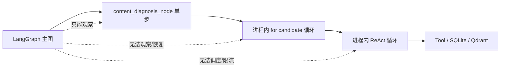
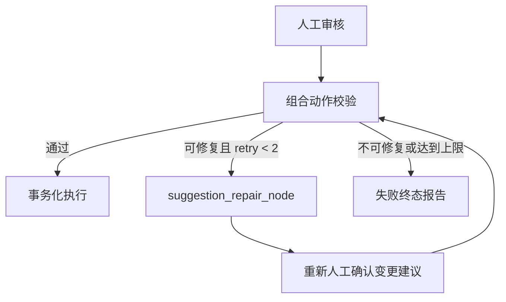
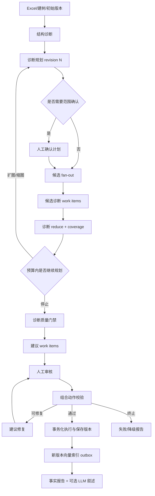

# 智能体架构迭代优化设计

> 日期：2026-07-10
> 状态：架构审计与迭代建议
> 适用范围：M2 内容诊断、M3 建议生成与人工审核、M4 动作执行/版本/报告、M5 可观测工作台
> 依据：当前代码、`00_开发里程碑索引.md`、`04`～`10` 功能设计、`产品标准体系维护智能体_技术架构设计.md`、`架构评审报告.md`

---

## 1. 结论摘要

当前系统已经不再是早期“全部节点硬编码”的骨架：它具备 LangGraph 主流程、DeepSeek tool calling、手写 ReAct loop、Qdrant、人工 interrupt/resume、SQLite checkpointer、版本执行和 SSE。因此，说它“完全不是智能体”并不准确。

但用户的直觉仍然成立：**当前智能决策被封装在少数长时间、进程内、不可恢复的 Python 循环里；LangGraph 只能看到粗粒度节点，无法管理每个候选、每条问题、每次工具调用和每次模型决策。** 它更像“带 LLM 子程序的固定工作流”，还不是可观测、可恢复、可评估、可治理的工程化智能体系统。

最关键的问题不是继续增加更多 LLM 节点，而是把已有智能行为提升为一等执行单元：

1. 候选级/问题级任务可持久化、可重试、可恢复。
2. 工具调用与模型调用有结构化事件、预算、超时和错误分类。
3. 失败不会被后续节点覆盖为“completed”。
4. 规划字段真正影响候选生成和停止条件。
5. 动作、版本、报告和向量索引共享同一条可追溯证据链。

推荐采用“**增量演进方案**”：保留当前确定性主图，将内容诊断和建议生成拆成可恢复的 map-reduce 子图；先解决运行时隔离、幂等和失败语义，再开启有界并发、滚动规划、模型路由和跨 Agent 工作记忆。

---

## 2. 审计范围与当前基线

### 2.1 已核对的主要实现

- LangGraph：`backend/app/agents/graph.py`、`nodes.py`、`states.py`
- Agent loop：`content_diagnosis_service.py`、`suggestion_service.py`
- Tool：`tree_tools.py`、`validation_tools.py`
- 持久化与事件：`checkpoints.py`、`events.py`、`task_repo.py`、`db.py`
- API 与 SSE：`api/workflows.py`
- 执行/版本/报告：`action_service.py`、`version_service.py`、`report_service.py`
- 前端事件消费：`TaskStatusBar.vue`、`WorkflowView.vue`
- M1～M4 后端测试及 M5 前端契约测试

### 2.2 验证基线

2026-07-10 本地执行结果：

- 后端：`54 passed`，1 条第三方 Starlette TestClient 弃用警告。
- 前端：`npm run test:contract` 失败，失败项为上传页缺少“选择已有文件”入口。该失败属于当前工作区已有前端变更，本文件不修改它。

测试通过说明当前单元功能具有一定基础，但现有测试主要验证单候选、单进程、成功路径，尚未覆盖并发工作流、崩溃恢复、重复 resume、模型限流、事件重连和跨版本证据一致性。

---

## 3. 当前实现到底“像不像智能体”

### 3.1 已具备的智能体特征

| 能力 | 当前实现 | 判断 |
|---|---|---|
| LLM 规划 | `DiagnosisPlanningAgent` 调用 DeepSeek 输出 `DiagnosisPlan` | 已有，但为单次静态规划 |
| Tool calling | 内容诊断、建议生成均通过 `bind_tools` | 已有 |
| ReAct 循环 | 每个候选/问题最多多轮模型调用 | 已有 |
| 自校验 | SuggestionAgent 内部校验失败后可反馈重试 | 已有局部闭环 |
| 人工审核 | LangGraph `interrupt()` + `Command(resume=...)` | 已有 |
| 持久化 checkpoint | `SqliteSaver` | 已有，但只覆盖图级 checkpoint |
| 过程事件 | 节点完成/失败事件 + SSE | 已有，但只有节点级 |

### 3.2 不像工程化智能体的根因

LangGraph 只负责“进入内容诊断”和“内容诊断返回”，真正的决策循环、工具调用和候选进度都藏在 service 内。结果是：图级 checkpoint、SSE、路由、重试和人工控制无法作用于最昂贵、最不稳定的部分。

因此当前问题不是“固定 DAG 不智能”，而是**智能行为的执行粒度和编排粒度不一致**。

---

## 4. 对已提出 P0～P3 的核验与修正

### 4.1 P0-1｜Agent loop 黑盒单步：结论成立，且影响不止内容诊断

代码证据：

- `content_diagnosis_node` 一次调用 `ContentDiagnosisAgent.run()`。
- `run()` 在进程内串行遍历候选；每个候选又在进程内执行最多 `max_iter=8` 次模型循环。
- `SuggestionAgent.run()` 也串行遍历全部 pending issue，LLM 型建议最多执行 `max_retry × max_iter = 24` 轮。
- `trace_log` 只存在当前 Agent 实例内，节点退出后不作为工作流事实保存。

风险比“前 47 条全丢”更复杂：`submit_diagnosis` 和 `submit_suggestion` 会在 Agent 循环中直接写 SQLite。因此崩溃时可能出现两种状态：

1. 数据库已经写入部分结果，但图 checkpoint 尚未提交，重跑时会重复或混入旧结果。
2. `diagnosis_issue` 有部分唯一约束，可能复用旧记录；`adjustment_suggestion` 没有等价幂等键，重跑更容易生成重复建议和新 review batch。

所以真正目标不是只“保住列表返回值”，而是建立候选级执行账本和幂等提交协议。

#### 建议

- 将内容诊断拆为 `select_candidates → diagnose_candidate(Send) → reduce_diagnosis`。
- 将 LLM 型建议拆为 `select_issues → generate_issue_suggestion(Send) → reduce_suggestions`。
- 每个工作单元持久化状态：`pending/running/succeeded/retryable_failed/permanent_failed/skipped`。
- 唯一键至少包含 `workflow_id + phase + subject_id + plan_revision`。
- 工作单元成功后只保存结果引用和统计，Graph State 不保存完整结果集合。

### 4.2 P0-2｜串行候选未并行：结论成立，但不能直接并行

当前 50 个候选独立执行，确实未利用并行。然而直接加线程池或直接启用大量 `Send` 会放大三个已有问题：

1. `nodes.py`、`tree_tools.py`、`validation_tools.py` 使用模块级可变 `_runtime_settings`；多个 workflow 可互相覆盖运行时配置。
2. SQLite 未配置 WAL、`busy_timeout` 或单写者策略，多 Agent 同时写入容易出现锁竞争。
3. DeepSeek、Embedding 和 Qdrant 调用没有统一限流、退避和熔断。

#### 正确顺序

1. 取消模块级运行时，使用实例化 Tool/依赖注入或 graph `configurable` context。
2. 引入工作单元状态与幂等键。
3. 配置 SQLite WAL/超时，或采用“并发读与模型调用、集中批量写”的 reducer。
4. 再启用有界并发，初始建议 2～4，按真实限流和 P95 延迟调优。

“2 万节点压到秒级”不应作为承诺。实际耗时受候选数、每候选模型轮数、速率限制和 Qdrant/Embedding 延迟影响；合理目标应由压测结果定义。

### 4.3 P1-1｜校验失败回流：结论成立，但当前失败语义更严重

当前 `route_after_validate` 将校验失败路由到报告，没有图级重生成闭环。SuggestionAgent 内部虽已有一次“生成→校验→反馈→重试”，它只覆盖模型首次生成；无法处理以下情况：

- 人工编辑后造成非法动作。
- 多个单独合法动作组合后冲突。
- 审核到执行之间版本发生变化。

更严重的是，`node_guard` 把失败转换为普通 state update，随后 `generate_report_node` 又把 `status` 写成 `completed`。报告 service 也没有接收失败原因。因此当前不是稳定地“生成失败报告”，而可能是**失败被 completed 覆盖，报告中也没有失败证据**。

#### 建议闭环

必须重新人工确认修复后的建议，不能让 LLM 在用户审核后静默替换动作。

### 4.4 P1-2｜静态规划：结论成立，而且当前计划字段多数没有生效

当前 `DiagnosisPlan` 有四个字段，但候选查询只使用：

- `priority_subtrees`
- `estimated_candidates`

`sample_strategy` 和 `focus_issues` 未参与候选生成。候选 SQL 又只选择 `syn_list` 非空节点，因此即使规划要求诊断 `semantic_duplicate`、`bad_parent_child_relation`、`inconsistent_granularity` 或 `naming_irregular`，没有同义词的节点也不会进入候选集。

这意味着当前 planning 在相当程度上是“可展示但不完全控制执行”的计划。

#### 建议

- 为每类问题实现独立候选生成器，再按 plan 合并、去重和排序。
- `sample_strategy` 明确映射到确定性采样算法，并保存随机种子/查询版本。
- 每批 10～20 个候选执行后汇总命中率、失败率、平均成本和子树密度。
- planner 输出下一批范围、停止、扩圈或缩圈决策；每次产生 `plan_revision`。
- 设置硬预算：最大候选数、模型调用数、token、墙钟时间和最大规划轮数。

### 4.5 P2-1｜单一模型路由与降级：方向成立，但需修正现状描述

当前规划、内容诊断、LLM 型建议使用同一 DeepSeek 配置。**当前报告是模板生成，并未调用 DeepSeek**，与 M4 文档中“LLM 报告生成”的目标仍有差距。

另外，当前“降级”主要是静默跳过：

- 无 DeepSeek key：规划使用 fallback，内容诊断直接返回空列表。
- 无 DashScope key：向量索引和相似查询可被跳过/返回空。
- workflow 仍可能继续并最终显示 completed。

这不是受控降级，而是容易产生 false success。

#### 建议

- 建立 `ModelRouter(task_type)`，配置模型、温度、超时、重试、并发、token 预算和备用端点。
- 依赖不可用时明确返回 `degraded`，并记录哪些能力未运行。
- 报告优先保持“事实模板 + 可选 LLM 叙述增强”；LLM 失败不得影响事实报告生成。
- 前端和报告必须展示 coverage：规划候选数、已诊断数、失败数、跳过原因和依赖状态。

### 4.6 P2-2｜共享工具缓存/工作记忆：结论成立

当前内容诊断和建议生成都可能重复调用节点详情、路径、子节点和向量召回。建议按 `workflow_id + version_id + tool_name + normalized_args + data_revision` 建立读穿缓存。

缓存分两类：

- 确定性 DB 查询：可在 workflow 生命周期内缓存。
- Qdrant/Embedding 查询：需要记录 embedding model、collection revision、top_k 和过滤条件。

缓存只能用于只读工具；提交诊断、提交建议、动作执行等副作用工具不得缓存。

### 4.7 P2-3｜外部 QA 闭环：结论成立

应新增独立于生成 Agent 的评估过程，避免“自己生成、自己校验、自己宣布正确”。Golden set 应覆盖问题定位和动作质量两个层面：

- 诊断：precision、recall、F1、类型准确率、节点定位准确率。
- 建议：结构合法率、动作可执行率、人工接受率、人工编辑率、危险动作漏拦截率。
- 运行：候选覆盖率、失败率、重试率、每条有效问题成本、P50/P95 延迟。

评估节点不应阻塞所有生产流程。建议对课程 demo 固定数据强制门禁，对普通用户数据输出质量标签和人工 triage 队列。

### 4.8 P3-1｜昂贵步骤前人工范围确认：方向成立，建议做成策略化 interrupt

不要让每次运行都强制多一次点击。建议配置：

- `auto`：低成本、小范围、可信计划自动执行。
- `confirm`：候选数/token 预算超过阈值或跨多个高风险子树时人工确认。
- `always_confirm`：课程演示或审计模式始终确认。

人工确认后应冻结 `plan_revision` 和预算快照，保证后续执行与用户看到的范围一致。

### 4.9 P3-2｜State 变胖与工具散落：部分成立，需要精确区分

- `completed_steps` 最多是图节点数量，当前不会随 2 万节点线性增长，不是主要膨胀源。
- `executed_nodes` 会保存完整节点快照，是显著膨胀源；它还会进入 LangGraph checkpoint 和 `task_record.result_payload`。
- Agent 的 `trace_log` 虽不在 State，却随单节点执行增长，且不可持久恢复。

建议 State 只保留协调信号、计数、版本 ID、批次 ID、结果引用和预算摘要。完整节点快照、候选结果、工具事件与模型响应落独立表/对象文件。

工具注册表应至少声明：所属 Agent、输入 schema、只读/副作用、幂等策略、超时、缓存策略、成本等级、允许暴露给模型的参数和事件脱敏规则。

---

## 5. 代码和文档之外新增发现

### 5.1 P0｜失败传播错误：任意上游失败可能继续执行并被覆盖

`node_guard` 捕获异常后返回 `status=failed`，但主图除 `validate_action_node` 外没有统一的失败路由。上游失败后，固定边仍会进入后续节点；后续 `_complete_step` 又默认把状态改回 `running`，报告最终改为 `completed`。

#### 改进

- 不要把异常统一吞成普通成功返回；可重试错误进入 retry，永久错误进入失败终态。
- 每个可失败节点使用统一 `route_after_node`，或用子图统一处理 success/retry/fail。
- `completed` 的不变量：所有必需阶段成功，或明确声明 `completed_degraded` 且带 coverage。
- 报告区分成功报告、降级报告和失败报告。

### 5.2 P0｜运行时全局变量使并发 workflow 不安全

`configure_workflow_runtime`、`configure_tree_tool_runtime`、`configure_validation_tool_runtime` 都会修改模块级全局对象。并发运行不同数据库、不同 Qdrant store 或不同配置时，后启动任务可能改变先启动任务的工具行为。

#### 改进

- Tool 必须由 workflow-scoped factory 创建，闭包捕获只读依赖。
- Agent 构造函数接收 tool registry，不再调用全局 configure。
- graph build 不修改全局 settings；通过依赖容器或 `RunnableConfig` 传递运行上下文。
- 增加两个 workflow 并发、不同临时数据库的隔离测试。

### 5.3 P0｜图 checkpoint 与业务副作用不具备原子性/幂等性

当前副作用发生在 Agent 内部或多个 repository 连接中，LangGraph checkpoint 位于另一个 SQLite 文件。以下 crash window 会产生不一致：

1. 已写 diagnosis/suggestion，但尚未 checkpoint。
2. 已把 suggestion 标记 executed，但尚未保存新版本。
3. 已创建 taxonomy_version，但节点快照尚未完整写入。
4. 已保存新版本，但未完成 Qdrant 新版本索引。

文档 §14.3 要求 `batch_id/idempotency_key`，当前实现仅部分满足；`save_new_version` 没有按 `action_batch_id` 去重，版本号也没有数据库唯一约束。

#### 改进

- 对每个副作用定义 idempotency key 和唯一索引。
- 动作状态更新、新版本创建、节点快照、operation_log 尽量在同一业务事务提交。
- `taxonomy_version` 增加唯一约束 `(file_id, version_no)`，并保存 `source_version_id/action_batch_id/workflow_id`。
- 外部 Qdrant 用 outbox/eventual consistency：业务事务写 `vector_index_job`，成功后再标记 ready。
- checkpoint 恢复时根据业务账本对账，而不是盲目重放工具。

### 5.4 P0｜工作流结果缺少 run 级隔离，多个 workflow 会互相污染

`diagnosis_issue` 只关联 `version_id`，没有 `workflow_id/diagnosis_run_id`。`SuggestionAgent` 会读取该版本全部 pending issue。对同一 file/version 重复启动 workflow 时：

- 结构诊断 `replace_issues` 会删除该版本已有诊断，包括另一运行的内容问题。
- 建议生成可能读取旧运行的问题。
- 报告无法区分本次运行发现的问题与历史问题。

#### 改进

- 新增 `diagnosis_run`/`agent_run`，issue 关联 `run_id`。
- 结构问题和内容问题分来源写入，不再以“删除整个 version 的 issue”刷新。
- suggestion 关联 `workflow_id/run_id/issue_id`，生成只读取当前 run 的可处理问题。
- 同一 file 是否允许多个活跃 workflow 必须有显式策略：拒绝、复用或排队。

### 5.5 P0｜计划不能覆盖声明的问题类型，Agent 的“自主范围”被硬编码候选 SQL 限制

当前候选只来自 `syn_list` 非空节点，无法系统性覆盖无同义词的重复、父子异常、粒度和命名问题。`focus_issues` 未被使用，导致规划和实际执行不一致。

#### 改进

定义候选生成器注册表：

| 问题类型 | 候选生成器 |
|---|---|
| synonym_pollution | 同义词非空、异常词规则、同义词 embedding 偏离 |
| semantic_duplicate | 同名组、名称/路径向量近邻、跨子树相似 |
| bad_parent_child_relation | 父子语义低相似、结构异常路径 |
| inconsistent_granularity | 同级节点层级/概念粒度特征异常 |
| naming_irregular | 命名规则、长度、符号和领域词典异常 |

planner 只决定调用哪些候选生成器、范围与预算；候选生成本身保持确定性、可复现。

### 5.6 P1｜缺少明确的“无问题”终止动作

ContentDiagnosisAgent 只把 `submit_diagnosis` 视为成功终止。如果模型判断“没有问题”且不调用工具，代码会反复提示继续，直到 `max_iter`，最后把正常负样本和 Agent 失败都返回 `None`。

#### 改进

- 增加结构化终止：`submit_diagnosis_result(is_issue, reason, confidence, evidence_refs)`。
- `is_issue=false` 是成功结果，必须持久化 coverage，而不是丢弃。
- 区分 `clean`、`issue_found`、`inconclusive`、`failed`、`skipped`。

### 5.7 P1｜工具参数由模型提供，缺少 workflow scope 强约束

工具向模型暴露 `version_id/category_id`，`submit_diagnosis` 直接信任模型传入的 version 和 node。模型输出错误参数时可能查询或写入非当前工作流对象。

#### 改进

- `version_id/workflow_id/subject_id` 由运行上下文注入，不允许模型覆盖。
- 模型只选择受限业务参数，例如 `top_k`、查询目的；`top_k` 需硬上限。
- 副作用工具提交前验证 issue 的 node 与当前 work item 一致。
- taxonomy 文本视为不可信数据，prompt 中明确数据边界，防止 Excel 内容诱导工具调用。

### 5.8 P1｜不应向前端暴露原始 Thought/chain-of-thought

M5 文档希望展示 Thought-Action-Observation，但生产系统不应持久化或展示模型原始隐藏推理。它可能包含敏感输入、无关推测、提示词和不可稳定依赖的内容。

#### 改进

前端展示“可审计决策摘要”而非原始 Thought：

- 当前对象与阶段。
- 决策摘要/证据摘要。
- 调用的工具、脱敏参数和结果摘要。
- 模型、耗时、token、重试次数。
- 最终结论、置信度和 evidence refs。

事件名建议统一为 `agent_step`、`agent_tool_started`、`agent_tool_completed`、`agent_decision`，不使用 `agent_thought` 作为对外契约。

### 5.9 P1｜新版本、诊断、建议、报告和向量索引的证据链断裂

动作成功后 `current_version_id` 指向新版本，随后报告按新版本查询 issue/suggestion；但这些记录仍属于基础版本，所以报告可能显示为空。技术架构又要求新版本更新 Qdrant，当前主图在保存新版本后没有 reindex。

此外，报告统计还有两个一致性问题：

- `issue_summary` 已包含内容问题，当前又加 `content_issue_count`，质量计算会重复计数。
- “结构问题总数”使用全部 issue 类型汇总，也会混入内容问题。

#### 改进

- taxonomy_version 保存显式 lineage：`source_version_id/workflow_id/action_batch_id`。
- 报告输入改为 `workflow_id + analyzed_version_id + result_version_id`，而不是仅一个 version_id。
- 诊断和建议保持在 analyzed version，报告通过 workflow/run 关联读取。
- 新版本保存后触发 `index_new_version_node`；完成前版本标记 `vector_status=pending`。
- 结构/内容类型使用显式枚举过滤，避免重复计数。

### 5.10 P1｜后台任务与“重启可恢复”能力被高估

workflow 通过 FastAPI `BackgroundTasks` 在 Web 进程内运行。SQLite checkpointer 可以保存图状态，但服务重启后：

- 正在运行的后台任务不会自动恢复。
- `task_record` 可能永久停留在 running。
- 只有处于人工 interrupt 且用户再次调用 resume 的场景有较明确恢复入口。
- `/resume` 当前同步执行剩余图，长执行仍可能占用 HTTP 请求。

#### 改进

- 增加 durable worker/任务领取机制；课程 MVP 可用数据库队列 + 单独 worker 进程。
- 应用启动时扫描 `running` 且 lease 过期的工作单元并重排。
- start/resume API 只提交命令并快速返回，不在请求内执行长图。
- 增加 cancel API、取消检查点和资源清理；State 已声明 cancelled，但当前没有实现路径。

### 5.11 P2｜SSE 只有节点完成事件，重连语义不完整

当前没有 node started、candidate progress 和 tool event。SSE frame 也没有 `id:`，未消费 `Last-Event-ID`；浏览器重连会从事件 0 重放，产生重复日志。

#### 改进

- 每条事件包含单调 `sequence/id`，SSE 输出 `id: <event_id>`。
- 读取 `Last-Event-ID` 或 query cursor，从下一条继续。
- 前端按 event_id 去重。
- 事件表为 `(workflow_id, id)` 建索引并设置保留策略。
- `workflow_interrupt` 后恢复应产生新 stream epoch 或允许同一连接继续。

### 5.12 P2｜workflow_id 生成存在秒级碰撞

`workflow_id` 由 `file_id + 秒级时间戳` 生成。同一文件同一秒启动两次会共享 workflow_id/thread_id，造成事件和 checkpoint 混淆。

建议使用 UUID/ULID，并在 task/workflow 表建立唯一约束。

### 5.13 P2｜模型输出解析、重试与成本治理不足

- planner 用贪婪正则提取 JSON，没有原生 structured output、schema retry 或错误分类。
- 内容诊断模型错误会中断整个节点，没有候选级退避。
- Tool 调用缺少统一 timeout；`get_children` 和 `top_k` 结果缺少上下文大小预算。
- 没有记录 token、模型调用次数、缓存命中和单候选成本。

建议统一 `ModelGateway` 与 `ToolExecutor`，集中实现 structured output、指数退避+jitter、Retry-After、超时、熔断、预算和指标。

---

## 6. 三种演进方案比较

| 方案 | 做法 | 优点 | 缺点 | 结论 |
|---|---|---|---|---|
| A. 最小补丁 | 保留 service 内循环，只增加事件回调、try/except 和线程池 | 改动小、短期演示快 | 仍不能候选级 checkpoint；副作用和重跑问题未根治；并发放大全局状态风险 | 仅适合临时演示，不推荐作为主线 |
| B. 增量子图 | 主图不变，内容诊断/建议生成改为持久化 work item + Send/map-reduce 子图 | 能复用现有 service/repo；逐步获得恢复、并发、可观测和评测能力 | 需要新增 run/work item/event 数据模型和迁移 | **推荐** |
| C. 全面任务平台化 | 引入独立队列、分布式 worker、完整 tracing/eval/model gateway | 扩展性和可靠性最佳 | 对本地课程项目过重，交付风险高 | 作为未来演进，不在当前迭代一次完成 |

推荐 B，并吸收 C 的接口边界：先在 SQLite + 单机 worker 上实现，接口保持可替换，后续需要时再迁移到 Postgres/Redis/Celery 等基础设施。

---

## 7. 推荐目标架构

### 7.1 主图

### 7.2 执行单元数据模型

建议新增最小数据结构：

#### `agent_run`

- `id`
- `workflow_id`
- `agent_type`
- `version_id`
- `plan_revision`
- `status`
- `model_profile`
- `budget_json`
- `coverage_json`
- `started_time/completed_time`

#### `agent_work_item`

- `id`
- `run_id`
- `subject_type`：candidate/issue/suggestion
- `subject_id`
- `status`
- `attempt/max_attempts`
- `lease_owner/lease_expires_at`
- `input_ref/result_ref`
- `error_code/error_message`
- `started_time/updated_time/completed_time`
- 唯一键：`(run_id, subject_type, subject_id)`

#### `agent_event`

- `event_id/sequence`
- `workflow_id/run_id/work_item_id`
- `agent_name`
- `event_type`
- `phase/tool_name`
- `summary_json`
- `latency_ms/model/token_usage`
- `attempt/status/created_time`

现有 `workflow_event` 可先扩展承载 `agent_event`，当事件量增长后再拆表。

### 7.3 Graph State 瘦身目标

保留：

- identity：workflow/thread/task ID
- 当前版本与运行 ID
- 状态、路由信号、计数和 coverage
- review/action/report 引用
- retry/budget/plan revision
- error code 和终态原因

移出：

- `executed_nodes` 完整快照
- 完整候选列表
- Agent trace 文本
- 完整模型输入输出
- 大型 review payload

### 7.4 统一错误分类

| 类别 | 示例 | 处理 |
|---|---|---|
| retryable_external | 429、5xx、网络超时、Qdrant 暂不可用 | 有界重试、退避、熔断 |
| retryable_internal | SQLite busy、worker lease 超时 | 重领工作单元 |
| permanent_input | Excel 字段错误、节点不存在、非法动作 | 立即失败/人工修复 |
| model_output_invalid | schema 不合法、未知 tool、越权参数 | schema retry，超过上限失败 |
| budget_exhausted | token/调用数/时间超过预算 | completed_degraded + coverage |
| cancelled | 用户取消 | 停止新工作单元，安全收尾 |

---

## 8. 分阶段迭代路线图

### I0｜语义修复与运行时隔离（P0，先做）

#### 范围

1. 统一失败路由，禁止失败被后续节点覆盖为 completed。
2. 消除 workflow/tool 模块级可变 runtime。
3. 增加 run/workflow 隔离字段；停止按 version 全量删除问题。
4. 明确依赖降级状态，不再把未运行内容诊断显示为“未发现问题”。
5. 修复新版本报告的证据来源、结构/内容重复计数。
6. workflow_id 改 UUID/ULID。

#### 验收

- 任一必需节点失败后不会执行高风险后续节点。
- 两个不同 settings 的 workflow 并发运行无串库。
- 无 LLM/Qdrant 时状态明确为 degraded，报告展示未覆盖范围。
- 新版本报告仍能引用本次基础版本的诊断、建议和动作。

### I1｜候选级持久化与可恢复执行（P0）

#### 范围

1. 新增 `agent_run/agent_work_item`。
2. 内容诊断改为 select/map/reduce 子图。
3. 增加 clean/issue/inconclusive/failed 终止状态。
4. 候选结果幂等提交，恢复时只执行 pending/retryable work item。
5. SuggestionAgent 至少先增加 issue 级 work item；LLM 建议再拆 map。

#### 验收

- 第 48 个候选注入故障后，恢复只重试失败/未执行项。
- 进程在提交候选结果前后分别崩溃，均不重复 issue。
- dashboard 可看到候选总数、成功、clean、issue、失败、剩余。

### I2｜结构化 Agent 事件与 SSE 续传（P0/P1）

#### 范围

1. 持久化 agent/tool/model 结构化事件。
2. 不输出原始 chain-of-thought，只输出决策/证据摘要。
3. SSE 支持 event id、Last-Event-ID 和去重。
4. 增加 node started、candidate progress、retry、budget 事件。

#### 验收

- 前端能按候选展示工具调用与结论摘要。
- 断开并重连 SSE 后不丢失、不重复已确认事件。
- 事件 payload 不含 API key、完整 prompt、原始隐藏推理和未脱敏大对象。

### I3｜有界并发、退避与 durable worker（P0/P1）

#### 范围

1. DeepSeek/Qdrant/Embedding 分资源 semaphore。
2. 429/5xx/timeout 指数退避、jitter、熔断。
3. SQLite WAL/busy_timeout；优先集中 reducer 写入。
4. start/resume 改为提交命令，worker 异步执行。
5. lease、重启恢复、cancel。

#### 验收

- 并发 2/4/8 压测给出吞吐、P95、429、DB lock 和成本曲线。
- worker 强制退出后能自动恢复 lease 过期 work item。
- 同一 work item 不会被两个 worker 成功提交两次。

### I4｜真正生效的计划与 Reflexion 闭环（P1）

#### 范围

1. 候选生成器注册表覆盖五类内容问题。
2. plan 的四个字段全部映射到执行行为。
3. 每批运行后滚动规划，硬预算停止。
4. 可选计划确认 interrupt。
5. 图级 suggestion repair，修复后重新人工审核，最多 2 次。

#### 验收

- 测试可证明关闭某 focus issue 后相应候选不会进入执行。
- 高密度子树可扩圈，连续低命中批次可停止。
- 人工编辑非法建议能收到定向修复，新建议不会绕过复审。

### I5｜模型路由、共享工作记忆与 QA 门禁（P2）

#### 范围

1. ModelRouter + fallback + 成本/延迟指标。
2. 只读工具 read-through cache。
3. Golden set 评估和置信度校准。
4. 低置信度/高分歧进入 triage。
5. 事实模板报告 + 可选模型叙述层。

#### 验收

- 主模型故障时按策略降级，不丢失事实报告。
- 缓存命中显著降低重复 Qdrant/Embedding 调用。
- Demo golden set 输出可复现 precision/recall/F1。
- 发布门禁包含危险动作漏拦截率和回归阈值。

---

## 9. 指标与质量门禁

### 9.1 可靠性

- work item 成功率/重试率/永久失败率
- workflow 恢复成功率
- 重复 issue/suggestion/version 数
- SQLite busy/lock 次数
- checkpoint 与业务账本不一致数

### 9.2 性能与成本

- 每候选模型调用次数、tool 次数、token、费用
- 单候选与全流程 P50/P95/P99
- 并发度与 429/5xx 的关系
- 缓存命中率
- 每发现一个有效问题的成本

### 9.3 智能质量

- 候选覆盖率
- precision/recall/F1
- inconclusive 比例
- suggestion 校验首次通过率
- 人工接受率、编辑率、拒绝率
- 高风险动作错误放行率（目标应为 0）

### 9.4 终态不变量

workflow 标记 completed 前必须满足：

1. 所有 required work item 为 succeeded/clean/skipped_by_policy。
2. retryable item 已清零或达到预算并转为 degraded。
3. approved 动作全部校验且执行结果可对账。
4. 新版本快照完整；若向量索引异步，明确显示 pending/ready。
5. 报告引用本次 workflow/run 的事实数据。

---

## 10. 必补测试矩阵

| 场景 | 预期 |
|---|---|
| 第 N 个候选模型超时 | 仅当前 item 重试，其他成功结果保留 |
| 模型提交错误 version/node | Tool scope 拒绝，不写数据库 |
| 模型判断无问题 | work item=clean，不消耗至 max_iter |
| 429 + Retry-After | 按策略退避，不形成请求风暴 |
| 两 workflow 并发、不同 DB | 无 runtime 串扰 |
| 同 file 同时启动两次 | 按策略拒绝/排队/隔离，不混 run |
| suggestion 写入后进程崩溃 | 恢复不生成重复建议 |
| 动作标记 executed 后崩溃 | 恢复能对账并完成/回滚版本事务 |
| 重复 resume | 幂等，不生成第二个新版本 |
| SSE 重连 | 从 Last-Event-ID 续传且前端去重 |
| LLM key 缺失 | completed_degraded，coverage 明确 |
| 新版本报告 | 包含基础版本诊断、本次建议和动作证据 |
| 新版本 Qdrant | 最终 ready，查询只命中新版本点 |
| 用户取消 | 停止领取新 item，已运行 item 安全收尾 |

---

## 11. 设计文档需要同步修订的内容

1. `00_开发里程碑索引.md`
   - 在 M2/M3 后增加“工程化智能体 I0～I5”路线或新 M6。
   - M5 的“Thought-Action-Observation”改为“决策摘要-工具调用-证据摘要”。
   - 补 run/work item 幂等和 degraded 终态。

2. `04_向量索引与内容诊断开发设计.md`
   - 将 service 内 `for candidate` 伪代码替换为 map-reduce 子图。
   - 明确五类候选生成器、negative terminal、candidate retry 和 coverage。

3. `05_智能建议生成开发设计.md`
   - 增加 issue 级执行单元和图级 repair loop。
   - 明确修复后的建议必须重新人工审核。

4. `07_动作执行与版本管理开发设计.md`
   - 增加业务事务、idempotency key、版本 lineage、唯一约束和 Qdrant outbox。

5. `08_导出与诊断报告开发设计.md`
   - 报告入参改为 workflow/run 证据上下文。
   - 区分 success/degraded/failed 报告。

6. `09_前端工作台开发设计.md`
   - 增加候选覆盖、预算、重试、降级和事件续传 UI。
   - 删除对原始 Thought 的展示要求。

7. `10_LangGraph智能体工作流开发设计.md`
   - 主图中加入诊断/建议子图、统一失败路由、滚动规划和建议修复回路。
   - State 设计改为引用型状态。

---

## 12. 明确不建议做的事

- 不要为了“更像 Agent”把 Excel 解析、结构规则、动作校验和数据库执行交给 LLM。
- 不要在消除全局 runtime 和 SQLite 写入风险前直接开启 50 路并发。
- 不要把原始 chain-of-thought 当作可观测性或产品功能。
- 不要仅靠 LangGraph checkpoint 宣称业务副作用 exactly-once。
- 不要把没有 API key、Qdrant 不可用或预算耗尽解释为“未发现问题”。
- 不要在校验失败后由模型静默替换用户已经审核的动作。
- 不要一次引入分布式队列、Postgres、Redis 和全套评测平台；先在本地架构中建立正确边界。

---

## 13. 推荐实施顺序（一句话版）

**I0 修失败语义与运行隔离 → I1 候选级账本与恢复 → I2 结构化事件 → I3 有界并发与 worker → I4 滚动规划/修复闭环 → I5 模型路由/缓存/QA。**

完成 I0～I2 后，系统才真正具备“可解释、可恢复的智能体”基本形态；完成 I3～I5 后，才具备面向 2 万节点数据的性能、质量与演示可信度。
