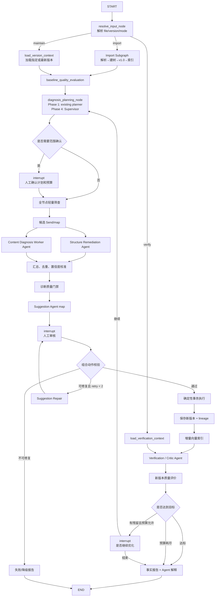

# 标准产品体系维护多智能体最终设计

> **目标架构（TARGET）**：本文描述长期目标，不表示相关能力已经实现，也不直接决定近期开发顺序。当前事实见 `CURRENT_IMPLEMENTATION.md`，近期路线见 `ROADMAP.md`。

> 日期：2026-07-10
> 状态：待评审终局设计
> 适用范围：在已完成 M1～M5 的基础上，将一次性 Excel 分析流水线升级为版本驱动、可恢复、可评价、可持续迭代的多智能体维护平台。
> 历史前置文档：`archive/00_开发里程碑索引.md`、`10_LangGraph智能体工作流开发设计.md`、`archive/11_智能体架构迭代优化设计.md`

---

## 1. 设计结论

采用以下终局架构：

> **版本驱动的确定性 LangGraph 主干 + 专职 Agent 子图 + 质量评价与反思闭环。**

本方案不推翻 FastAPI、SQLite、Qdrant、LangChain、LangGraph 和 Vue 技术栈，也不重写已经完成的 Excel、分类树、诊断规则、审核、动作执行、版本 diff/rollback/export 等能力。重构重点集中在：

1. workflow 从 `file_id` 驱动升级为 `file_id/base_version_id + workflow_mode` 驱动。
2. 内容诊断和建议生成从节点内串行循环升级为候选/问题级可恢复工作单元。
3. 新版本生成后增加重新索引、质量评价和 Verification/Critic 反思闭环。
4. 增加真正可执行的结构拆分、合并、弃用和叶子删除动作。
5. 建立 Agent 运行、工具调用、历史审核和质量评估的持久化记忆。

确定性操作继续由程序完成，LLM 只负责语义判断、规划、方案生成、解释和反思。高风险动作必须经过人工审核。

---

## 2. 产品目标对齐

| 原始需求 | 目标能力 | 本设计的实现方式 |
|---|---|---|
| 结构合理性检测 | 检测深度、宽度、断链、重复结构 | 全量确定性 StructureDiagnosisService |
| 自动给出结构调整建议 | 输出完整拆分、扁平化、补父、合并方案 | StructureRemediationAgent + simulate/validate tools |
| 自动完成结构调整 | 审核后程序执行并生成新版本 | ActionExecutor + 事务 + Human-in-the-loop |
| 检测每个节点的内容问题 | 每个节点都经过低成本筛查 | 全量规则/向量 screening，疑似项进入 Agent 深诊断 |
| 冗余与父子关系治理 | 合并/弃用/叶子删除/移动 | ContentDiagnosisWorker + SuggestionAgent + ActionExecutor |
| 体系质量评价 | 量化评分、解释、前后对比 | MetricsService + QualityEvaluationAgent |
| 历史版本维护 | 快照、lineage、diff、回滚、继续优化 | VersionService + version-centric workflow |

---

## 3. 设计原则

1. **规则优先**：结构完整性、循环依赖、动作合法性等确定性问题不交给 LLM。
2. **Agent 有边界**：每个 Agent 必须声明目标、输入、工具、输出、预算和停止条件。
3. **证据驱动**：诊断和建议必须引用节点、路径、相似结果或结构统计证据。
4. **版本不可变**：原始 Excel 和历史版本不原地修改，每次执行生成新快照。
5. **先模拟后执行**：所有动作先在内存快照中模拟、校验并生成 diff。
6. **高风险人审**：merge、split、批量 move、删除等动作必须人工确认。
7. **可恢复**：候选级任务失败只重试当前任务，不重跑整个 Agent 节点。
8. **可评价**：修改前后必须使用同一评分版本计算，不能只展示“执行成功”。
9. **有限自治**：所有 Agent 都受候选数、调用数、token、墙钟时间和轮次预算限制。
10. **不暴露原始推理**：前端展示决策摘要、工具和证据，不展示原始 chain-of-thought。

---

## 4. 方案选择

| 方案 | 优点 | 缺点 | 选择 |
|---|---|---|---|
| 单一万能 Agent | 演示简单 | 上下文过大、不可控、不可恢复、工具权限过宽 | 不采用 |
| 当前固定图加事件/线程池 | 改动小 | 仍是节点内黑盒，无法形成版本评价和反思闭环 | 仅作为过渡 |
| 分层多 Agent + 确定性主干 | 边界清晰、可恢复、可评价、可迭代 | 需要扩展 State、数据模型和子图 | **采用** |

多 Agent 的目的不是增加 Agent 数量，而是隔离不同决策责任，避免一个模型同时承担规划、证据判断、动作生成、质量评价和执行授权。

---

## 5. Agent 角色设计

### 5.1 Maintenance Supervisor Agent

职责：

- 读取基础版本、质量基线、结构统计和历史维护结果。
- 制定本轮维护范围、问题类型、候选预算和停止条件。
- 根据批次命中率、成本和风险决定扩圈、缩圈或停止。
- 决定是否触发诊断范围人工确认。

只读工具：

- `get_tree_overview`
- `get_quality_evaluation`
- `get_issue_distribution`
- `get_maintenance_history`
- `estimate_diagnosis_cost`

输出：`MaintenancePlan`

```json
{
  "base_version_id": 3,
  "plan_revision": 1,
  "targets": [
    {
      "issue_type": "wide_node",
      "priority_subtree_ids": [1001],
      "candidate_budget": 10
    },
    {
      "issue_type": "bad_parent_child_relation",
      "priority_subtree_ids": [2001, 2002],
      "candidate_budget": 50
    }
  ],
  "max_model_calls": 120,
  "max_rounds": 2,
  "require_scope_review": true,
  "target_quality_score": 85.0
}
```

跨阶段实现契约：

- PLAN 的 LangGraph 节点名始终是 `diagnosis_planning_node`，阶段间不改变主图接口。
- 阶段一复用当前 `DiagnosisPlanningAgent`，只生成单次静态 `DiagnosisPlan`；它不是空占位，也不支持批次反馈。
- 阶段二、三继续消费相同的计划输出，并通过 adapter 补齐默认预算字段。
- 阶段四将节点内部 service 替换为 `AdaptivePlanningService` 驱动的 Maintenance Supervisor，增加 plan revision、批次反馈和扩圈/缩圈循环。
- 因此阶段一的实际路径是 `baseline_quality_evaluation → diagnosis_planning_node(existing) → screening/content diagnosis`，不能跳过 PLAN。

停止条件：

- 达到目标质量分。
- 连续两个批次命中率低于阈值。
- 达到候选、模型调用、token、时间或轮次预算。
- 用户取消或选择结束。

### 5.2 Structure Remediation Agent

职责：把规则检测出的结构问题转换为完整、可模拟、可审核的治理方案。

工具：

- `get_subtree`
- `get_children`
- `cluster_children`
- `search_similar_nodes`
- `simulate_action_batch`
- `validate_split_plan`
- `validate_action`

主要输出：

- 过宽节点 → 完整 `split_subtree` 分组方案。
- 过深路径 → `move_node`/中间层合并方案。
- 父节点缺失 → `add_node` 或合法根节点挂载方案。
- 重复结构 → `merge_node`/`mark_as_valid` 方案。

`split_subtree` 必须保证：

1. 所有原直接子节点均被分配。
2. 每个子节点只出现一次。
3. 新分组名称在同级下不重名。
4. 分组数和单组宽度满足阈值。
5. 模拟后路径和层级合法。

### 5.3 Content Diagnosis Worker Agent

职责：对单个候选节点进行证据驱动的内容诊断。

工具：

- `get_node_detail`
- `get_node_path`
- `get_parent_detail`
- `get_children`
- `get_siblings`
- `search_similar_nodes`
- `submit_diagnosis_result`

输出状态必须是：

- `clean`
- `issue`
- `inconclusive`
- `failed`
- `skipped`

输出示例：

```json
{
  "candidate_id": 441,
  "status": "issue",
  "issue_type": "bad_parent_child_relation",
  "reason": "节点语义与当前父节点不一致",
  "evidence": [
    {"type": "current_path", "value": "食品 > 水果 > 手机"},
    {"type": "better_parent", "node_id": 900, "score": 0.91}
  ],
  "confidence": 0.92
}
```

停止条件：提交结构化结论、达到最大迭代数、达到预算、被取消或发生永久错误。

### 5.4 Suggestion Agent

职责：把当前诊断 run 的问题转换为结构化动作，并完成模拟和自校验。

循环：

```text
读取问题证据
→ 查询目标上下文
→ 生成动作
→ simulate_action_batch
→ validate_action
→ 失败原因反馈
→ 最多修复 2 次
→ 提交待审核建议
```

允许动作：

- `add_node`
- `move_node`
- `rename_node`
- `merge_node`
- `deprecate_node`
- `delete_leaf_node`
- `clean_synonym`
- `split_subtree`
- `mark_as_valid`

修复后的建议必须重新进入人工审核，不能静默替换已审核动作。

节点状态不变量：任意 `active` 节点的祖先链必须全部为 `active`。`deprecate_node` 默认要求目标在动作模拟后的快照中没有 active children；若同批 `move_node` 已把 children 迁走则允许弃用，或使用显式 `cascade` 策略把完整子树一起弃用。禁止出现 deprecated 父节点下仍挂 active children 的正式版本。

### 5.5 Quality Evaluation Agent

质量评分由确定性 MetricsService 计算，Agent 负责解释、归因和给出维护优先级，不负责自由打分。

100 分模型：

| 维度 | 分值 | 主要指标 |
|---|---:|---|
| 结构完整性 | 25 | 缺失父节点、环、孤立节点、路径一致性 |
| 层级与分支均衡度 | 20 | 深度、宽度、子树分布 |
| 父子语义一致性 | 20 | 父子向量相似、异常关系比例 |
| 节点冗余度 | 15 | 同名、语义重复、可合并节点 |
| 命名与同义词规范性 | 10 | 命名规则、同义词污染 |
| 诊断覆盖与可信度 | 10 | screening 覆盖率、深诊断覆盖率、inconclusive 比例 |

输出：

- 总分和各维度分。
- 指标明细和证据引用。
- 主要风险和扣分来源。
- 与父版本的分数差异。
- 下一轮维护优先级。

评分公式必须带 `score_version`，历史版本使用同一公式才能直接比较。

### 5.6 Verification / Critic Agent

职责：验证动作是否解决原问题，是否引入回归，以及是否需要下一轮维护。

输入：

- analyzed version 和 result version。
- 执行动作与 diff。
- affected node IDs。
- 修改前后质量评价。
- 原问题证据和新版本复检结果。

输出：

```json
{
  "verification_status": "partially_passed",
  "resolved_issue_ids": [1, 2, 3],
  "unresolved_issue_ids": [4],
  "introduced_issue_ids": [19],
  "quality_delta": 6.7,
  "next_decision": "ask_continue",
  "reason": "质量有所提升，但目标子树仍有一个高风险父子关系问题"
}
```

问题对比必须在同一 verification scope 上对基础版本和结果版本运行同版本的检测器，再以稳定 fingerprint 做集合差：

```text
baseline fingerprints = B
result fingerprints   = R
resolved   = B - R
unresolved = B ∩ R
introduced = R - B
```

fingerprint 至少包含 `detector_version + issue_type + logical_node_id + normalized_evidence_key`。verification scope 由动作 diff 推导，包含 affected nodes、路径发生变化的 descendants、old/new parents 及其直接 children；不能只检查动作 target 本身。introduced issue 是结果版本在该对称复检范围中新出现、基础版本不存在的 fingerprint。

路由决策必须受确定性策略约束：

- 存在高风险回归 → 失败/人工处理，禁止自动进入下一轮执行。
- 质量达标且原问题解决 → 报告。
- 未达标、仍有预算且无高风险回归 → 询问用户是否继续。
- 达到轮次或预算上限 → 降级完成并报告残留问题。

---

## 6. 确定性组件边界

以下组件不是 Agent：

- Excel 解析、字段校验。
- 分类树构建、路径计算。
- 结构规则扫描。
- 向量索引写入。
- 动作 schema 校验、循环检测、同级重名检测。
- 动作事务执行。
- 版本号生成、节点快照保存、diff、rollback、export。
- 原始质量指标计算。

Agent 只能查询、规划、模拟、解释和提交候选动作；不能直接修改 `category_node`、正式版本、Qdrant 或原始 Excel。

---

## 7. 最终 LangGraph 拓扑



---

## 8. Workflow 模式与版本连续性

### 8.1 Import

```json
{
  "mode": "import",
  "file_id": 1
}
```

执行 Excel 解析、建树、v1.0 保存和初始索引。

### 8.2 Maintain

```json
{
  "mode": "maintain",
  "base_version_id": 2,
  "max_rounds": 2
}
```

对指定版本执行维护。未传 `base_version_id` 但传 `file_id` 时，选择该文件最新版本，禁止固定回到 v1.0。

### 8.3 Verify

```json
{
  "mode": "verify",
  "base_version_id": 2,
  "result_version_id": 3
}
```

只运行重新索引、受影响范围复检、质量评价和结果报告，不生成新建议。

### 8.4 版本 lineage

`taxonomy_version` 增加：

- `parent_version_id`
- `source_workflow_id`
- `analysis_run_id`
- `action_batch_id`
- `vector_index_status`
- `vector_index_generation`
- `verification_status`

版本不可原地修改。继续优化时以 result version 作为下一轮 base version。

---

## 9. 全节点覆盖与性能策略

“检测每一个节点”通过两阶段实现，不能对 2 万节点逐个执行 LLM ReAct。

### 9.1 全量轻量筛查

每个节点执行：

- 结构规则。
- 命名规则。
- 同义词基本规则。
- 父子 embedding 相似度。
- 同名/向量近邻重复召回。
- 层级和同级分布异常检测。

所有节点记录 `screened=true` 和筛查规则版本，从而提供真实 coverage。

### 9.2 Agent 深度诊断

只有以下对象进入 LLM：

- 规则命中节点。
- 向量分数处于异常区间的节点。
- 多个检测器结论冲突的节点。
- Supervisor 选择的高风险子树。
- 质量抽检样本。

典型数据流：

```text
20,000 节点 → 全量筛查 → 300 疑似候选 → 排序/预算 → 50 Agent 深诊断
```

### 9.3 有界并发

初始并发上限：

- DeepSeek：4。
- Qdrant：8。
- Embedding：4。
- SQLite 副作用：集中 reducer 或小批量事务写。

实际并发通过压测和提供方 rate limit 调整，必须支持 Retry-After、指数退避、jitter 和熔断。

### 9.4 增量索引

新版本只重新索引：新增、重命名、移动、同义词变化及路径受影响的后代节点。索引通过 outbox/job 最终一致完成，版本保存事务不依赖 Qdrant 在线。

---

## 10. 记忆设计

### 10.1 Graph State

只保存协调信号和引用：

- `workflow_id/thread_id/task_id`
- `workflow_mode`
- `file_id/base_version_id/current_version_id/result_version_id`
- `analysis_run_id/plan_id/review_batch_id/action_batch_id`
- `evaluation_before_id/evaluation_after_id`
- `round/max_rounds`
- `affected_node_ids`
- `work_item_counts`
- `budget_summary`
- `status/error_code/error_message`

不得保存完整节点快照、完整候选、完整模型响应或完整 trace。

### 10.2 短期工作记忆

当前 workflow 保存计划 revision、候选状态、证据引用、工具缓存、预算和失败原因。

### 10.3 长期业务记忆

跨版本保存：

- 历史诊断与动作效果。
- 用户接受、拒绝和编辑建议记录。
- 重复被拒绝的建议模式。
- 各 Agent/模型在不同问题类型上的准确率、成本和延迟。
- 每次质量评价及维度变化。

历史反馈用于提示和候选排序，不直接绕过本轮校验和人工审核。

---

## 11. 持久化模型

### 11.1 `agent_run`

- workflow、Agent 类型、版本和 plan revision。
- 状态、模型档位、预算、coverage、开始/结束时间。

### 11.2 `agent_work_item`

- run ID、subject 类型/ID。
- `pending/running/succeeded/clean/inconclusive/retryable_failed/permanent_failed/skipped/cancelled`。
- attempt、lease、input/result reference、错误分类。
- 唯一键 `(run_id, subject_type, subject_id)`。

### 11.3 `agent_event`

- workflow/run/work item。
- event type、Agent、tool、决策/证据摘要。
- latency、模型、token、attempt、sequence。

### 11.4 `quality_evaluation`

- version、workflow、score version。
- total score、dimension JSON、metric JSON、risk JSON、narrative。

### 11.5 `agent_memory`

- scope、memory type、subject key。
- content、source workflow、valid version range、confidence。

---

## 12. Tool 注册表与权限

工具必须声明：

- `owner_agent`
- `read_only/side_effect`
- `cache_policy`
- `timeout_ms`
- `cost_level`
- `idempotency_strategy`
- `argument_scope`
- `result_limit`
- `redaction_policy`

`workflow_id`、`version_id`、`candidate_id` 等作用域参数由系统注入，不允许模型自由填写。

cache `data_revision` 规则：

- taxonomy 只读查询：`taxonomy:{version_id}`。版本是不可变完整快照，因此 version ID 就是内容 revision，新版本自动全量失效，旧版本缓存仍可复用。
- diagnosis/suggestion 运行数据：`agent_run:{run_id}:event:{latest_event_id}`，写入新事件后 revision 变化。
- Qdrant：`qdrant:{collection}:{version_id}:{embedding_model}:{index_generation}`，索引 job 完成时递增 generation。
- quality/evaluation：包含 `score_version` 或 `dataset_version`。

副作用工具只能提交候选结果或建议；正式动作执行和版本写入不是 LLM tool。

---

## 13. 人机协同策略

| 风险 | 策略 |
|---|---|
| low | 可配置自动批准，默认仍进入批量审核 |
| medium | 必须人工审核 |
| high | 必须逐条审核并展示模拟 diff |
| merge/split/批量 move | 必须人工审核 |
| delete/deprecate | 必须人工审核 |

系统自动完成：检测、证据收集、方案生成、模拟、校验、审核后执行、版本保存和结果验证。人工承担风险授权，不替代 Agent 决策过程。

---

## 14. 可观测性

对外事件：

- `agent_run_started`
- `plan_created`
- `candidate_started`
- `tool_started/tool_completed`
- `candidate_clean/issue_found/candidate_failed`
- `suggestion_validated/suggestion_repaired`
- `human_reviewed`
- `action_executed`
- `quality_evaluated`
- `verification_completed`

前端展示：对象、阶段、决策摘要、工具、证据、置信度、耗时、模型调用数和预算。事件必须有单调 ID，SSE 支持 `Last-Event-ID` 续传和前端去重。

---

## 15. 错误、恢复与终态

| 错误类别 | 处理 |
|---|---|
| retryable_external | 模型/Qdrant 429、5xx、timeout：退避重试 |
| retryable_internal | SQLite busy、lease 超时：重新领取 work item |
| model_output_invalid | structured-output retry，达到上限后永久失败 |
| permanent_input | 非法动作、节点不存在：立即失败/人工修复 |
| budget_exhausted | `completed_degraded`，报告 coverage 与残留项 |
| cancelled | 停止领取新 item，当前 item 安全收尾 |

`completed` 必须满足：

1. 所有 required work item 已终止且可解释。
2. approved 动作全部完成对账。
3. 新版本快照完整。
4. 质量评价和验证结果存在。
5. 报告引用本 workflow/run 的事实数据。

Golden release baseline 不是任意首次运行。它是同一 `dataset_version` 上，由人工确认的 golden truth 评测后显式批准并锁定的参考 Agent bundle 运行；记录模型、prompt、tool、detector 和 score 版本。新候选 bundle 同时满足绝对安全阈值和“不低于该 pinned baseline”才允许通过 release gate。首次运行只能生成 baseline candidate，未经人工批准不得自动成为正式 baseline。

---

## 16. 四阶段交付路径

### 阶段一：版本持续维护闭环

解决：新版本不能继续维护、修改后无评价、无验证闭环、失败被 completed 覆盖。

交付：workflow mode、base version、version lineage、QualityEvaluationAgent、VerificationAgent、新版本增量索引、继续优化入口；PLAN 复用现有 `diagnosis_planning_node` 的单次静态规划实现。

历史实施计划：`archive/13_阶段一_版本持续维护闭环实施计划.md`

### 阶段二：Agent 执行单元化

解决：内容诊断/建议生成黑盒串行、失败从头重跑、过程不可观测。

交付：agent run/work item、候选级 Send/map-reduce、有界并发、Agent 事件、SSE 续传、运行时隔离。

历史实施计划：`archive/14_阶段二_Agent执行单元化实施计划.md`

### 阶段三：产品动作补齐

解决：过宽子树无法真正拆分、冗余节点不能合并/删除、动作组合缺少模拟。

交付：split、merge、deprecate、delete leaf、动作模拟、组合校验、StructureRemediationAgent。

历史实施计划：`archive/15_阶段三_产品动作补齐实施计划.md`

### 阶段四：智能增强

解决：计划静态、模型单一、重复查询、缺少历史记忆和外部 QA。

交付：在保持 `diagnosis_planning_node` 接口不变的前提下接入滚动 Supervisor、模型路由、工具缓存、历史审核记忆、Golden set、pinned release baseline、置信度校准和质量门禁。

历史实施计划：`archive/16_阶段四_智能增强实施计划.md`

---

## 17. 最终验收场景

1. 上传 Excel，生成 v1.0 和质量基线。
2. 全部节点经过轻量筛查并输出 coverage。
3. Supervisor 制定范围和预算。
4. 多个 Worker 并发诊断并实时输出证据摘要。
5. Structure Agent 为过宽节点生成完整拆分方案。
6. Content Agent 识别冗余和父子关系问题。
7. Suggestion Agent 生成、模拟、校验和修复动作。
8. 用户审核中高风险动作。
9. 程序生成 v1.1 并保持 v1.0 不变。
10. 新版本完成增量索引、复检和质量评价。
11. Critic 判断问题解决、残留和回归。
12. 用户选择继续优化 v1.1，生成 v1.2。
13. 任一候选失败后只重试该候选。
14. 服务重启后能够恢复未完成工作单元。
15. 前端展示 Agent 决策证据、工具、进度、成本和质量变化。

本设计通过 Planning、Tool Use、Memory、Multi-Agent Collaboration、Reflection、Human-in-the-loop、Evaluation、Persistence 和 Iterative Improvement 体现对 Agent 系统的完整理解。
