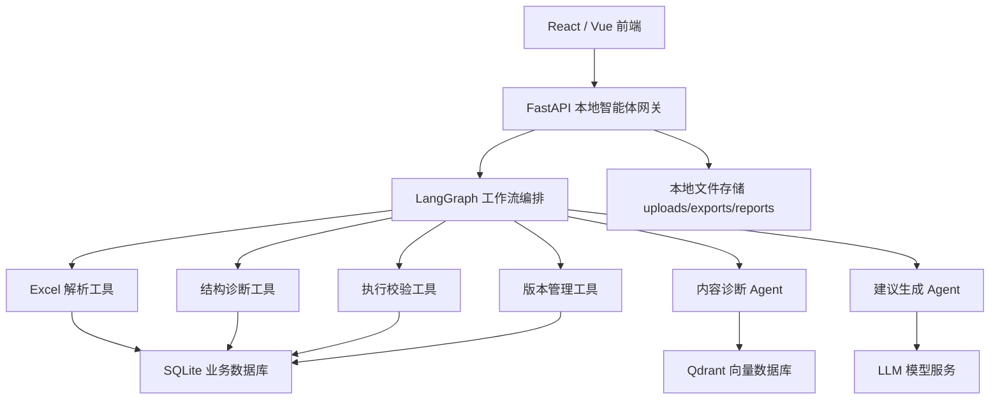
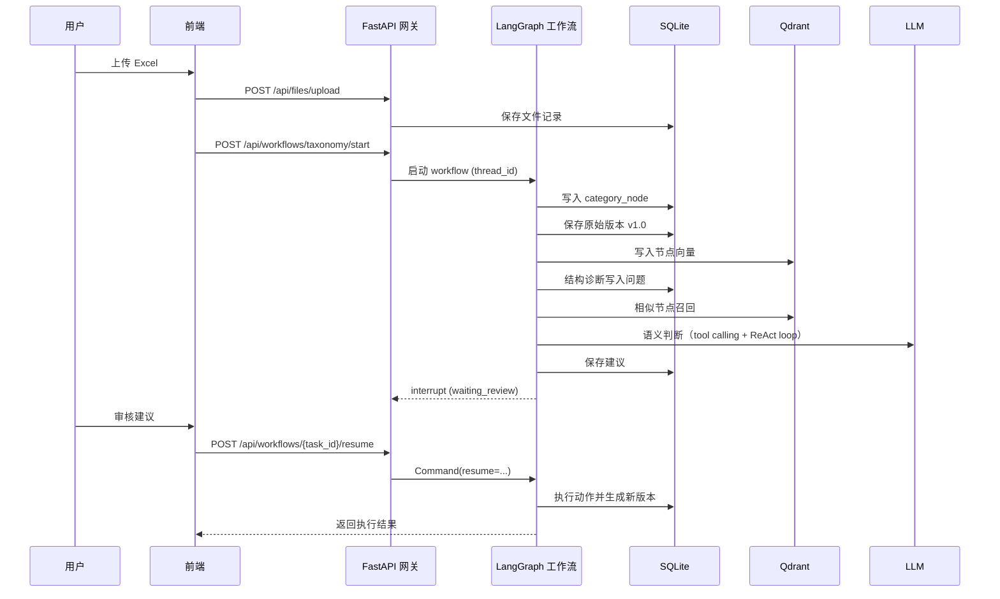
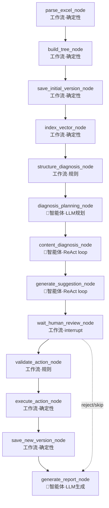

# 技术架构文档：标准产品体系维护智能体平台

> 项目名称：基于 LangChain 生态的本地标准产品体系维护智能体平台  
> 文档类型：技术架构设计文档  
> 版本：v1.0  
> 日期：2026-07-04  
> 技术路线：React/Vue + FastAPI + LangGraph + LangChain + SQLite + Qdrant

---

## 1. 架构目标

本系统面向产品标准分类体系维护场景，要求在本地环境中完成 Excel 上传、分类树解析、结构诊断、内容诊断、智能建议生成、人工审核、版本保存和导出。

架构设计目标如下：

1. 本地化运行：Excel、数据库、向量库、报告文件均默认存储在本地。
2. 流程可控：使用 LangGraph 编排明确的智能体工作流。
3. 数据安全：大模型不直接修改原始文件或数据库。
4. 人机协同：所有高风险建议必须人工确认后执行。
5. 可回滚：每次修改都生成新版本和操作日志。
6. 可扩展：后续可扩展多文件、多体系、多用户和权限管理。

---

## 2. 总体技术选型

| 层级 | 技术 | 说明 |
|---|---|---|
| 前端 | React 或 Vue | 上传文件、展示分类树、查看问题、审核建议 |
| UI 组件 | Ant Design / Element Plus | 表格、树形控件、弹窗、步骤条 |
| 后端网关 | FastAPI | 本地智能体网关，提供 REST API |
| 智能体编排 | LangGraph | 编排多阶段、有状态、可中断的维护流程 |
| 模型与工具 | LangChain | 封装 LLM、Prompt、Tool、结构化输出 |
| 可选增强 | DeepAgents | 用于复杂子树分析、深度报告生成 |
| 业务数据库 | SQLite | 保存节点、问题、建议、版本、日志 |
| 向量数据库 | Qdrant | 保存节点语义向量，支持相似度检索 |
| Excel 处理 | Python 标准数据处理逻辑 | 读取、解析、导出 Excel |
| 文件存储 | 本地目录 | 保存上传文件、导出文件、报告文件 |

---

## 3. 总体架构图



---

## 4. 本地部署架构

```text
standard-taxonomy-agent/
├── frontend/                  # React 或 Vue 前端
├── backend/                   # FastAPI 后端
├── data/
│   ├── app.db                 # SQLite 数据库
│   ├── uploads/               # 用户上传的 Excel
│   ├── exports/               # 导出的 Excel
│   ├── reports/               # 诊断报告
│   └── qdrant_storage/        # Qdrant 本地持久化数据
├── docker-compose.yml         # Qdrant 等服务
└── README.md
```

部署方式：

1. 前端运行在本地端口，例如 `localhost:5173`。
2. FastAPI 后端运行在本地端口，例如 `localhost:8000`。
3. Qdrant 运行在本地端口，例如 `localhost:6333`。
4. SQLite 数据库保存在 `data/app.db`。
5. 上传和导出文件保存在本地 `data/` 目录下。

---

## 5. 核心数据流

> **API 入口收敛说明**（修订 2026-07-05）：
> - `/api/workflows/*` 是**唯一对外入口**，用于启动、查询、恢复和订阅 workflow 事件流
> - `/api/diagnosis/run`、`/api/suggestions/generate`、`/api/suggestions/approve` 等为**内部辅助 API**，仅供前端查询和调试使用，不作为 workflow 启动入口
> - `/api/files/upload` 是 workflow 的前置输入（文件上传），不属于 workflow API



---

## 6. 模块划分

## 6.1 前端模块

前端可使用 React 或 Vue。建议组件如下：

| 页面 | 主要组件 |
|---|---|
| 上传页 | Upload、Progress、FileInfoCard |
| 概览页 | StatisticCard、TreeSummary、IssueChart |
| 分类树页 | Tree、SearchInput、NodeDetailDrawer |
| 结构诊断页 | IssueTable、RiskTag、FilterPanel |
| 内容诊断页 | SemanticIssueTable、SimilarNodePanel |
| 建议审核页 | SuggestionTable、ActionPreview、ConfirmModal |
| 版本管理页 | VersionTable、DiffViewer、ExportButton |
| 报告页 | MarkdownViewer、DownloadButton |
| 智能问答页 | ChatPanel、RetrievedContextList |

前端只负责展示和交互，不直接处理 Excel 和智能体逻辑。

---

## 6.2 FastAPI 本地智能体网关

FastAPI 是系统统一入口，负责：

1. 接收文件上传。
2. 调用 LangGraph 工作流。
3. 查询 SQLite 数据。
4. 查询 Qdrant 语义检索结果。
5. 返回问题列表、建议列表、版本列表。
6. 处理建议确认和执行请求。
7. 生成和下载报告。

推荐目录结构（修订 2026-07-05，以 F10 §4 为准）：

```text
backend/
├── app/
│   ├── main.py
│   ├── config.py
│   ├── api/
│   │   ├── files.py
│   │   ├── taxonomy.py
│   │   ├── diagnosis.py          # 内部辅助 API
│   │   ├── suggestions.py        # 内部辅助 API
│   │   ├── versions.py
│   │   ├── reviews.py            # 审核建议查询
│   │   ├── chat.py
│   │   └── workflows.py          # 唯一对外 workflow 入口
│   ├── agents/
│   │   ├── graph.py              # StateGraph 构建、编译、路由
│   │   ├── states.py             # TaxonomyGraphState (30+ 字段)
│   │   ├── nodes.py              # 薄节点，只调 service 并更新 state
│   │   ├── prompts.py            # LLM Prompt 模板
│   │   ├── checkpoints.py        # LangGraph checkpointer 配置
│   │   └── events.py             # streaming 事件映射
│   ├── services/
│   │   ├── excel_service.py
│   │   ├── taxonomy_service.py
│   │   ├── vector_index_service.py
│   │   ├── diagnosis_service.py
│   │   ├── content_diagnosis_service.py  # 内容诊断 Agent Loop
│   │   ├── suggestion_service.py         # 建议生成 Agent Loop
│   │   ├── review_service.py
│   │   ├── action_service.py
│   │   ├── version_service.py
│   │   └── report_service.py
│   ├── repositories/
│   │   ├── file_repo.py
│   │   ├── taxonomy_repo.py
│   │   ├── diagnosis_repo.py
│   │   ├── suggestion_repo.py
│   │   ├── version_repo.py
│   │   ├── task_repo.py
│   │   └── checkpoint_repo.py
│   ├── vectorstores/
│   │   └── qdrant_store.py
│   ├── schemas/
│   │   ├── node.py
│   │   ├── issue.py
│   │   ├── suggestion.py
│   │   ├── version.py
│   │   └── taxonomy.py
│   └── tools/
│       ├── tree_tools.py         # @tool: get_node_detail, get_node_path, get_children, search_similar_nodes
│       ├── validation_tools.py  # @tool: validate_action, submit_suggestion
│       └── export_tools.py       # @tool: export_excel
└── tests/
```

---

## 6.3 LangGraph 工作流模块

LangGraph 负责编排产品体系维护流程。

### 6.3.1 工作流状态 State

> **修订说明**（2026-07-05）：原 State 只有 10 个字段，已废弃。以 `10_LangGraph智能体工作流开发设计.md` §5.1 的 30+ 字段版为准。

```python
from typing import Literal
from pydantic import BaseModel, Field

WorkflowStatus = Literal[
    "pending", "running", "waiting_review", "completed", "failed", "cancelled"
]

class TaxonomyGraphState(BaseModel):
    # identity
    workflow_id: str
    thread_id: str
    task_id: str | None = None
    # input
    file_id: int | None = None
    file_path: str | None = None
    file_name: str | None = None
    # version context
    base_version_id: int | None = None
    current_version_id: int | None = None
    new_version_id: int | None = None
    version_no: str | None = None
    # progress
    status: WorkflowStatus = "pending"
    current_step: str | None = None
    progress: int = 0
    completed_steps: list[str] = Field(default_factory=list)
    # counts
    row_count: int = 0
    column_count: int = 0
    node_count: int = 0
    max_depth: int = 0
    max_children_count: int = 0
    structure_issue_count: int = 0
    content_issue_count: int = 0
    suggestion_count: int = 0
    approved_action_count: int = 0
    executed_action_count: int = 0
    # human review
    review_batch_id: str | None = None
    review_decision: Literal["approve", "reject", "edit"] | None = None
    review_payload: dict | None = None
    # report/export
    report_id: int | None = None
    report_path: str | None = None
    export_path: str | None = None
    # error
    error_code: str | None = None
    error_message: str | None = None
```

### 6.3.2 主流程

> **修订说明**（2026-07-05）：新增 `diagnosis_planning_node`（智能体·LLM 规划），位于结构诊断后、内容诊断前。节点性质分为工作流节点（确定性）和智能体节点（Agent loop）。



### 6.3.3 节点职责

| LangGraph 节点 | 性质 | 职责 |
|---|---|---|
| `parse_excel_node` | 工作流·确定性 | 读取 Excel，识别字段，转为节点列表 |
| `build_tree_node` | 工作流·确定性 | 构建父子关系、计算层级、路径、叶子节点 |
| `save_initial_version_node` | 工作流·确定性 | 保存原始版本和节点快照 |
| `index_vector_node` | 工作流·确定性 | 将节点文本向量化并写入 Qdrant |
| `structure_diagnosis_node` | 工作流·规则 | 规则检测结构问题（不调 LLM） |
| `diagnosis_planning_node` | 🤖智能体·LLM 规划 | LLM 根据结构诊断结果规划内容诊断范围和优先级 |
| `content_diagnosis_node` | 🤖智能体·ReAct loop | 召回→LLM判断→补充查询→再判断（tool calling） |
| `generate_suggestion_node` | 🤖智能体·ReAct loop | 分析→工具查询→生成→自校验→重试（tool calling） |
| `wait_human_review_node` | 工作流·interrupt | 暂停流程等待用户确认 |
| `validate_action_node` | 工作流·规则 | 校验建议动作是否合法 |
| `execute_action_node` | 工作流·确定性 | 执行用户确认后的动作 |
| `save_new_version_node` | 工作流·确定性 | 保存新版本快照 |
| `generate_report_node` | 🤖智能体·LLM 生成 | LLM 生成报告内容 |

---

## 6.4 LangChain 模块

> **修订说明**（2026-07-05）：补充 tool calling 和 agent loop 设计，对齐 F10 §13。

LangChain 在系统中主要负责：

1. 统一封装 LLM 调用（`ChatOllama`）。
2. 管理 Prompt 模板（`agents/prompts.py`）。
3. 封装工具调用（`@tool` 装饰器，`tools/*.py`）。
4. 实现结构化输出（Pydantic 输出解析器）。
5. 封装 Agent Loop（`create_react_agent` 或手写 ReAct 循环）。
6. 对接 Qdrant 向量检索。
7. 支持智能问答 RAG。

### 6.4.1 建议生成 Prompt 示例

```text
你是产品标准分类体系治理专家。请根据输入的问题节点、完整路径、同义词、相似节点和结构诊断结果，生成可执行的维护建议。

要求：
1. 不要直接删除节点。
2. 对高风险操作必须标记 need_confirm=true。
3. 输出 JSON，不要输出额外解释。
4. action_type 只能从 add_node、move_node、rename_node、merge_node、clean_synonym、split_subtree、mark_as_valid 中选择。
```

### 6.4.2 结构化输出 Schema

```python
from pydantic import BaseModel, Field
from typing import Literal, Optional, List

class AdjustmentAction(BaseModel):
    issue_id: int
    action_type: Literal[
        "add_node",
        "move_node",
        "rename_node",
        "merge_node",
        "clean_synonym",
        "split_subtree",
        "mark_as_valid"
    ]
    target_node_id: int
    target_node_name: str
    old_parent_id: Optional[int] = None
    new_parent_id: Optional[int] = None
    old_name: Optional[str] = None
    new_name: Optional[str] = None
    synonyms_to_remove: List[str] = Field(default_factory=list)
    reason: str
    suggestion: str
    risk_level: Literal["low", "medium", "high"]
    confidence: float
    need_confirm: bool = True
```

---

## 6.5 DeepAgents 可选增强模块

DeepAgents 不作为主流程核心，而作为增强型分析助手使用。

适用场景：

1. 对指定子树进行多步深度分析。
2. 自动生成更完整的诊断报告。
3. 根据多个问题汇总形成答辩说明。
4. 用户在问答页提出复杂问题时，自动拆解任务。

不适用场景：

1. 不直接执行节点移动。
2. 不直接修改 SQLite 数据库。
3. 不直接覆盖 Excel 文件。
4. 不绕过人工审核。

---

## 7. SQLite 数据库设计

SQLite 用于保存业务事实数据。

### 7.1 uploaded_file

```sql
CREATE TABLE uploaded_file (
    id INTEGER PRIMARY KEY AUTOINCREMENT,
    file_name TEXT NOT NULL,
    file_path TEXT NOT NULL,
    file_size INTEGER,
    sheet_name TEXT,
    row_count INTEGER,
    column_count INTEGER,
    upload_time DATETIME DEFAULT CURRENT_TIMESTAMP,
    status TEXT DEFAULT 'uploaded'
);
```

### 7.2 taxonomy_version

```sql
CREATE TABLE taxonomy_version (
    id INTEGER PRIMARY KEY AUTOINCREMENT,
    file_id INTEGER NOT NULL,
    version_no TEXT NOT NULL,
    description TEXT,
    quality_score REAL,
    snapshot_path TEXT,
    created_time DATETIME DEFAULT CURRENT_TIMESTAMP,
    FOREIGN KEY (file_id) REFERENCES uploaded_file(id)
);
```

### 7.3 category_node

```sql
CREATE TABLE category_node (
    id INTEGER PRIMARY KEY AUTOINCREMENT,
    version_id INTEGER NOT NULL,
    category_id INTEGER NOT NULL,
    category_name TEXT NOT NULL,
    parent_id INTEGER,
    level INTEGER,
    path_ids TEXT,
    path_names TEXT,
    category_group_id TEXT,
    category_pids TEXT,
    category_group_name TEXT,
    syn_list TEXT,
    is_leaf INTEGER DEFAULT 0,
    created_time DATETIME DEFAULT CURRENT_TIMESTAMP,
    FOREIGN KEY (version_id) REFERENCES taxonomy_version(id)
);
```

### 7.4 diagnosis_issue

```sql
CREATE TABLE diagnosis_issue (
    id INTEGER PRIMARY KEY AUTOINCREMENT,
    version_id INTEGER NOT NULL,
    issue_type TEXT NOT NULL,
    node_id INTEGER,
    node_name TEXT,
    description TEXT,
    reason TEXT,
    risk_level TEXT,
    confidence REAL,
    status TEXT DEFAULT 'pending',
    created_time DATETIME DEFAULT CURRENT_TIMESTAMP,
    FOREIGN KEY (version_id) REFERENCES taxonomy_version(id)
);
```

### 7.5 adjustment_suggestion

```sql
CREATE TABLE adjustment_suggestion (
    id INTEGER PRIMARY KEY AUTOINCREMENT,
    issue_id INTEGER NOT NULL,
    version_id INTEGER NOT NULL,
    action_type TEXT NOT NULL,
    target_node_id INTEGER,
    target_node_name TEXT,
    old_parent_id INTEGER,
    new_parent_id INTEGER,
    old_name TEXT,
    new_name TEXT,
    action_payload TEXT,
    reason TEXT,
    suggestion TEXT,
    risk_level TEXT,
    confidence REAL,
    need_confirm INTEGER DEFAULT 1,
    status TEXT DEFAULT 'pending',
    created_time DATETIME DEFAULT CURRENT_TIMESTAMP,
    FOREIGN KEY (issue_id) REFERENCES diagnosis_issue(id),
    FOREIGN KEY (version_id) REFERENCES taxonomy_version(id)
);
```

### 7.6 operation_log

```sql
CREATE TABLE operation_log (
    id INTEGER PRIMARY KEY AUTOINCREMENT,
    version_id INTEGER,
    operator TEXT,
    operation_type TEXT,
    operation_detail TEXT,
    created_time DATETIME DEFAULT CURRENT_TIMESTAMP,
    FOREIGN KEY (version_id) REFERENCES taxonomy_version(id)
);
```

---

## 8. Qdrant 向量库设计

Qdrant 用于保存产品节点的语义向量和元数据。

### 8.1 Collection 设计

Collection 名称：

```text
taxonomy_nodes
```

### 8.2 Point ID 设计

```text
{version_id}_{category_id}
```

示例：

```text
v1_441
```

### 8.3 向量文本模板

每个节点向量化前转成如下文本：

```text
节点名称：{category_name}
完整路径：{path_names}
同义词：{syn_list}
层级：{level}
```

示例：

```text
节点名称：苹果
完整路径：农、林、牧、渔业类产品 > 农业产品 > 水果及坚果 > 水果（园林水果） > 苹果
同义词：AirPods, Apple, Apple Music, Apple Pencil, iPhone
层级：5
```

### 8.4 Payload 设计

```json
{
  "version_id": 1,
  "category_id": 441,
  "category_name": "苹果",
  "parent_id": 440,
  "level": 5,
  "path_names": "农、林、牧、渔业类产品 > 农业产品 > 水果及坚果 > 水果（园林水果） > 苹果",
  "syn_list": "[...同义词...]",
  "is_leaf": true
}
```

### 8.5 使用场景

| 场景 | 查询方式 |
|---|---|
| 相似节点召回 | 输入目标节点文本，返回相似节点 TopK |
| 重复节点发现 | 对同名或相似名节点做向量相似度比较 |
| 同义词污染检测 | 将同义词与节点路径语义进行比较 |
| 父子关系判断 | 比较子节点与父节点路径语义是否一致 |
| 智能问答 | 根据用户问题召回相关节点作为上下文 |

---

## 9. 诊断算法设计

## 9.1 结构诊断算法

结构诊断以规则为主，不依赖大模型。

### 9.1.1 父节点缺失

```python
def detect_missing_parent(nodes):
    id_set = {node.category_id for node in nodes}
    issues = []
    for node in nodes:
        if node.parent_id and node.parent_id not in id_set:
            issues.append(node)
    return issues
```

当前 Excel 中可检测到 44 条父节点缺失问题。

### 9.1.2 层级过深

```python
def detect_deep_nodes(nodes, threshold=7):
    return [node for node in nodes if node.level > threshold]
```

当前 Excel 最大深度为 10。

### 9.1.3 节点过宽

```python
def detect_wide_nodes(children_map, threshold=80):
    return [
        (parent_id, children)
        for parent_id, children in children_map.items()
        if len(children) > threshold
    ]
```

当前过宽节点示例：`煤化工设备与试剂`，直接子节点数 225。

### 9.1.4 重复名称

```python
from collections import Counter

def detect_duplicate_names(nodes):
    counter = Counter(node.category_name for node in nodes)
    return [name for name, count in counter.items() if count > 1]
```

当前重复名称包括：锰矿石, 风机叶片, 风电齿轮箱。

---

## 9.2 内容诊断算法

内容诊断采用“向量召回 + LLM 判断”的组合方式。

### 9.2.1 疑似重复节点检测

流程：

```text
节点名称 / 路径文本
    ↓
Qdrant 相似节点召回
    ↓
排除自身和同一路径节点
    ↓
LLM 判断是否语义重复
    ↓
生成 merge_node 或 mark_as_valid 建议
```

### 9.2.2 同义词污染检测

流程：

```text
节点路径 + 节点名称 + 同义词
    ↓
逐个同义词语义判断
    ↓
识别与当前路径语义不一致的词
    ↓
生成 clean_synonym 建议
```

典型示例：

```text
节点：苹果
路径：农、林、牧、渔业类产品 > 农业产品 > 水果及坚果 > 水果（园林水果）
异常同义词：AirPods、Apple Music、Apple Pencil、iPhone
```

### 9.2.3 父子关系异常检测

流程：

```text
父节点路径 + 子节点名称
    ↓
Qdrant 搜索更相似的候选父节点
    ↓
LLM 判断当前父子关系是否合理
    ↓
如不合理，生成 move_node 建议
```

---

## 10. 建议执行机制

系统必须遵循：

```text
LLM 生成建议 → 程序校验 → 用户确认 → 程序执行 → 保存新版本
```

不能让 LLM 直接修改 Excel 或数据库。

### 10.1 动作校验规则

| 动作 | 校验规则 |
|---|---|
| `add_node` | 新节点名称不能为空，父节点必须存在或为根 |
| `move_node` | 新父节点必须存在，不能移动到自身子树下 |
| `rename_node` | 新名称不能为空，同级下不能重名 |
| `merge_node` | 源节点和目标节点必须存在，不能跨不兼容体系自动合并 |
| `clean_synonym` | 删除词必须存在于原 `syn_list` 中 |
| `split_subtree` | 只生成方案，MVP 阶段不自动拆分 |

### 10.2 版本生成规则

1. 每次执行动作前读取当前版本节点快照。
2. 按用户确认的动作生成新节点集合。
3. 重新计算 parent_id、level、path_ids、path_names、is_leaf。
4. 写入新的 `taxonomy_version`。
5. 写入新版本的 `category_node`。
6. 写入操作日志。
7. 更新 Qdrant 中对应版本的向量索引。

---

## 11. API 设计

> **API 入口收敛说明**（修订 2026-07-05）：
> - `/api/workflows/*` 是唯一对外入口，用于启动、查询、恢复和订阅 workflow
> - 以下 `/api/diagnosis/*`、`/api/suggestions/*` 为**内部辅助 API**，仅供前端查询和调试
> - `/api/files/upload` 是 workflow 的前置输入，不属于 workflow API

### 11.1 文件 API

| 方法 | 路径 | 说明 |
|---|---|---|
| POST | `/api/files/upload` | 上传 Excel（workflow 前置输入） |
| GET | `/api/files` | 获取文件列表 |
| GET | `/api/files/{file_id}` | 获取文件详情 |

### 11.2 分类体系 API

| 方法 | 路径 | 说明 |
|---|---|---|
| GET | `/api/taxonomy/overview` | 获取体系概览 |
| GET | `/api/taxonomy/tree` | 获取分类树 |
| GET | `/api/taxonomy/nodes/{node_id}` | 获取节点详情 |
| GET | `/api/taxonomy/search` | 搜索节点 |

### 11.3 诊断 API（内部辅助 API）

> 这些 API 仅供前端查询问题列表和调试使用，workflow 通过 `/api/workflows/taxonomy/start` 启动。

| 方法 | 路径 | 说明 |
|---|---|---|
| POST | `/api/diagnosis/structure/run` | 运行结构诊断（内部辅助） |
| POST | `/api/diagnosis/content/index` | 建立向量索引（内部辅助） |
| POST | `/api/diagnosis/content/run` | 运行内容诊断（内部辅助） |
| GET | `/api/diagnosis/issues` | 获取问题列表 |
| GET | `/api/diagnosis/issues/{issue_id}` | 获取问题详情 |

### 11.4 建议 API（内部辅助 API）

> 这些 API 仅供前端查询和审核使用，workflow 通过 `/api/workflows/{task_id}/resume` 恢复执行。

| 方法 | 路径 | 说明 |
|---|---|---|
| POST | `/api/suggestions/generate` | 生成建议（内部辅助） |
| GET | `/api/suggestions` | 获取建议列表 |
| POST | `/api/suggestions/{id}/approve` | 接受建议（内部辅助） |
| POST | `/api/suggestions/{id}/reject` | 拒绝建议（内部辅助） |
| PUT | `/api/suggestions/{id}` | 编辑建议 |
| POST | `/api/suggestions/execute` | 执行已确认建议（内部辅助） |

### 11.5 Workflow API（唯一对外入口）

| 方法 | 路径 | 说明 |
|---|---|---|
| POST | `/api/workflows/taxonomy/start` | 启动工作流 |
| GET | `/api/workflows/{task_id}` | 查询工作流状态 |
| GET | `/api/workflows/{task_id}/events` | 流式事件（SSE） |
| POST | `/api/workflows/{task_id}/resume` | 恢复工作流（审核后） |

### 11.5 版本 API

| 方法 | 路径 | 说明 |
|---|---|---|
| GET | `/api/versions` | 获取版本列表 |
| GET | `/api/versions/{version_id}` | 获取版本详情 |
| GET | `/api/versions/{version_id}/diff` | 获取版本差异 |
| POST | `/api/versions/{version_id}/rollback` | 回滚版本 |
| GET | `/api/versions/{version_id}/export` | 导出 Excel |

### 11.6 智能问答 API

| 方法 | 路径 | 说明 |
|---|---|---|
| POST | `/api/chat` | 针对分类体系进行问答 |
| GET | `/api/chat/history` | 获取问答历史 |

---

## 12. 后端服务接口示例

### 12.1 上传文件响应

```json
{
  "file_id": 1,
  "file_name": "产品标准体系(2).xlsx",
  "row_count": 21090,
  "columns": ['category_id', 'category_name', 'category_group_id', 'category_pids', 'category_group_name', 'syn_list'],
  "status": "uploaded"
}
```

### 12.2 体系概览响应

```json
{
  "version_id": 1,
  "total_nodes": 21090,
  "root_count": 12,
  "max_depth": 10,
  "leaf_count": 17965,
  "non_leaf_count": 3125,
  "missing_parent_count": 44,
  "duplicate_name_count": 3,
  "synonym_non_empty_count": 15072
}
```

### 12.3 问题响应

```json
{
  "issue_id": 12,
  "issue_type": "missing_parent",
  "node_id": 2737,
  "node_name": "通信设备嵌入式软件",
  "description": "该节点的直接父节点 2736 不存在。",
  "risk_level": "high",
  "confidence": 1.0,
  "status": "pending"
}
```

---

## 13. Docker Compose 示例

Qdrant 推荐使用本地 Docker 服务运行。

```yaml
version: "3.9"

services:
  qdrant:
    image: qdrant/qdrant:latest
    container_name: taxonomy-qdrant
    ports:
      - "6333:6333"
      - "6334:6334"
    volumes:
      - ./data/qdrant_storage:/qdrant/storage
```

后端和前端也可以加入 Docker Compose，但课程设计阶段可以先本地命令启动。

---

## 14. 环境配置

`.env` 示例：

```env
APP_NAME=standard-taxonomy-agent
DATABASE_URL=sqlite:///./data/app.db
UPLOAD_DIR=./data/uploads
EXPORT_DIR=./data/exports
REPORT_DIR=./data/reports
QDRANT_URL=http://localhost:6333
QDRANT_COLLECTION=taxonomy_nodes
EMBEDDING_MODEL=text-embedding-model
LLM_MODEL=chat-model
MAX_TREE_DEPTH_THRESHOLD=7
MAX_CHILDREN_THRESHOLD=80
```

---

## 15. 异常处理设计

| 异常 | 处理方式 |
|---|---|
| Excel 缺少必要字段 | 返回字段校验错误 |
| 节点 ID 重复 | 终止导入，提示重复 ID |
| 父节点缺失 | 记录为诊断问题，不终止导入 |
| Qdrant 连接失败 | 跳过语义诊断，保留结构诊断结果 |
| LLM 调用失败 | 标记内容诊断失败，允许重试 |
| 动作校验失败 | 不执行，返回错误原因 |
| 导出失败 | 保留版本数据，提示重新导出 |

---

## 16. 日志与可观测性

系统应记录：

1. 文件上传日志。
2. 解析任务日志。
3. LangGraph 每个节点执行状态。
4. LLM 调用输入摘要和输出结果。
5. 用户审核操作。
6. 动作执行日志。
7. 版本生成日志。
8. 导出日志。

课程设计中可以使用普通日志文件；如果要体现 LangChain 生态，可以接入 LangSmith 做调试与链路追踪。

---

## 17. 前后端交互状态设计

诊断任务可能耗时，因此建议设计任务状态：

| 状态 | 说明 |
|---|---|
| `pending` | 等待执行 |
| `running` | 正在执行 |
| `waiting_review` | 等待用户审核 |
| `completed` | 已完成 |
| `failed` | 执行失败 |

前端可以轮询：

```text
GET /api/tasks/{task_id}
```

返回当前步骤：

```json
{
  "task_id": "task_001",
  "status": "running",
  "current_step": "content_diagnosis",
  "progress": 65
}
```

---

## 18. 质量评分设计

每个版本可以计算一个质量分，便于展示优化效果。

```text
质量分 = 100
      - 父节点缺失数 * 1.0
      - 层级过深节点数 * 0.2
      - 过宽节点数 * 0.5
      - 重复名称数 * 0.5
      - 高风险内容问题数 * 1.0
```

课程设计中可以展示：

| 版本 | 质量分 | 说明 |
|---|---:|---|
| v1.0 | 72 | 原始 Excel |
| v1.1 | 78 | 修复父节点缺失 |
| v1.2 | 83 | 清理同义词污染 |

具体分数可根据实际诊断结果动态计算。

---

## 19. 开发里程碑划分

> **修订说明**（2026-07-05）：原按"阶段一~五"划分，已替换为 M1-M5 里程碑制。详见 `00_开发里程碑索引.md`。

### M1：工作流骨架接真实数据（确定性闭环）

1. 搭建 FastAPI + 前端骨架。
2. 实现 Excel 上传、SQLite 表结构。
3. 实现分类树解析、版本保存（v1.0）。
4. 实现结构诊断（纯规则）。
5. 实现 `/api/workflows/*`（start + status）。
6. 生成模板化报告（不调 LLM）。

### M2：向量索引 + 内容诊断智能体（🤖 ReAct loop）

1. 搭建 Qdrant。
2. 生成节点 embedding 写入 Qdrant。
3. 实现 `tools/tree_tools.py` 的 `@tool` 函数。
4. 实现 `diagnosis_planning_node`（LLM 规划诊断范围）。
5. 实现 `content_diagnosis_node`（Agent Loop + tool calling）。

### M3：建议生成智能体 + 人工审核（🤖 tool calling + interrupt）

1. 实现 `SuggestionAgent`（ReAct loop + 自校验）。
2. 实现 interrupt 等待人工审核。
3. 实现 `POST /api/workflows/{task_id}/resume`。
4. 实现 `validate_action`（动作校验）。

### M4：动作执行 + 版本管理 + 报告（🤖 LLM 报告生成）

1. 执行已审核动作，生成新版本。
2. 实现版本差异、回滚、导出 Excel。
3. 报告接入 LLM 生成。
4. checkpointer 从 MemorySaver 换成 SQLite 持久化。

### M5：前端工作台 + 端到端演示

1. 前端串联完整流程。
2. 实现 SSE 事件流。
3. 展示 Agent Loop 过程（Thought-Action-Observation）。
4. 课程演示闭环。

---

## 20. 关键设计原则

1. 规则能解决的问题，不交给大模型。
2. 大模型负责语义判断和解释，不直接执行修改。
3. 数据库保存事实，Qdrant 保存语义索引。
4. 所有修改都必须可追踪、可审核、可回滚。
5. 前端展示结果，后端控制流程，LangGraph 编排智能体。
6. 先完成 MVP，再增强 DeepAgents 和复杂报告能力。

---

## 21. 最终技术方案总结

本系统采用本地 Web 平台架构。前端使用 React 或 Vue，后端使用 FastAPI 作为本地智能体网关。后端通过 LangGraph 编排产品体系维护流程，通过 LangChain 封装 LLM、Prompt、工具和结构化输出。业务数据保存在 SQLite 中，节点语义向量保存在 Qdrant 中。系统支持上传 Excel、构建分类树、结构诊断、内容诊断、智能建议、人机审核、版本管理、报告生成和导出。

该架构既能体现 LangChain 生态的智能体开发能力，又能保证分类体系维护流程的可控性、可解释性和工程完整性，适合作为智能体开发课程设计项目。
