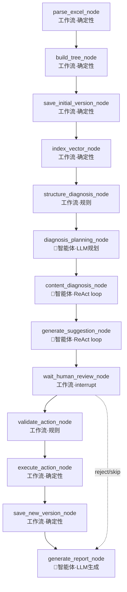

# 产品标准体系维护智能体 — 架构评审报告

> 评审人：Bob（架构师）
> 评审日期：2026-07-05
> 评审范围：当前实现代码 + dev-doc 全部设计文档（PRD、技术架构、F00-F10）
> 核心问题：用户反馈"当前实现像工作流不像智能体"，评估拆分计划是否合理

---

## 第 1 部分：当前实现 vs 设计的差距矩阵

### 1.1 差距等级定义

| 等级 | 含义 |
|------|------|
| **完整** | 代码已实现且可运行，与设计文档一致 |
| **骨架** | 结构存在但内部逻辑未填充（如空类、空函数） |
| **占位** | 返回 501 或硬编码假数据，无法完成真实业务 |
| **缺失** | 文件/模块完全不存在 |

### 1.2 分层差距矩阵

| 层 | 设计要求 | 当前实现 | 差距等级 | 关键缺口 |
|----|----------|----------|----------|----------|
| **API 层** | 7 个路由模块（files/taxonomy/diagnosis/suggestions/versions/chat/workflows）+ SSE 流式 | files.py ✅ 可用；health.py ✅ 可用；taxonomy/diagnosis/suggestions/versions/chat 全部 501 占位；**workflows.py 完全缺失** | 占位 | `/api/workflows/*` 4 个 API 全部缺失；SSE 事件流未实现；现有诊断/建议 API 是孤立占位，未与 graph 串联 |
| **LangGraph 层** | 12 节点 StateGraph，薄节点只调 service，支持 interrupt + checkpointer + thread_id + streaming | graph.py 拓扑完整（12 节点 + 2 条件路由），MemorySaver + interrupt ✅；**nodes.py 全部 12 个节点返回硬编码假数据**，零 service 调用 | 骨架 | 所有节点无 service 调用；prompts.py 仅 1 行；SQLite checkpointer 未接入；streaming 未实现；events.py/checkpoints.py 不存在 |
| **Service 层** | 9 个 service（excel/taxonomy/vector_index/diagnosis/suggestion/review/action/version/report） | **仅 excel_service.py 可用**；其余 8 个 service 文件完全不存在 | 缺失 | taxonomy_service / diagnosis_service / suggestion_service / version_service / report_service / review_service / action_service / vector_index_service 全部缺失 |
| **Repository 层** | 7 个 repo（file/taxonomy/diagnosis/suggestion/version/task/checkpoint） | **仅 file_repo.py 可用**；其余全部缺失 | 缺失 | taxonomy_repo / diagnosis_repo / suggestion_repo / version_repo / task_repo / checkpoint_repo 全部缺失 |
| **Tool 层** | 3 个工具文件（tree_tools / validation_tools / export_tools），供 LangChain tool calling 使用 | 3 个文件均只有 1 行 docstring 注释 | 缺失 | 零实现；未定义任何 `@tool` 函数；未接入 LangChain tool calling |
| **向量层** | QdrantStore：collection 创建、节点索引、相似召回 | qdrant_store.py 空类，仅 `__init__` 存了 collection_name | 缺失 | 无 create_collection / index_nodes / search_similar 实现；requirements.txt 缺 `qdrant-client` 依赖 |
| **LangChain 层** | LLM 封装、Prompt 模板、输出解析、Tool 封装、Agent loop | **完全未使用**。requirements.txt 有 `langchain-ollama` 但代码中零 import | 缺失 | 无 LLM 实例化；无 Prompt 模板（prompts.py 仅 1 行）；无结构化输出解析；无 tool calling；无 agent executor |
| **前端** | Vue 3 骨架：上传/树浏览/诊断/建议审核/版本/报告/问答 | 目录结构存在（src/api, components, views, router, stores），与后端同为占位状态 | 骨架 | 无 workflow 状态消费；无 SSE 事件监听；无审核交互闭环 |
| **数据库** | 7 张业务表 + task_record 扩展（workflow_id/thread_id/version_id/progress/interrupt_payload/result_payload）+ workflow_event 表 | 7 张业务表已建 ✅；**task_record 扩展字段缺失；workflow_event 表缺失** | 骨架 | task_record 仍是原始 9 字段；无 workflow_event；SQLite checkpointer 表未建 |
| **测试** | State 测试 + Node 单测（fake service）+ Graph 集成 + API 测试 + 幂等测试 | health/db/excel_service/file_upload_api 真实测试 ✅；test_langgraph_workflow.py 基于**硬编码假数据**跑通 interrupt + resume | 占位 | 验证的全是写死值（assert suggestion_count==3, structure_issue_count==44）；无 fake service 测试；无 API 集成测试 |

### 1.3 可用代码占比估算

| 维度 | 可用文件数 | 总应有文件数 | 完成度 |
|------|-----------|-------------|--------|
| API | 2/7 | 7 | 29% |
| Service | 1/9 | 9 | 11% |
| Repository | 1/7 | 7 | 14% |
| Agents | 3/5 | 5 (graph/states/nodes/prompts + events) | 60%（但 nodes 全假数据） |
| Tools | 0/3 | 3 | 0% |
| Vectorstores | 0/1 | 1 | 0% |
| **整体后端** | **~7/35** | **~35** | **~20%** |

---

## 第 2 部分："像工作流不像智能体"的根因诊断

### 2.1 用户直觉是否准确？

**准确。** 用户的直觉一针见血。当前实现本质上是一个 12 步线性流水线（DAG），唯一的"智能体特征"是 `wait_human_review_node` 中的 `interrupt()`，而 interrupt 是 LangGraph 的**流程控制**能力，不是**智能体**能力。

### 2.2 概念澄清：LangGraph 固定 DAG ≠ 不是智能体

智能体（Agent）的核心特征不是拓扑结构是否固定，而是**LLM 是否作为决策者参与流程控制**：

| 特征 | 工作流（Workflow） | 智能体（Agent） | 当前实现 |
|------|-------------------|-----------------|----------|
| 流程编排 | 固定 DAG | 可有固定骨架，但关键节点内部是 LLM 驱动的循环 | 12 节点固定 DAG ✅ |
| 决策者 | 代码/规则 | LLM 决定调用哪些工具、是否需要更多信息 | **代码硬编码，LLM 完全缺席** |
| 工具调用 | 无或固定 | LLM 自主选择调用哪些 tool | **零 tool calling** |
| 动态路由 | 条件分支（if/else） | LLM 决定下一步去哪 | **2 个条件路由全是 `if state.xxx` 硬编码** |
| 迭代推理 | 单次执行 | ReAct 循环（思考→行动→观察→再思考） | **无任何循环，每节点单次执行** |
| 输出结构化 | 固定模板 | LLM 生成结构化输出 + 程序校验 | **硬编码常量** |

**结论**：LangGraph 固定 DAG 可以是智能体的骨架——前提是关键节点内部封装了 LLM 驱动的 agent loop。当前的问题是：**骨架有了，但骨架内部的 agent loop 完全不存在。**

### 2.3 当前代码缺失的智能体特征

| 智能体特征 | 设计文档是否要求 | 当前代码是否有 | 差距 |
|-----------|----------------|--------------|------|
| LLM 实例化与调用 | ✅（F10 §13 LangChain 使用边界） | ❌ 零 import langchain | 完全缺失 |
| Prompt 模板管理 | ✅（F10 §13、技术架构 §6.4.1） | ❌ prompts.py 仅 1 行字符串 | 完全缺失 |
| 结构化输出解析 | ✅（技术架构 §6.4.2、F05 §7） | ❌ 无 Pydantic 输出解析器 | 完全缺失 |
| Tool calling | ✅（F10 §13.4 Tool calling 子流程） | ❌ tools/*.py 空文件，无 `@tool` | 完全缺失 |
| ReAct / Agent loop | ✅（F10 §13.5 Agent loop） | ❌ 无 `create_react_agent` / `AgentExecutor` | 完全缺失 |
| LLM 动态路由 | 设计未显式要求（但智能体应有） | ❌ 路由全靠 `if state.xxx` | 完全缺失 |
| 自主信息检索 | ✅（内容诊断：召回→判断→必要时再召回） | ❌ content_diagnosis_node 返回硬编码 `content_issue_count=2` | 完全缺失 |
| 多轮推理与自校验 | ✅（建议生成：分析→查询→生成→自校验） | ❌ generate_suggestion_node 返回硬编码 `suggestion_count=3` | 完全缺失 |

### 2.4 架构设计层面是否有缺陷？

**有。** F10 的 12 节点固定流水线设计本身不一定是错的——很多优秀的 agent 系统也有固定骨架（如 Plan-and-Execute 模式）。但 F10 的设计存在以下结构性缺陷：

#### 缺陷 1：内容诊断节点被设计为单次节点，而非 agent loop

F10 §8.6 的 `content_diagnosis_node` 设计是：

```
调 diagnosis_service.run_content_diagnosis(version_id) → 返回 issue_count
```

但内容诊断的本质是一个**迭代探索过程**：
1. 对每个候选节点，召回相似节点
2. LLM 判断是否有问题
3. 如果 LLM 不确定，需要补充查询（如查父节点路径、查兄弟节点）
4. LLM 再次判断
5. 输出结论

这个"召回→判断→补充查询→再判断"的循环，**不应该在一个单次 service 调用中完成**，而应该是一个 agent loop。当前设计把它压缩成了一个"薄节点"，导致 service 层必须自己实现 agent loop——但 service 层连骨架都没有。

#### 缺陷 2：建议生成节点被设计为单次节点，而非 agent loop

F10 §8.7 的 `generate_suggestion_node` 设计是：

```
调 suggestion_service.generate_suggestions(version_id) → 返回 suggestion_count
```

但建议生成的本质是一个**推理 + 查询 + 自校验过程**：
1. LLM 分析问题节点
2. LLM 调用工具查询上下文（查节点路径、查相似节点、查校验规则）
3. LLM 生成建议
4. 程序校验建议合法性
5. 如果校验失败，LLM 重新生成
6. 输出最终建议

这个"分析→查询→生成→校验→重试"的循环，**也不应该是一个单次 service 调用**。

#### 缺陷 3：缺少"诊断规划"环节

当前设计是无差别全量扫描 21090 个节点。一个真正的智能体应该先"看一眼整体"：
- 哪些一级类目问题最多？
- 哪些子树值得深入诊断？
- 是否需要采样还是全量？

这需要 LLM 在诊断前做一个"规划"决策。当前设计完全没有这个环节。

#### 缺陷 4：条件路由全部硬编码，无 LLM 参与

```python
def route_after_review(state):
    if state.review_decision == "reject":
        return "generate_report_node"
    if state.approved_action_count == 0:
        return "generate_report_node"
    return "validate_action_node"
```

这些路由是纯规则的，没有任何 LLM 参与。对于"审核后是否需要重新诊断"这种判断，LLM 可以基于审核反馈决定是否需要补充诊断——但当前设计没有这个分支。

### 2.5 明确结论

| 维度 | 判断 | 说明 |
|------|------|------|
| 实现深度不够 | ✅ 是 | 节点全部硬编码、service/tool/vectorstore/langchain 全缺失 |
| 架构方向有偏差 | ⚠️ 部分是 | F10 的薄节点 + 固定 DAG 骨架方向正确，但关键节点（内容诊断、建议生成）被设计为单次调用而非 agent loop，**设计层面就没有充分体现智能体特征** |
| 综合结论 | **两者都有** | 既需要补实现深度（service/tool/langchain），也需要调整架构方向（关键节点改为 agent loop） |

---

## 第 3 部分：智能体化方向调整建议

### 3.1 节点性质重新划分

将 12 个节点分为两类：

| 节点 | 建议性质 | 理由 |
|------|----------|------|
| `parse_excel_node` | **工作流节点**（确定性） | Excel 解析是确定性操作，不需要 LLM |
| `build_tree_node` | **工作流节点**（确定性） | 树构建是算法操作，不需要 LLM |
| `save_initial_version_node` | **工作流节点**（确定性） | 数据库写入，不需要 LLM |
| `index_vector_node` | **工作流节点**（确定性） | 向量索引是批处理操作，不需要 LLM |
| `structure_diagnosis_node` | **工作流节点**（确定性） | 结构诊断是纯规则，PRD 明确"规则能解决的不交给大模型" |
| `content_diagnosis_node` | **🤖 智能体节点**（Agent loop） | 召回→LLM判断→补充查询→再判断，需要 LLM 迭代推理 |
| `generate_suggestion_node` | **🤖 智能体节点**（Agent loop） | 问题分析→工具查询→LLM生成→自校验→输出，需要 LLM + tool calling |
| `wait_human_review_node` | **工作流节点**（interrupt） | 流程暂停，不是智能体行为 |
| `validate_action_node` | **工作流节点**（确定性） | 动作校验是纯规则 |
| `execute_action_node` | **工作流节点**（确定性） | 动作执行是程序操作 |
| `save_new_version_node` | **工作流节点**（确定性） | 版本保存是数据库操作 |
| `generate_report_node` | **🤖 智能体节点**（LLM 生成） | 报告内容需要 LLM 组织语言 |

**新增建议节点**：

| 新节点 | 性质 | 理由 |
|--------|------|------|
| `diagnosis_planning_node` | **🤖 智能体节点**（LLM 规划） | 在结构诊断后、内容诊断前，让 LLM 看整体结构，决定重点诊断哪些子树 |

### 3.2 内容诊断节点改为 Agent Loop 的具体方案

```
当前设计：
content_diagnosis_node → service.run_content_diagnosis(version_id) → return count

建议设计：
content_diagnosis_node → ContentDiagnosisAgent.run(version_id, plan) → return issues

ContentDiagnosisAgent 内部 ReAct loop：
  1. [Thought] 分析候选节点列表（来自结构诊断结果 + 同义词非空节点）
  2. [Action] 调用 search_similar_nodes(node_id) 工具
  3. [Observation] 获得相似节点列表
  4. [Thought] 判断是否需要查父节点路径
  5. [Action] 调用 get_node_path(node_id) 工具
  6. [Observation] 获得完整路径
  7. [Thought] 综合判断是否存在语义问题
  8. [Action] 调用 submit_diagnosis(issue_type, reason, confidence) 工具
  9. [Observation] 确认已记录
  10. 如果还有候选节点，回到步骤 1
```

关键变化：
- service 层实现 agent loop（用 LangChain `create_react_agent` 或手写 while 循环）
- LLM 通过 tool calling 自主决定查询哪些信息
- 不是一次性全量扫描，而是 LLM 根据候选重要性决定诊断深度

### 3.3 建议生成节点改为 Agent Loop 的具体方案

```
当前设计：
generate_suggestion_node → service.generate_suggestions(version_id) → return count

建议设计：
generate_suggestion_node → SuggestionAgent.run(version_id, issues) → return suggestions

SuggestionAgent 内部 ReAct loop（对每条 issue）：
  1. [Thought] 分析 issue 类型和目标节点
  2. [Action] 调用 get_node_detail(node_id) 获取节点上下文
  3. [Action] 调用 get_node_path(node_id) 获取路径上下文
  4. [Action] 调用 search_similar_nodes(node_id) 获取相似节点
  5. [Action] 调用 validate_action(action_json) 预校验动作合法性
  6. [Observation] 校验通过/失败
  7. [Thought] 如果校验失败，调整建议内容
  8. [Action] 调用 submit_suggestion(action_json) 提交建议
  9. 如果还有 issue，回到步骤 1
```

关键变化：
- LLM 在生成建议时可以主动查询上下文（tool calling）
- 生成后立即调用 `validate_action` 工具自校验
- 校验失败则 LLM 自动调整并重试（ReAct 循环）

### 3.4 诊断规划 Agent（新增）

在 `structure_diagnosis_node` 之后、`content_diagnosis_node` 之前，新增 `diagnosis_planning_node`：

```
diagnosis_planning_node → DiagnosisPlanningAgent.run(structure_stats, tree_overview) → return plan

DiagnosisPlanningAgent：
  输入：结构诊断统计（44 个缺失父节点、225 个过宽子节点等）+ 12 个一级类目概览
  LLM 任务：决定内容诊断的优先级和范围
  输出 plan：
    - priority_subtrees: ["煤化工设备与试剂", "电子产品"]  # 优先诊断
    - sample_strategy: "focused" | "full_scan" | "sampling"
    - focus_issues: ["synonym_pollution", "bad_parent_child_relation"]
    - estimated_candidates: 200
```

这样内容诊断就不是无差别全量扫描 21090 个节点，而是 LLM 根据结构诊断结果智能规划诊断范围。

### 3.5 LangChain Tool Calling 接入方案

给 LLM 暴露以下 tools（用 `@tool` 装饰器或 `StructuredTool` 封装）：

| Tool 名称 | 功能 | 供哪个 Agent 使用 |
|-----------|------|------------------|
| `get_node_detail(version_id, category_id)` | 查询单个节点详情 | 内容诊断 / 建议生成 |
| `get_node_path(version_id, category_id)` | 查询节点完整路径 | 内容诊断 / 建议生成 |
| `get_children(version_id, parent_id)` | 查询直接子节点 | 内容诊断 / 建议生成 |
| `search_similar_nodes(version_id, node_text, top_k)` | Qdrant 语义召回 | 内容诊断 / 建议生成 |
| `validate_action(action_json)` | 预校验建议动作合法性 | 建议生成 |
| `submit_diagnosis(issue)` | 提交一条诊断结果 | 内容诊断 |
| `submit_suggestion(suggestion)` | 提交一条维护建议 | 建议生成 |
| `get_tree_overview(version_id)` | 获取树整体统计 | 诊断规划 |

### 3.6 动态路由建议

| 路由点 | 当前设计 | 建议改为 |
|--------|----------|----------|
| 审核后路由 | `if reject → report; if count==0 → report; else → validate` | 保持规则路由（这里是确定性逻辑，不需要 LLM） |
| 校验后路由 | `if error → back to review; else → execute` | 保持规则路由 |
| **结构诊断后路由**（新增） | 当前：固定 → content_diagnosis | **改为：→ diagnosis_planning → content_diagnosis**（新增规划环节） |
| **内容诊断后路由**（新增） | 当前：固定 → generate_suggestion | **可改为 LLM 决定**：如果内容问题少且低风险，可直接 → report；如果问题多，→ generate_suggestion |

### 3.7 修订后的 Graph 拓扑



**3 个智能体节点 + 1 个新增规划节点 = 清晰体现智能体能力，同时保留确定性骨架。**

---

## 第 4 部分：现有拆分计划的问题诊断

### 4.1 逐条问题分析

| # | 问题类型 | 具体问题 | 严重程度 |
|---|---------|---------|---------|
| 1 | **顺序矛盾** | 00 索引推荐开发顺序 01→02→...→10，把 LangGraph 工作流（F10）放最后。但 F10 自己（§0 实施建议）说"从第 10 个文档开始重整后端主线"。两处自相矛盾，导致团队不知该先做业务功能还是先搭工作流骨架 | 🔴 高 |
| 2 | **缺智能体维度** | 01-10 全部按**业务功能**拆分，没有任何一个文档专门描述"智能体能力"如何实现。F10 是编排文档，但它假设 service 层已经实现了 agent loop——而 service 层文档（F04/F05）把内容诊断和建议生成设计成了单次 service 调用，没有 agent loop 的设计 | 🔴 高 |
| 3 | **MVP 范围过重** | 12 节点全部要求可运行（F10 §20 最小版本要求至少 4 节点可运行，但 §18 验收标准要求 12 节点全部薄节点化）。对于课程设计项目，12 节点全量实现工作量巨大，且前 4 个节点（parse/build/save/index）是纯确定性操作，不体现智能体能力 | 🟡 中 |
| 4 | **无假数据替换里程碑** | graph.py 已经用硬编码跑通了拓扑 + interrupt + resume，但 01-10 拆分计划中**没有一个明确的"将硬编码替换为真实 service 调用"的里程碑**。工程师不知道什么时候、以什么顺序替换 | 🔴 高 |
| 5 | **节点性质未区分** | F10 把 12 个节点一视同仁地设计为"薄节点调 service"，没有区分"确定性工作流节点"和"智能体 agent loop 节点"。这导致工程师可能把所有节点都实现成单次 service 调用，而内容诊断和建议生成本质需要 agent loop | 🔴 高 |
| 6 | **API 入口未收敛** | F10 要求"对外运行入口应收敛到 LangGraph workflow"，但 00 索引仍保留 `/api/diagnosis/run`、`/api/suggestions/generate` 等独立 API。当前代码这些 API 全部 501 占位，且与 graph 无关联。工程师不知道该补这些独立 API 还是补 `/api/workflows/*` | 🟡 中 |
| 7 | **数据库扩展未排期** | F10 §6 要求扩展 task_record + 新增 workflow_event，但 00 索引没有把这个作为独立里程碑，混在各功能文档中 | 🟡 中 |
| 8 | **前端排最后** | 09 前端排第 9，但 F10 §20 明确要求"前端可以看到 task 当前节点""用户可以提交审核并 resume"是最小版本必要条件。没有前端配合，interrupt/resume 无法端到端演示 | 🟡 中 |

### 4.2 PRD / 技术架构设计本身的矛盾

| # | 矛盾点 | 说明 |
|---|--------|------|
| 1 | **技术架构 §5 数据流 vs F10 API** | 技术架构 §5 的数据流图显示 `POST /api/diagnosis/run` 启动诊断、`POST /api/suggestions/approve` 执行确认。但 F10 §11 要求收敛到 `POST /api/workflows/taxonomy/start` + `POST /api/workflows/{task_id}/resume`。两套 API 并存，工程师不知以谁为准 |
| 2 | **技术架构 §6.3.2 State vs F10 §5.1 State** | 技术架构 §6.3.2 的 TaxonomyGraphState 只有 10 个字段，F10 §5.1 扩展到了 30+ 字段。当前代码（states.py）跟随了 F10 的扩展版，但技术架构文档未同步更新 |
| 3 | **PRD "规则优先" vs 智能体能力展示** | PRD 强调"规则能解决的不交给大模型"，这导致结构诊断等 5 类问题全是规则——但这些恰恰是数据量最大的诊断结果（44 个缺失父节点等）。如果智能体只参与内容诊断和建议生成，那能展示智能体能力的场景可能只有几十条 issue，演示效果偏弱 |

---

## 第 5 部分：修订后的拆分计划

### 设计原则

1. **以"最小可演示智能体闭环"为第一里程碑**——能体现 LLM 决策 + tool calling + 动态路由 + 人工审核 interrupt
2. **每个里程碑有明确的"智能体特征"标注**
3. **区分工作流节点和智能体节点**
4. **先搭骨架接真实数据，再加智能体能力**
5. **控制在 4-6 个里程碑**

### 修订后的里程碑计划

#### 里程碑 M1：工作流骨架接真实数据（确定性闭环）

**目标**：将 graph 的硬编码节点替换为真实 service 调用，跑通"上传→解析→建树→保存版本→结构诊断→报告"的确定性闭环。

**智能体特征**：本里程碑不含智能体能力（纯工作流），但为后续智能体节点提供真实数据基础。

**涉及节点**（全部为工作流节点）：
- `parse_excel_node` → 调 `excel_service.parse_uploaded_file(file_id)`
- `build_tree_node` → 调 `taxonomy_service.build_tree(file_id)`（新增）
- `save_initial_version_node` → 调 `version_service.create_initial_version(file_id)`（新增）
- `structure_diagnosis_node` → 调 `diagnosis_service.run_structure_diagnosis(version_id)`（新增，纯规则）
- `generate_report_node` → 调 `report_service.generate_diagnosis_report(version_id)`（新增，先模板化不调 LLM）

**新增文件**：
- `services/taxonomy_service.py`、`services/diagnosis_service.py`、`services/version_service.py`、`services/report_service.py`
- `repositories/taxonomy_repo.py`、`repositories/diagnosis_repo.py`、`repositories/version_repo.py`
- `schemas/taxonomy.py`、`schemas/issue.py`、`schemas/version.py`

**数据库扩展**：
- task_record 增加 workflow_id/thread_id/version_id/progress/interrupt_payload/result_payload
- 新增 workflow_event 表

**API**：
- 新增 `api/workflows.py`：`POST /api/workflows/taxonomy/start` + `GET /api/workflows/{task_id}`
- 暂不接 SSE 和 resume

**验收标准**：
1. 上传样例 Excel 后，调 `POST /api/workflows/taxonomy/start`，返回 task_id
2. 调 `GET /api/workflows/{task_id}` 能看到真实进度（非硬编码）
3. 结构诊断检测到 44 个父节点缺失（来自真实数据，非硬编码 44）
4. 生成 v1.0 版本记录
5. 生成 Markdown 报告（模板化，非 LLM 生成）

---

#### 里程碑 M2：向量索引 + 内容诊断智能体（核心智能体能力）

**目标**：实现内容诊断的 agent loop，体现 LLM 决策 + tool calling + 迭代推理。

**智能体特征**：🤖 LLM 作为决策者 + tool calling + ReAct 循环

**涉及节点**：
- `index_vector_node` → 调 `vector_index_service.index_version(version_id)`（新增，确定性）
- `content_diagnosis_node` → **改为智能体节点**，调 `ContentDiagnosisAgent.run(version_id, candidates)`

**新增内容**：
- `vectorstores/qdrant_store.py`：实现 create_collection / index_nodes / search_similar
- `services/vector_index_service.py`（新增）
- `services/content_diagnosis_service.py`（新增，封装 agent loop）
- `tools/tree_tools.py`：实现 `get_node_detail` / `get_node_path` / `get_children` / `search_similar_nodes` 并用 `@tool` 封装
- `agents/prompts.py`：内容诊断 system prompt + few-shot examples
- LangChain 接入：实例化 `ChatOllama` / `OllamaEmbeddings`，用 `create_react_agent` 或手写 ReAct loop

**Agent Loop 设计**：
```
ContentDiagnosisAgent：
  1. 从结构诊断结果 + 同义词非空节点中选候选
  2. 对每个候选用 ReAct loop：
     - Thought → Action(search_similar) → Observation
     - Thought → Action(get_node_path) → Observation
     - Thought → Action(submit_diagnosis) → done
  3. 返回 issue 列表
```

**验收标准**：
1. Qdrant 索引 21090 个节点成功
2. 内容诊断能识别"苹果"同义词污染（AirPods/iPhone）
3. LLM 通过 tool calling 自主查询节点信息（非硬编码）
4. 可以在日志/LangSmith 中看到 ReAct 循环的 Thought-Action-Observation 链
5. content_issue_count 来自真实 LLM 判断（非硬编码 2）

---

#### 里程碑 M3：建议生成智能体 + 人工审核闭环

**目标**：实现建议生成的 agent loop + interrupt/resume 完整闭环。

**智能体特征**：🤖 LLM tool calling + 自校验循环 + 人工审核 interrupt

**涉及节点**：
- `generate_suggestion_node` → **改为智能体节点**，调 `SuggestionAgent.run(version_id, issues)`
- `wait_human_review_node` → 接真实 review_service（新增）
- `validate_action_node` → 调 `action_service.validate_approved_actions(review_batch_id)`（新增，纯规则）

**新增内容**：
- `services/suggestion_service.py`（新增，封装 agent loop）
- `services/review_service.py`（新增）
- `services/action_service.py`（新增，校验逻辑）
- `tools/validation_tools.py`：实现 `validate_action` 并用 `@tool` 封装
- `agents/prompts.py`：建议生成 system prompt + 结构化输出 schema
- `api/workflows.py`：增加 `POST /api/workflows/{task_id}/resume`
- `api/reviews.py`（新增）：`GET /api/reviews/{review_batch_id}`

**Agent Loop 设计**：
```
SuggestionAgent（对每条 issue）：
  1. Thought → Action(get_node_detail) → Observation
  2. Thought → Action(search_similar) → Observation
  3. Thought → 生成建议 JSON
  4. Action(validate_action) → Observation（通过/失败）
  5. 如果失败 → Thought（调整）→ 重新生成
  6. Action(submit_suggestion) → done
```

**验收标准**：
1. 建议由 LLM 生成（非硬编码 3 条），包含 action_type/reason/risk_level/confidence
2. LLM 在生成过程中调用了 `get_node_detail` / `validate_action` 等 tool
3. interrupt 后前端能看到待审核建议列表
4. `POST /api/workflows/{task_id}/resume` 能恢复执行
5. validate_action 能拒绝非法动作（如 move 到自身子树下）

---

#### 里程碑 M4：动作执行 + 版本管理 + 报告生成

**目标**：完成审核后执行→新版本→报告的闭环，并让报告节点接入 LLM 生成。

**智能体特征**：🤖 报告生成 LLM 组织语言（轻量智能体特征）

**涉及节点**：
- `execute_action_node` → 调 `action_service.execute_actions(version_id, review_batch_id)`（确定性）
- `save_new_version_node` → 调 `version_service.save_new_version(...)`（确定性）
- `generate_report_node` → **改为智能体节点**，调 LLM 生成报告内容

**新增内容**：
- `services/action_service.py`：补全 execute 逻辑
- `services/version_service.py`：补全 save_new_version 逻辑
- `services/report_service.py`：接入 LLM 生成报告
- `tools/export_tools.py`：实现 Excel 导出
- `api/versions.py`：实现版本列表/diff/rollback/export
- checkpointer 从 MemorySaver 换成 SQLite 持久化

**验收标准**：
1. 用户审核通过的建议能被真实执行（生成新节点集合）
2. 新版本 v1.1 保存成功，可查看与 v1.0 的差异
3. 报告由 LLM 生成，包含问题摘要、建议执行情况、质量评分变化
4. 服务重启后同 thread_id 可恢复（SQLite checkpointer）
5. 所有修改有 operation_log 记录

---

#### 里程碑 M5：前端工作台 + 端到端演示

**目标**：前端串联完整流程，支持课程演示。

**智能体特征**：端到端可见的智能体行为（LLM 决策可视化 + tool calling 展示 + interrupt/resume 交互）

**新增内容**：
- 前端：上传页 → 任务状态栏（SSE 事件流）→ 审核页 → 版本页 → 报告页
- `api/workflows.py`：实现 SSE `GET /api/workflows/{task_id}/events`
- 前端展示 ReAct 循环过程（可选：展示 Thought-Action-Observation 链）
- 新增 `diagnosis_planning_node`（可选，如果时间允许）

**验收标准**：
1. 前端上传 Excel → 自动启动 workflow → 实时看到节点流转
2. 到达 waiting_review 时前端展示建议列表
3. 用户审核后 workflow 恢复执行
4. 完成后展示新版本和报告
5. 课程演示中能清晰展示：LLM 决策、tool calling、interrupt/resume、版本管理

---

### 里程碑依赖关系


### 里程碑 vs 智能体特征对照

| 里程碑 | LLM 决策 | Tool Calling | ReAct 循环 | 动态路由 | Interrupt | 版本管理 |
|--------|---------|-------------|-----------|---------|-----------|---------|
| M1 | ❌ | ❌ | ❌ | ❌ | ❌ | ✅ |
| M2 | ✅ | ✅ | ✅ | ❌ | ❌ | ❌ |
| M3 | ✅ | ✅ | ✅ | ❌ | ✅ | ❌ |
| M4 | ✅(轻) | ❌ | ❌ | ❌ | ❌ | ✅ |
| M5 | — | — | — | — | ✅ | ✅ |

---

## 第 6 部分：下一步行动建议

### 给主理人的 3 条建议

| # | 建议 | 理由 |
|---|------|------|
| 1 | **立即修订 dev-doc 索引**，将开发顺序从"01→10"改为"M1→M5"里程碑制，消除 F00 与 F10 的顺序矛盾 | 当前两处文档自相矛盾，团队执行力被内耗 |
| 2 | **在 F04/F05 设计文档中补充 agent loop 设计章节**，明确内容诊断和建议生成的 ReAct 循环、tool 列表、Prompt 模板 | 当前 F04/F05 把这两个核心智能体节点设计成了单次 service 调用，需要在设计层面补齐 agent loop |
| 3 | **将技术架构 §5 数据流图中的 `/api/diagnosis/run` 等独立 API 标注为"内部辅助 API"**，明确 `/api/workflows/*` 为唯一对外入口 | 消除 API 入口矛盾，让工程师知道该补哪些 API |

### 给工程师的 5 条行动建议

| 优先级 | 行动 | 具体操作 | 预期产出 |
|--------|------|---------|---------|
| **P0** | **先补 4 个 service + 3 个 repo，替换 graph 硬编码** | 实现 taxonomy_service（build_tree）、diagnosis_service（结构诊断纯规则）、version_service（create_initial_version）、report_service（模板报告）+ 对应 repo。将 nodes.py 中 parse/build/save/structure/report 5 个节点的硬编码替换为 service 调用 | M1 里程碑完成，graph 跑通真实数据闭环 |
| **P0** | **新增 `api/workflows.py`，实现 start + status 两个 API** | `POST /api/workflows/taxonomy/start`（调 `graph.invoke`）、`GET /api/workflows/{task_id}`（读 task_record + graph state）。同时扩展 task_record 表 | 前端可通过 API 启动和查询 workflow |
| **P1** | **接入 LangChain + Ollama，先实现内容诊断 agent loop** | 实例化 `ChatOllama`；实现 `tools/tree_tools.py` 中的 4 个 `@tool` 函数；用 `create_react_agent` 封装 ContentDiagnosisAgent；替换 content_diagnosis_node 硬编码 | M2 里程碑完成，**项目首次出现真实智能体行为** |
| **P1** | **补 `qdrant-client` 到 requirements.txt，实现 QdrantStore** | 安装 qdrant-client；实现 create_collection / index_nodes / search_similar；启动 Qdrant Docker | 向量索引可用，为内容诊断提供语义召回 |
| **P2** | **实现建议生成 agent loop + resume API** | 实现 `tools/validation_tools.py` 的 `validate_action` @tool；用 ReAct 封装 SuggestionAgent；实现 `POST /api/workflows/{task_id}/resume` | M3 里程碑完成，interrupt/resume 闭环可用 |

### 最关键的一句话

> **当前项目的核心问题不是"工作流 vs 智能体"的方向选择错误，而是"智能体能力层"完全空白。** graph 骨架方向正确（薄节点 + 固定 DAG），但 12 个节点全部硬编码、service/tool/langchain/vectorstore 全部缺失，导致系统没有一丝智能体行为。**当务之急是在 M2 里程碑中让内容诊断节点首次跑通"LLM 决策 + tool calling + ReAct 循环"——这是项目从"工作流"变成"智能体"的转折点。**

---

## 附录：设计文档矛盾点汇总

| # | 文档 A | 文档 B | 矛盾内容 | 建议处理 |
|---|--------|--------|---------|---------|
| 1 | F00 §3 推荐开发顺序 | F10 §0 实施建议 | F00 说 01→10 顺序开发；F10 说"从第 10 个文档开始重整后端主线" | 以 M1-M5 里程碑制替代，消除矛盾 |
| 2 | 技术架构 §5 数据流 | F10 §11 API 设计 | 技术架构用 `/api/diagnosis/run` 启动诊断；F10 用 `/api/workflows/taxonomy/start` | 以 F10 为准，独立 API 标注为内部辅助 |
| 3 | 技术架构 §6.3.2 State | F10 §5.1 State | 技术架构 State 10 字段；F10 State 30+ 字段 | 以 F10 为准，更新技术架构文档 |
| 4 | F04 §6 内容诊断策略 | F10 §8.6 content_diagnosis_node | F04 描述了"召回→LLM判断"流程但未提 agent loop；F10 把它压缩为单次 service 调用 | 在 F04/F10 中补充 agent loop 设计 |
| 5 | F05 §6 生成策略 | F10 §8.7 generate_suggestion_node | F05 描述了"规则型 + LLM 型"建议生成但未提 tool calling；F10 把它压缩为单次 service 调用 | 在 F05/F10 中补充 tool calling + 自校验设计 |
| 6 | F10 §18 验收标准 | F10 §20 最小版本 | §18 要求 12 节点全部薄节点化；§20 说 4 节点即可 | 明确 M1-M5 各阶段的验收标准，不再一刀切 |
