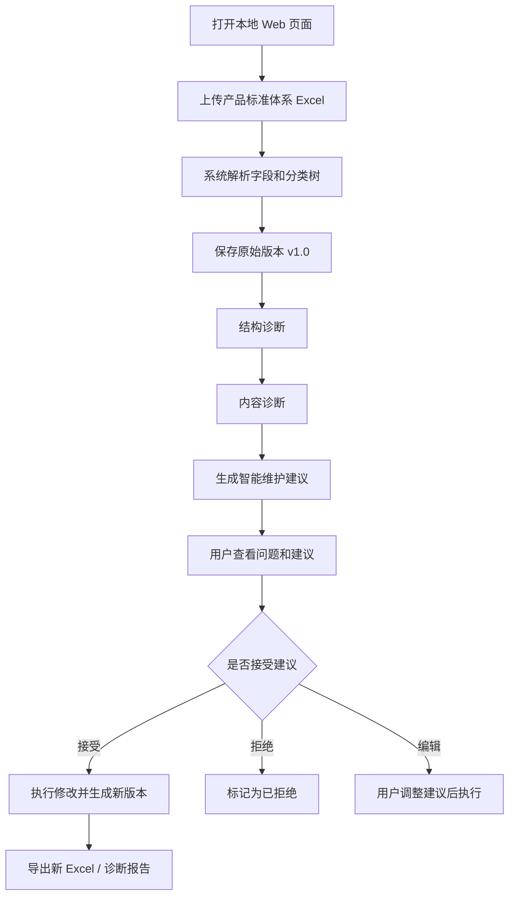

# 产品需求文档：标准产品体系维护智能体平台

> **产品需求参考（REFERENCE）**：用于说明产品背景、用户和能力边界。当前实现状态与近期优先级分别以[当前实现情况](../00_当前状态/当前实现情况.md)、[当前开发路线图](../00_当前状态/当前开发路线图.md)为准。

> 项目名称：基于 LangChain 生态的本地标准产品体系维护智能体平台  
> 文档类型：产品需求文档（PRD）  
> 版本：v1.0  
> 日期：2026-07-04  
> 适用场景：智能体开发课程设计 / 产品分类体系治理 / Excel 分类树维护

---

## 1. 项目背景

老师提供的 Excel 文件 `产品标准体系(2).xlsx` 是一张产品标准分类体系表，数据来自某个产品分类数据库或标准产品体系导出结果。该表不是普通商品清单，而是一个多层级的产品分类树。

### 1.1 Excel 数据概况

经分析，当前 Excel 具备以下特征：

| 指标 | 结果 |
|---|---:|
| Sheet 名称 | Sheet1 |
| 数据行数 | 21090 |
| 字段数 | 6 |
| 一级类目数 | 12 |
| 最大层级深度 | 10 |
| 叶子节点数 | 17965 |
| 非叶子节点数 | 3125 |
| 缺失父节点数 | 44 |
| 重复名称类型数 | 3 |
| 同义词非空节点数 | 15072 |

字段如下：

| 字段名 | 含义 |
|---|---|
| `category_id` | 当前分类节点 ID |
| `category_name` | 当前分类节点名称 |
| `category_group_id` | 当前节点的祖先节点 ID 路径 |
| `category_pids` | 当前节点路径 ID，包含根标记 `[-1]` |
| `category_group_name` | 当前节点的祖先节点名称路径 |
| `syn_list` | 当前节点的同义词列表 |

示例路径：

```text
农、林、牧、渔业类产品 > 农业产品 > 水果及坚果 > 水果（园林水果） > 苹果
```

该数据适合用于构建“产品分类树治理智能体”，让系统自动发现产品体系中的结构问题和语义问题，并提供可审核、可执行、可回滚的维护建议。

---

## 2. 项目定位

本项目不是一个普通的 Excel 上传工具，也不是单纯的大模型聊天机器人，而是一个面向产品标准分类体系的本地智能体治理平台。

用户通过本地 Web 页面上传产品标准体系 Excel，系统解析为分类树结构后，由 LangGraph 编排多个智能体完成结构诊断、内容诊断、语义检索、调整建议生成、人工审核、版本保存和导出。

一句话描述：

> 用户上传产品标准体系 Excel 后，智能体像“分类体系医生”一样对产品分类树进行体检，发现层级过深、节点过宽、父节点缺失、重复节点、同义词污染、父子关系异常等问题，并给出可解释、可确认、可执行、可回滚的维护建议。

---

## 3. 用户角色

| 角色 | 说明 | 主要需求 |
|---|---|---|
| 体系管理员 | 负责维护产品分类体系的人 | 上传 Excel、查看诊断、确认修改、导出新版本 |
| 业务专家 | 熟悉产品分类业务的人 | 审核智能体建议、判断语义合理性 |
| 系统管理员 | 负责本地部署和数据管理的人 | 配置模型、管理数据库、备份数据 |
| 课程答辩用户 | 教师或评审人员 | 观看系统演示、理解智能体如何工作 |

---

## 4. 核心业务痛点

当前 Excel 中已经能体现出产品分类体系维护的典型问题：

### 4.1 层级过深

当前最大层级为 10 层。示例：

```text
产业链,风电产业,风电整机,风电机舱,风电传动系统,风电齿轮箱,齿轮箱加热器,智能感应加热器,加热器磁芯 > 铁氧体
```

层级过深会导致分类理解困难、维护复杂、前端展示体验差。

### 4.2 节点过宽

部分父节点下直接子节点过多：

| 父节点 | 直接子节点数 |
|---|---:|
| 煤化工设备与试剂 | 225 |
| 初级形态塑料 | 151 |
| 其他电子元件 | 136 |
| 建材物料 | 102 |
| 生物化学制品 | 94 |
| 其他资源再利用设备 | 93 |
| 其他通信传输设备 | 91 |

节点过宽会导致分类粒度混乱，适合拆分中间层级。

### 4.3 父节点缺失

当前检测到 44 条节点的直接父节点不存在。示例：

| 子节点 | 缺失父节点 ID | 祖先路径 |
|---|---:|---|
| 通信设备嵌入式软件 | 2736 | 纸、印刷品、软件、文教、工艺品类产品,软件、电子出版物,软件产品,嵌入式软件产品 |
| 网络设备嵌入式软件 | 2736 | 纸、印刷品、软件、文教、工艺品类产品,软件、电子出版物,软件产品,嵌入式软件产品 |
| 数字装备设备嵌入式软件 | 2736 | 纸、印刷品、软件、文教、工艺品类产品,软件、电子出版物,软件产品,嵌入式软件产品 |
| 数字视频产品嵌入式软件 | 2736 | 纸、印刷品、软件、文教、工艺品类产品,软件、电子出版物,软件产品,嵌入式软件产品 |
| 自动控制产品嵌入式软件 | 2736 | 纸、印刷品、软件、文教、工艺品类产品,软件、电子出版物,软件产品,嵌入式软件产品 |

该类问题会导致树结构断裂，影响后续检索、展示和导出。

### 4.4 重复节点

当前存在重复名称：

```text
锰矿石, 风机叶片, 风电齿轮箱
```

重复节点不一定都是错误，例如“风电齿轮箱”可能分别出现在产品分类视角和产业链视角中，因此需要智能体结合路径语义判断是否合并。

### 4.5 同义词污染

例如节点“苹果”位于水果路径下，但同义词中包含 `Apple`、`AirPods`、`Apple Music`、`Apple Pencil`、`iPhone` 等电子品牌相关词，属于典型同义词污染。

这类问题难以通过简单规则发现，适合使用向量检索 + 大模型语义判断。

---

## 5. 产品目标

### 5.1 总体目标

构建一个本地运行的产品标准体系维护智能体平台，实现 Excel 产品分类树的自动诊断、智能建议、人机协同维护和版本管理。

### 5.2 具体目标

1. 支持用户在本地 Web 页面上传产品标准体系 Excel。
2. 自动识别 Excel 字段并解析为分类树。
3. 自动检测结构问题：层级过深、节点过宽、父节点缺失、孤立节点、重复节点等。
4. 自动检测内容问题：同义词污染、命名不规范、父子关系语义异常、分类粒度不一致等。
5. 使用 Qdrant 建立产品节点语义向量索引，支持相似节点召回和智能问答。
6. 使用 LangGraph 编排多个智能体完成诊断、建议生成、审核和执行流程。
7. 所有修改建议必须经过用户确认后才可执行。
8. 支持版本管理、版本对比、回滚和导出新 Excel。
9. 支持生成诊断报告和课程答辩展示结果。

---

## 6. 产品范围

### 6.1 MVP 必做范围

| 模块 | 功能 |
|---|---|
| Excel 上传 | 上传、保存、字段识别、基础校验 |
| 分类树解析 | 根据 `category_group_id` 和 `category_group_name` 构建树 |
| 结构诊断 | 层级过深、节点过宽、父节点缺失、重复名称 |
| 内容诊断 | 同义词异常样例、父子关系异常样例、相似节点召回 |
| 智能建议 | 根据问题生成结构化调整建议 |
| 人工审核 | 接受、拒绝、编辑建议 |
| 版本管理 | 原始版本、优化版本、操作日志 |
| 导出 | 导出优化后 Excel 和 Markdown 诊断报告 |

### 6.2 可选增强范围

| 模块 | 功能 |
|---|---|
| DeepAgents 分析助手 | 对复杂子树进行多步分析，生成深度报告 |
| 版本对比可视化 | 展示节点新增、删除、移动、改名差异 |
| 子树重构建议 | 对过宽节点自动提出拆分方案 |
| 智能问答 | 用户用自然语言询问分类体系问题 |
| 权限管理 | 多用户登录、操作权限、审批流 |

### 6.3 暂不支持范围

1. 不直接连接真实企业生产数据库。
2. 不允许大模型直接修改原始 Excel 文件。
3. 不自动删除节点，所有高风险操作必须人工确认。
4. 不保证所有语义建议 100% 正确，系统只提供辅助决策。
5. 不做分布式部署，课程设计阶段以本地部署为主。

---

## 7. 用户使用流程



---

## 8. 功能需求

## 8.1 文件上传模块

### 8.1.1 功能说明

用户在本地网页上传 Excel 文件，系统保存原始文件并进行字段识别。

### 8.1.2 输入

- `.xlsx` 文件。
- 文件中至少包含分类节点 ID、节点名称、父级路径或祖先路径。

### 8.1.3 输出

- 文件基本信息。
- 字段识别结果。
- 数据规模统计。
- 初始版本记录。

### 8.1.4 验收标准

1. 可以成功上传 `产品标准体系(2).xlsx`。
2. 系统识别出字段：`category_id`、`category_name`、`category_group_id`、`category_pids`、`category_group_name`、`syn_list`。
3. 系统显示节点数量 21090。
4. 上传后生成原始版本 `v1.0`。

---

## 8.2 分类树解析模块

### 8.2.1 功能说明

系统根据 Excel 中的路径字段构建分类树。

### 8.2.2 解析规则

1. `category_id` 作为当前节点唯一 ID。
2. `category_group_id` 表示当前节点的祖先节点 ID 列表。
3. `parent_id` 取 `category_group_id` 中最后一个 ID。
4. 如果 `category_group_id` 为空，则该节点为一级类目。
5. `level = 祖先节点数量 + 1`。
6. `category_group_name + category_name` 组成完整名称路径。

### 8.2.3 验收标准

1. 正确识别 12 个一级类目。
2. 正确计算最大深度 10。
3. 正确统计叶子节点和非叶子节点。
4. 支持按节点展开局部树。

---

## 8.3 体系概览模块

### 8.3.1 功能说明

展示当前产品分类体系的整体统计信息。

### 8.3.2 展示内容

| 指标 | 示例 |
|---|---|
| 节点总数 | 21090 |
| 一级类目数 | 12 |
| 最大层级 | 10 |
| 叶子节点数 | 17965 |
| 非叶子节点数 | 3125 |
| 缺失父节点数 | 44 |
| 重复名称类型数 | 3 |
| 同义词非空节点数 | 15072 |

### 8.3.3 验收标准

1. 页面能展示统计卡片。
2. 页面能展示一级类目列表。
3. 页面能根据节点名称或 ID 搜索分类节点。

---

## 8.4 结构诊断模块

### 8.4.1 功能说明

通过确定性规则检测分类树结构问题。

### 8.4.2 诊断规则

| 问题类型 | 检测方式 | 风险等级 |
|---|---|---|
| 父节点缺失 | `parent_id` 不在节点 ID 集合中 | 高 |
| 层级过深 | `level > 7` 或超过配置阈值 | 中 |
| 节点过宽 | 直接子节点数超过配置阈值，例如 80 | 中 |
| 重复名称 | 相同 `category_name` 出现多次 | 中 |
| 孤立节点 | 无法追溯到根节点 | 高 |
| 单链过长 | 多层连续只有一个子节点 | 低 |

### 8.4.3 输出字段

| 字段 | 说明 |
|---|---|
| issue_type | 问题类型 |
| node_id | 问题节点 ID |
| node_name | 问题节点名称 |
| description | 问题描述 |
| reason | 产生原因 |
| risk_level | 风险等级 |
| confidence | 置信度 |
| status | 待处理 / 已接受 / 已拒绝 / 已执行 |

### 8.4.4 验收标准

1. 能识别 44 个父节点缺失问题。
2. 能识别最大深度为 10 的深层路径。
3. 能识别“煤化工设备与试剂”等过宽节点。
4. 能识别重复节点名称。

---

## 8.5 内容诊断模块

### 8.5.1 功能说明

结合 Qdrant 向量检索和大模型语义判断，发现分类体系中的内容问题。

### 8.5.2 诊断对象

1. 节点名称是否规范。
2. 父子关系是否语义合理。
3. 同义词是否与节点语义一致。
4. 相似节点是否构成重复。
5. 节点粒度是否明显不一致。

### 8.5.3 示例问题

| 节点 | 问题 | 说明 |
|---|---|---|
| 苹果 | 同义词污染 | 水果节点混入 Apple、AirPods、iPhone 等电子品牌词 |
| 风电齿轮箱 | 疑似重复 | 在不同路径下出现，需要判断是重复还是多视角复用 |
| 煤化工设备与试剂 | 节点过宽 | 直接子节点数量过多，建议拆分中间类目 |

### 8.5.4 验收标准

1. 能针对指定节点生成语义分析说明。
2. 能召回与目标节点相似的其他节点。
3. 能识别至少 5 个同义词异常样例。
4. 能对父子关系异常输出理由和建议。

---

## 8.6 智能建议生成模块

### 8.6.1 功能说明

根据诊断问题生成可执行的维护建议。

### 8.6.2 建议动作类型

| 动作 | 说明 | 是否需要人工确认 |
|---|---|---|
| `add_node` | 新增缺失父节点或中间分类 | 是 |
| `move_node` | 将节点迁移到更合理父节点下 | 是 |
| `rename_node` | 修改节点名称 | 是 |
| `merge_node` | 合并重复节点 | 是 |
| `clean_synonym` | 清理错误同义词 | 是 |
| `split_subtree` | 对过宽子树提出拆分方案 | 是 |
| `mark_as_valid` | 标记为合理复用，不修改 | 否 |

### 8.6.3 输出格式

```json
{
  "issue_id": 101,
  "action_type": "clean_synonym",
  "target_node_id": 441,
  "target_node_name": "苹果",
  "reason": "该节点位于水果分类路径下，但同义词包含电子品牌和设备名称。",
  "suggestion": "建议删除 AirPods、Apple Music、Apple Pencil、iPhone 等同义词，保留与水果相关的同义词。",
  "risk_level": "medium",
  "confidence": 0.92,
  "need_confirm": true
}
```

### 8.6.4 验收标准

1. 每个建议必须包含问题、原因、动作、风险等级和置信度。
2. 建议必须是结构化 JSON，方便程序校验和执行。
3. 高风险动作不能自动执行。

---

## 8.7 人工审核模块

### 8.7.1 功能说明

用户查看智能体建议后，可以接受、拒绝或编辑建议。

### 8.7.2 操作

| 操作 | 说明 |
|---|---|
| 接受 | 将建议加入待执行队列 |
| 拒绝 | 保留问题记录，但不修改 |
| 编辑 | 修改建议内容后再执行 |
| 批量接受低风险建议 | 批量处理低风险清理类问题 |

### 8.7.3 验收标准

1. 用户可以逐条查看建议详情。
2. 用户可以对建议进行接受、拒绝、编辑。
3. 所有用户操作写入操作日志。

---

## 8.8 执行与版本管理模块

### 8.8.1 功能说明

系统根据用户确认后的建议执行树结构修改，并保存新版本。

### 8.8.2 版本规则

1. 原始 Excel 导入后生成 `v1.0`。
2. 每次批量执行建议后生成新版本，例如 `v1.1`、`v1.2`。
3. 每个版本保存节点快照。
4. 支持查看版本差异。
5. 支持回滚到历史版本。

### 8.8.3 验收标准

1. 执行修改前保存原始版本。
2. 执行修改后生成新版本。
3. 可以导出任意版本对应的 Excel。
4. 可以查看版本操作日志。

---

## 8.9 报告生成模块

### 8.9.1 功能说明

系统根据诊断结果生成 Markdown 或 PDF 诊断报告。

### 8.9.2 报告内容

1. 文件基本信息。
2. 分类树统计信息。
3. 结构问题统计。
4. 内容问题统计。
5. 典型问题案例。
6. 智能体维护建议。
7. 版本变更记录。
8. 后续优化建议。

### 8.9.3 验收标准

1. 可以生成 Markdown 报告。
2. 报告中包含真实统计数据。
3. 报告中包含至少 3 类典型问题案例。

---

## 9. 页面需求

前端可使用 React 或 Vue。课程设计阶段推荐 Vue + Element Plus 或 React + Ant Design。

### 9.1 页面列表

| 页面 | 功能 |
|---|---|
| 首页 / 上传页 | 上传 Excel，查看上传结果 |
| 体系概览页 | 展示节点统计和一级类目 |
| 分类树浏览页 | 展开、搜索、查看节点详情 |
| 结构诊断页 | 展示结构问题列表 |
| 内容诊断页 | 展示语义问题列表 |
| 智能建议页 | 查看、接受、拒绝、编辑建议 |
| 版本管理页 | 查看版本、导出、回滚 |
| 报告页 | 生成并下载诊断报告 |
| 智能问答页 | 询问分类体系相关问题 |

### 9.2 关键交互

1. 上传 Excel 后自动进入解析任务。
2. 诊断过程展示任务状态。
3. 问题列表支持按类型、风险、状态筛选。
4. 点击节点可查看完整路径、同义词、相似节点。
5. 修改建议执行前需要弹窗确认。
6. 导出前选择版本。

---

## 10. 非功能需求

| 类型 | 需求 |
|---|---|
| 本地化 | 系统应支持本地运行，文件和数据库默认保存在本地 |
| 安全性 | 原始 Excel 不直接覆盖，所有修改另存版本 |
| 可解释性 | 智能体建议必须说明原因 |
| 可回滚性 | 所有版本可追溯，可回滚 |
| 性能 | 2 万级节点应在可接受时间内完成基础结构诊断 |
| 可扩展性 | 后续可支持多文件、多体系、多用户 |
| 稳定性 | LLM 失败时不影响规则诊断和版本数据 |
| 可演示性 | 适合课堂展示，能清晰体现智能体作用 |

---

## 11. 数据安全与人机协同原则

1. 大模型只负责分析和生成建议，不直接修改数据库。
2. 所有修改动作必须结构化。
3. 所有修改动作必须经过程序校验。
4. 中高风险修改必须经过人工确认。
5. 原始文件必须保留。
6. 每次修改必须生成新版本。
7. 所有操作必须写入日志。

> **智能体能力边界说明**（修订 2026-07-05）：
> - "规则能解决的不交给大模型"原则适用于**结构诊断**（5 类规则问题），这些是确定性操作，不需要 LLM。
> - 但**内容诊断**和**建议生成**是语义判断任务，必须通过 LLM 驱动的 Agent Loop（ReAct 循环 + tool calling）实现。
> - 内容诊断节点和建议生成节点不是单次 service 调用，而是封装了迭代推理的智能体节点。
> - 详见 `10_LangGraph智能体工作流开发设计.md` §8.6/§8.7 和 `04`/`05` 文档的 Agent Loop 设计章节。

---

## 12. MVP 验收清单

| 编号 | 验收项 | 是否必需 |
|---|---|---|
| 1 | 能上传当前 Excel 文件 | 必需 |
| 2 | 能解析 21090 个分类节点 | 必需 |
| 3 | 能展示 12 个一级类目 | 必需 |
| 4 | 能检测父节点缺失问题 | 必需 |
| 5 | 能检测层级过深问题 | 必需 |
| 6 | 能检测节点过宽问题 | 必需 |
| 7 | 能检测重复名称问题 | 必需 |
| 8 | 能调用 Qdrant 做相似节点召回 | 推荐 |
| 9 | 能调用 LLM 生成维护建议 | 必需 |
| 10 | 能人工确认后执行修改 | 必需 |
| 11 | 能保存新版本 | 必需 |
| 12 | 能导出诊断报告 | 必需 |

---

## 13. 课程设计亮点

1. 真实 Excel 数据规模较大，包含 2 万多个节点。
2. 同时结合规则算法和大模型语义判断。
3. 使用 LangGraph 编排多智能体工作流。
4. 使用 Qdrant 构建本地语义向量库。
5. 使用 SQLite 保存业务数据和版本记录。
6. 支持人工审核，避免大模型直接修改数据。
7. 支持版本管理和回滚，符合真实业务系统设计。
8. 可通过 React / Vue 前端进行可视化展示。

---

## 14. 项目一句话包装

> 本项目基于 LangChain 生态构建本地标准产品体系维护智能体平台，通过 React/Vue 前端、FastAPI 本地智能体网关、LangGraph 多智能体工作流、SQLite 本地业务库和 Qdrant 向量数据库，实现产品分类体系 Excel 的自动解析、结构诊断、语义诊断、智能建议、人机协同维护、版本管理和报告导出。
